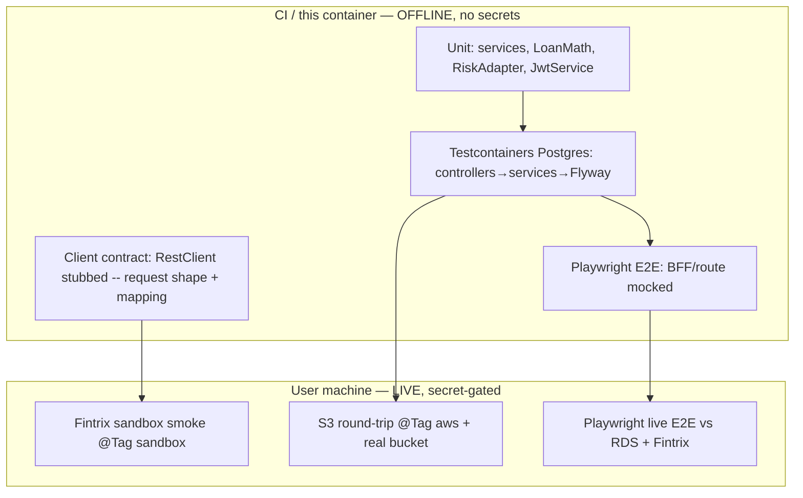

# NAVIX Finance — Testing Plan (UI E2E + Backend Feature Testing)

> Companion to the production-migration plan (9-step onboarding, real Fintrix/DigiLocker, S3, RiskPort,
> JWT auth, payment settings, agreements — phases **P0–P8**). This document is the test strategy for
> everything that plan builds. Author tests **per phase as features land** (not all at the end); the
> exit criterion for each impl phase is "its tests below are green."

---

## 1. Context & goals

The migration replaces mocked integrations, header-based identity, and `bytea` storage with **real
Fintrix/DigiLocker calls, JWT auth, and S3**, and adds a **9-step verified onboarding wizard**, an
**agreement-consent gate**, and an **admin-editable payment block** on repay. Each of those is a place a
regression or a security hole can hide (SoD bypass, idempotency double-charge, PII leak, presign
mis-scoping, gate skipped). This plan defines:

1. **Backend feature tests** — extend the existing unit + Testcontainers patterns to cover the new
   verification orchestration, ports/adapters, S3, auth, and payment settings.
2. **UI E2E tests** — stand up Playwright (installed, currently unused) and script the borrower wizard,
   agreements, repay, auth, and the staff approver/admin flows.
3. **The offline/online split** — what runs in CI with no secrets vs. what runs on a machine with the
   `navix-dev` AWS profile + Fintrix sandbox creds + reachable RDS.

### Hard constraint: default suite must be fully offline
This remote/CI environment has **no AWS creds, no `.env`, no Docker daemon, no RDS reachability**. So the
**default** `./mvnw test` and the CI Playwright run must pass with **everything external mocked**. Live
calls (Fintrix sandbox, real S3, real RDS) are **opt-in by tag/profile** and run on the user's local
machine. Every test below is labelled **[offline]** (CI-safe) or **[live]** (local/manual, secret-gated).

---

## 2. Backend feature testing

**Reuse the existing patterns** — do not invent new harnesses:
- **Unit:** `*ServiceTest.java` per module (JUnit 5 + Mockito), e.g. `navix-loan/.../LoanMathTest`,
  `navix-income-risk/.../LimitCalculatorTest`, `navix-iam/.../SeparationOfDutiesGuardTest`.
- **Integration:** one Testcontainers MockMvc test class style as `navix-app/.../ApplicationFlowIntegrationTest`
  (`@SpringBootTest @AutoConfigureMockMvc @Testcontainers @Tag("integration")`, `PostgreSQLContainer` +
  `@ServiceConnection`, real Flyway). Run with `./mvnw -pl navix-app test -Pit`.
- **Mock seams:** mock the **ports** (`VerificationPort`/`DocumentStoragePort`/`RiskPort`) at the service
  layer; mock **`RestClient`** at the client layer (`MockRestServiceServer` from
  `spring-test`, already on the classpath — no new dep). New tags `@Tag("sandbox")` and `@Tag("aws")`
  gate live calls; add matching Maven profiles `-Psandbox` / `-Paws` mirroring the existing `it` profile.

### 2.1 Loan math + RiskPort (P2) — [offline]
- Extend `LoanMathTest`: eligible limit = 25% of salary **floored to ₹100**; fee 10%, GST 18%-on-fee,
  interest 1%/day over tenure, late penalty 2%/day capped 30 days; due date = next salary credit ≤ 40
  days (boundary: salary day 30 disbursed on the 24th → +36 days; clamp to month length). All in **integer
  paise**, HALF_UP. Reuse the worked example from `CLAUDE.md` §9 as fixtures.
- New `RiskAdapterTest` (navix-income-risk): `RiskPort.eligibleLimitPaise(salary)` matches
  `LoanMath.eligibleLimitPaise` for the pure-25% path; grade A/B/C/D mapping. Assert the duplication is
  resolved (one authority) by asserting parity across a salary sweep.

### 2.2 Fintrix/DigiLocker clients (P1) — contract [offline] + smoke [live]
Per client in `navix-verification/.../client/*` (`PanComprehensive`, `EmailVerification`,
`AddressVerification`, `Experian`, `Crif`, `PennyDrop`, `DigiLocker`):
- **[offline] Request-shape test** with `MockRestServiceServer`: assert the **correct auth scheme**
  (Fintrix = `Authorization: Basic base64(id:secret)`; DigiLocker = `X-Client-ID`/`X-Client-Secret`),
  the **endpoint path + JSON body fields** (cross-checked against `NAVIX.postman_collection.json`,
  `NAVIX_Fintrix_Integration_Flow.md`, `Digilocker_API_Guide.md`), and a deterministic
  `client_ref_num`. Then feed a **captured sample response** (copy real sandbox JSON into
  `src/test/resources/fintrix/*.json`) and assert it maps into `FintrixDtos`/`DigiLockerDtos` correctly.
- **[offline] Error handling:** non-2xx / error-envelope → typed exception (not a null/`PASS`); timeout
  configured (the `FintrixClientConfig` TODO) — assert via a delayed mock.
- **[offline] `BureauService`:** Experian primary → CRIF fallback triggers on no-record / missing score /
  source-down; both map to one `UnifiedBureauReport`; assert no fallback when Experian succeeds.
- **[offline] `DigiLockerClient` redirect+poll:** init → `{client_id,url}`; `status` PENDING then
  COMPLETED; `listDocuments` → `document`/`aadhar_xml`; assert poll loop exits on `completed` and the
  parsed Aadhaar is **masked** (full number never surfaces).
- **[live, `@Tag("sandbox")`]** One real call each to `pan_comprehensive`, `cv_email_verification`,
  `ent_address_verification`, `verification_pennydrop`, `individual_experian` — assert 2xx + parseable.
  Skipped by default; run locally with `.env` creds via `-Psandbox`.

### 2.3 Ports / adapters (P2) — [offline]
- `VerificationAdapterTest`: neutral records (`PanCheck`, `EmailCheck`, `AddressCheck`, `BureauCheck`,
  `PennyDropCheck`, `DigiLockerSession/Status`, `AadhaarResult`, `FaceLivenessCheck`) are produced from
  provider DTOs; **no provider DTO leaks** onto the neutral type (compile-time + assert package).
- `StorageAdapterTest`: delegates to `DocumentStorageService` (mock `S3Client`/`S3Presigner`);
  `buildApplicationKey(appId, docType, ext)` → `applications/{id}/{docType}/{timestamp}.{ext}` (assert the
  exact prefix pattern; timestamp injected/clock-controlled for determinism).
- Mirror `LoanDirectoryAdapterTest` (already exists) as the template.

### 2.4 ApplicationVerificationService (P2/P3) — [offline] the highest-value unit tests
With `VerificationPort`/`DocumentStoragePort`/`RiskPort` mocked + Testcontainers for the entity:
- **Idempotency:** second `runOnce(app, checkType)` after a stored `PASS` returns the stored row and
  **does not call the port again** (`verify(port, never())`). The `UNIQUE(application_id, check_type)`
  upsert holds under a duplicate insert.
- **Cross-match scoring:** PAN name/DOB == Aadhaar XML == penny-drop name → high `name_match_score` →
  PASS; a mismatch → **REVIEW (not hard FAIL)**; below-threshold is configurable and starts permissive.
- **DigiLocker resume:** a stored `PENDING` row with a `provider_txn_id` resumes via `status(...)` rather
  than re-`init`.
- **Derived fields:** `applicant_profile` gets `pan_verified/aadhaar_linked/email_verified/...`,
  `bureau_score/source`, `risk_category`, `name_match_score`, `agreement_accepted` updated; bureau score
  is stored but **never returned to the borrower DTO**.
- **Gating:** `allRequiredPassed(app)` true only when every required check is PASS/REVIEW **and** the
  agreement row is accepted; any FAIL → false.

### 2.5 Onboarding endpoints + submit-kyc gate (P3) — [offline, integration]
New integration test `OnboardingFlowIntegrationTest` (Testcontainers MockMvc), mirroring
`ApplicationFlowIntegrationTest` but mocking the **ports** via a `@TestConfiguration` that supplies stub
`VerificationPort`/`DocumentStoragePort`/`RiskPort` beans (so no network):
- Walk `create DRAFT → verify/email → verify/address → verify/digilocker(init→status→complete) →
  verify/pan → verify/bureau → verify/salary → verify/penny-drop → verify/selfie → verify/agreement →
  submit-kyc` and assert the app lands in **`KYC_PENDING`** with the expected `application_verification`
  rows + `application_event` audit entries.
- **Gate negative tests:** `submit-kyc` is rejected (422 `ILLEGAL_TRANSITION`/business error) when (a) a
  required check is missing, (b) a check is FAIL, (c) the agreement is not accepted.
- **Idempotent re-POST** of a verify step returns the stored result (no duplicate row).
- **Selfie retry path:** liveness FAIL → one retry allowed → second FAIL flags manual review (status
  REVIEW), and `submit-kyc` still passes the gate (REVIEW is allowed) but is visible to the approver.

### 2.6 S3 document storage (P4) — key/logic [offline] + round-trip [live]
- **[offline]** `DocumentStorageService` with mocked `S3Client`/`S3Presigner`: `buildApplicationKey`
  pattern; `presignUpload`/`presignDownload` build the right `PutObject`/`GetObject` + TTL (assert short
  TTL ~5 min for Aadhaar/selfie via `NAVIX_S3_PRESIGN_TTL`); `store` pins SSE-KMS when `kms-key-id` set;
  `exists`/`headObject` confirm-before-record. The `application_document` invariant (**exactly one** of
  `data` / `s3_object_key`) enforced — assert a row with neither/both is rejected.
- **[offline] (optional, recommended)** Use the **`adobe/S3Mock`** or **LocalStack** Testcontainer to do a
  real presign→PUT→GET against an in-container S3 so the round-trip is covered without AWS creds. Gate
  behind `@Tag("integration")` so it only runs where Docker exists.
- **[live, `@Tag("aws")`]** Presign PUT then approver presign GET against the real
  `navix-finance-bucket`; assert object lands under `applications/{id}/...` and is KMS-encrypted; assert
  **no document bytes flow through the backend** on the download path (only a URL is returned).

### 2.7 Auth — JWT + Spring Security (P6) — [offline]
- `JwtServiceTest`: sign/verify HS256 with `AUTH_SECRET`; reject **expired**, **tampered signature**,
  **wrong audience** (staff token presented on a borrower-only route and vice versa), and missing claims.
- `JwtAuthFilterTest`: a valid bearer populates `ActorContext` (id/name/role); absent/garbage → anonymous
  → fails closed at `requireRole`.
- **Security matrix integration test** (extend the Testcontainers IT): unauthenticated business call →
  **401**; authenticated wrong-role → **403 / `FORBIDDEN_ROLE`**; **SoD still enforced** (recommending
  Credit Exec ≠ approving Credit Head → `SOD_VIOLATION`); staff/borrower **token namespaces don't cross**.
- **Login:** staff `POST /api/auth/staff/login` BCrypt verify (good/bad password); borrower
  `POST /api/auth/borrower/login` with the **fixed mock OTP** issues a JWT carrying `applicantId`;
  invite-accept sets a password.
- **Migrate the existing IT:** rewrite the `act()` helper to **mint a test JWT** instead of injecting
  `X-Demo-Actor-*` (a `TestJwt.staff(role)` / `TestJwt.borrower(applicantId)` helper). All current 3
  integration scenarios must stay green after the identity swap.

### 2.8 Payment settings (P8) — [offline]
- `PaymentSettingsServiceTest` / controller IT: `GET /api/payment-settings` returns fields + **presigned
  GET URLs** for the QR image and account-info PDF (mock `DocumentStoragePort`); singleton upsert keeps a
  single row; the seed row exists after migration.
- **RBAC:** `PUT /api/payment-settings` succeeds for **ADMIN**, returns **403** for any other staff role
  and for a borrower token. Field update + object-key swap persists.

### 2.9 Migrations & data integrity — [offline, integration]
- Flyway **V1–V18** apply cleanly on a fresh Testcontainers Postgres (the Spring context boot in any
  `@Tag("integration")` test already proves this; add an explicit `flyway.validate()` assertion + a
  "no pending migrations" check).
- `application_verification` `UNIQUE(application_id, check_type)` and the `application_document`
  one-of-two invariant have negative tests (constraint violation surfaces as a typed error).

### Backend coverage matrix
| Feature (phase) | Unit | Integration (Testcontainers) | Live (tag) |
|---|---|---|---|
| LoanMath / RiskPort (P2) | ✅ | — | — |
| Fintrix/DigiLocker clients (P1) | ✅ contract | — | `sandbox` |
| Ports/adapters (P2) | ✅ | — | — |
| ApplicationVerificationService (P2/P3) | ✅ idempotency/cross-match/gate | ✅ | — |
| Onboarding endpoints + submit-kyc gate (P3) | — | ✅ happy + negative + retry | — |
| S3 storage (P4) | ✅ key/logic | ✅ S3Mock round-trip | `aws` |
| JWT auth + Security (P6) | ✅ | ✅ 401/403/SoD matrix | — |
| Payment settings (P8) | ✅ | ✅ RBAC | — |
| Migrations V1–V18 | — | ✅ | — |

---

## 3. UI testing (Playwright — greenfield setup)

Playwright `^1.61.0` is installed but unconfigured. **Use the pre-installed Chromium** at
`/opt/pw-browsers` — **do not run `playwright install`** (`PLAYWRIGHT_SKIP_BROWSER_DOWNLOAD=1` is set; if
the pinned version mismatches, launch with `executablePath: '/opt/pw-browsers/chromium'`).

### 3.1 Stand-up tasks
- Add **`frontend/playwright.config.ts`**: `testDir: './e2e'`, `baseURL: 'http://localhost:3000'`,
  `projects: [{ name: 'chromium', use: { ...devices['Desktop Chrome'] } }]`, a `webServer` that runs
  `npm run dev` and waits on the base URL, retries on CI, trace `on-first-retry`.
- Add scripts to `frontend/package.json`: `"test:e2e": "playwright test"`,
  `"test:e2e:ui": "playwright test --ui"`.
- Create **`frontend/e2e/`** with fixtures (`e2e/fixtures/`) and a `mocks/` helper.
- **Two run modes:**
  - **[offline / CI] Mocked-backend** — intercept BFF calls with Playwright **`page.route('**/api/**')`**
    returning canned `ApiResponse<T>` envelopes (or run against the BFF with the backend stubbed). Deterministic,
    no Fintrix/RDS. This is the **gating** E2E in CI.
  - **[live] Real backend** — `BACKEND_BASE_URL` → RDS-backed Spring + Fintrix sandbox; run locally for
    true end-to-end. Same specs, mocks disabled via an env flag (`E2E_LIVE=1`).

### 3.2 Borrower onboarding E2E (the spine) — `e2e/onboarding.spec.ts`
Walk the **9-step** wizard `mobile-otp → email → address → digilocker → pan → bureau(auto) → salary →
penny-drop → selfie → review(+agreements)`:
- **Happy path:** every `/verify/*` mock returns PASS → review shows the eligible limit (25% of declared
  salary) → submit → a **"pending approval"** confirmation; assert the app id persists across a reload
  (backend-DRAFT persistence, not just localStorage).
- **Per-step branch specs:**
  - **DigiLocker:** init opens the redirect URL (assert new tab / callback route), poll PENDING→COMPLETED,
    Aadhaar shown **masked**.
  - **Selfie liveness:** FAIL → retry guidance shown → second FAIL → "manual review" state, wizard still
    advances.
  - **Penny-drop:** name mismatch → REVIEW banner (not a hard stop).
  - **Address:** browser **geolocation denied** → manual-entry fallback appears and submits.
  - **Salary:** declared amount + **slip presigned PUT** (mock the presign + the S3 PUT 200).
  - **Bureau:** automatic step with no input; **risk grade / credit score never rendered** to the borrower
    (assert absence in the DOM — this is a security assertion, keep it explicit).
- **Agreement gate:** the review step lists the **3 agreement PDFs** (`public/legal/agreement-{1,2,3}.pdf`);
  **submit is disabled** until all are acknowledged; acknowledging calls `verify/agreement`.
- **Resume:** kill mid-wizard, reload, land on the next unfinished step (gating off persisted statuses).

### 3.3 Auth E2E — `e2e/auth.spec.ts`
- Borrower OTP login with the **fixed mock code** → `/dashboard`; wrong code → error.
- Staff **email+password** login → `/staff/dashboard`; wrong password → error.
- **Route guards:** borrower session hitting `/staff/*` is bounced (middleware cookie gate); staff session
  hitting borrower-only routes bounced; **two cookies never cross**.
- Logout clears the session and the stored app id.

### 3.4 Repay + payment settings E2E — `e2e/repay.spec.ts`
- Repay screen renders the **admin-configured QR ``** (UPI) and **account fields + account-info PDF
  download** (bank transfer) from `GET /api/payment-settings` — **not** the old hardcoded
  `navix.collections@hdfcbank` / `A/C 5010…` (assert the old literals are gone).
- Record a payment → "pending verification" state; prepayment-aware "pay today" figure shown.

### 3.5 Staff approver + admin E2E — `e2e/staff.spec.ts`
- KYC-approver `/staff/kyc-approvals`: a `KYC_PENDING` app shows a **verification card per step** (status +
  provider txn id + key derived fields) and **presigned-GET links** to Aadhaar / salary-slip / selfie
  (assert the links point at S3 presigned URLs, open without an app session). Approve → `KYC_APPROVED`.
- Admin `/staff/admin/payment-settings`: edit UPI/account fields + **upload QR image + account-info PDF**
  (mock presign+PUT) → save → re-open borrower repay → new values reflected.
- **RBAC visibility:** non-admin staff cannot see the payment-settings editor; PII gating per role holds.

### 3.6 Component / pure-logic unit tests (optional, recommended) — Vitest + Testing Library
Light layer for logic that E2E shouldn't carry:
- `lib/api/applications.ts` money helpers (`paiseToINR` / `rupeesToPaise`) round-trip + paise integrity.
- `lib/api/live-journey.ts` backend-status → designed-stage mapping (every `ApplicationStatus` maps).
- The wizard step-gating reducer (next unfinished step from persisted statuses).
Add `vitest` + `@testing-library/react` as devDeps and a `"test:unit": "vitest run"` script. Keep it small —
the E2E layer is primary.

### UI coverage matrix
| Flow | Spec | CI (mocked) | Live |
|---|---|---|---|
| 9-step onboarding happy + branches | `onboarding.spec.ts` | ✅ | ✅ |
| Agreement gate | `onboarding.spec.ts` | ✅ | ✅ |
| Auth + route guards | `auth.spec.ts` | ✅ | ✅ |
| Repay + payment settings | `repay.spec.ts` | ✅ | ✅ |
| Staff approver + admin | `staff.spec.ts` | ✅ | ✅ |
| Money/mapping/gating logic | Vitest units | ✅ | — |

---

## 4. CI wiring & commands

| Stage | Command | When | Needs |
|---|---|---|---|
| Backend unit + contract | `cd backend && ./mvnw test` | every push | nothing (offline) |
| Backend integration | `./mvnw -pl navix-app test -Pit` | PR | Docker (Testcontainers) |
| Fintrix sandbox smoke | `./mvnw -pl navix-verification test -Psandbox` | manual / nightly | `.env` creds |
| S3 round-trip | `./mvnw -pl navix-storage test -Paws` | manual | AWS `navix-dev` profile |
| Frontend static | `cd frontend && npx tsc --noEmit && npm run lint` | every push | nothing |
| Frontend unit | `npm run test:unit` | every push | nothing |
| Frontend E2E (mocked) | `npm run test:e2e` | PR | pre-installed Chromium |
| Frontend E2E (live) | `E2E_LIVE=1 npm run test:e2e` | manual | RDS + Fintrix sandbox |

> **Build caveat (carry from `CLAUDE.md` §4.5):** backend needs **Java 21**; `npm run build`'s static
> prerender currently fails at `/staff/admin/staff` (known Next 15 bug) — gate frontend correctness on
> `tsc --noEmit` + ESLint + Playwright, **not** `next build`.

---

## 5. Exit criteria
1. `./mvnw test` green offline (unit + client-contract + port/adapter + service idempotency/cross-match/gate).
2. `./mvnw -pl navix-app test -Pit` green: full DRAFT→KYC_PENDING walk, submit-kyc negative gates, the
   401/403/SoD security matrix, payment-settings RBAC, V1–V18 migrate-clean.
3. Playwright mocked-E2E green in CI for all five spec files; the borrower never sees risk grade/score;
   the agreement gate blocks submit; repay shows admin-configured QR/account.
4. **[live, on the user's machine]** Fintrix `sandbox` smoke + S3 `aws` round-trip + one live Playwright
   walk to `KYC_PENDING` with real verification rows + S3 artifacts opened via presigned GET.
5. No PII in logs (PAN/Aadhaar/mobile masked) — assert via a log-capturing test on one client call.

## 6. Notes / risks
- **Captured sandbox fixtures:** the client-mapping tests need **real** sample responses checked into
  `src/test/resources/` — capture them during the first `@Tag("sandbox")` run on the user's machine and
  commit (scrubbed of any real PII).
- **Cross-match thresholds** are a credit-policy knob — test both sides of the cutoff and keep the default
  permissive (mismatch → REVIEW, approver decides), matching the impl plan.
- **The existing 3 integration scenarios** must be migrated to JWT in P6 without losing coverage — treat
  that migration as a regression gate, not new work.
- **S3Mock/LocalStack vs mocked client:** prefer the container round-trip where Docker is available;
  fall back to a mocked `S3Client`/`S3Presigner` where it isn't, so CI never depends on AWS.
