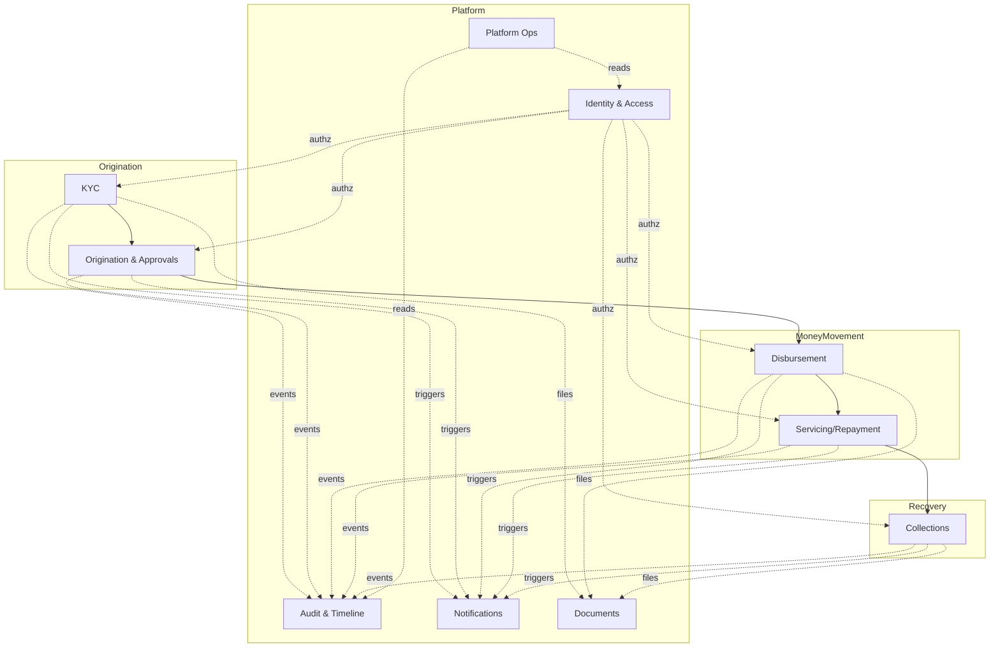
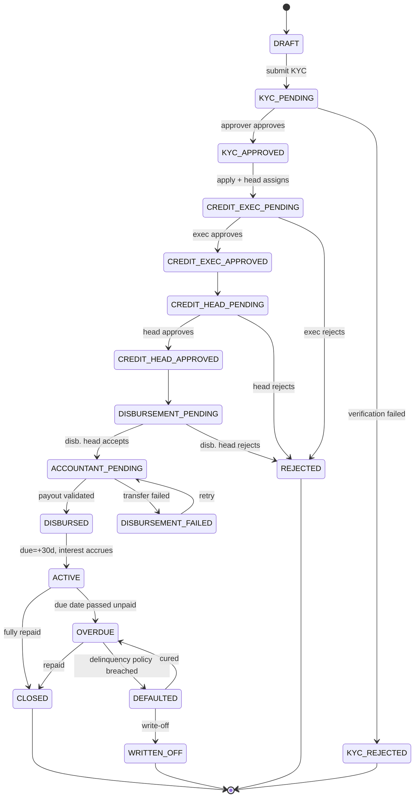
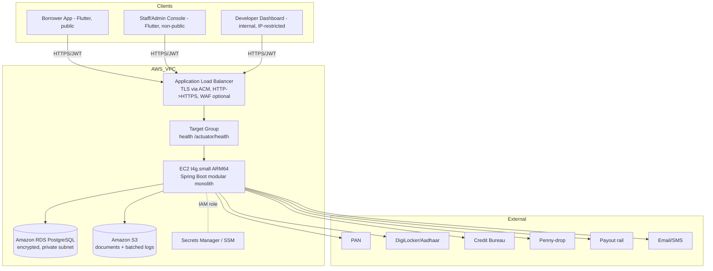
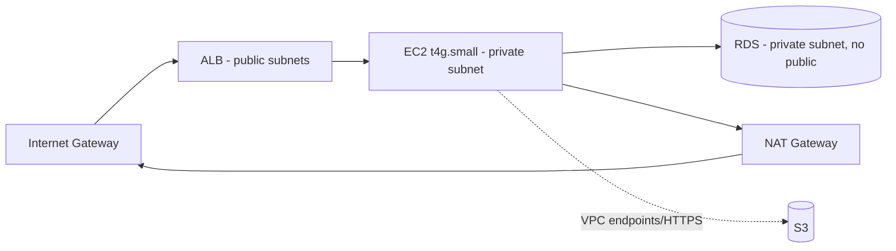
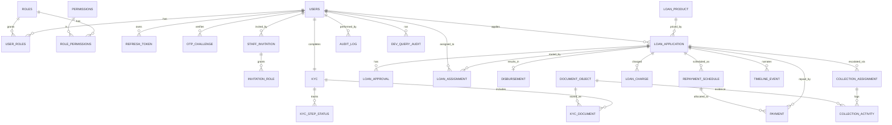
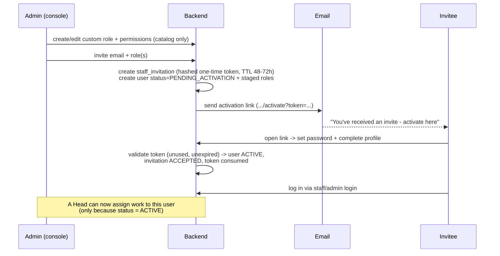

# LMS / NAVIX Finance — Master Document

> **Comprehensive architecture, design & execution reference (pre-code).**
> This is the authoritative umbrella document. Implementation-level detail is split into the **Backend Document**, **Frontend Document**, and the client-facing **NAVIX Finance — How It Works**. Where those go deeper, this document links to them; where they conflict, **this document and the decision log (§4) win**.

| | |
|---|---|
| **Version** | 2.1 (expanded) |
| **Status** | Ready for engineering kickoff |
| **Product** | NAVIX Finance — short-term consumer lending platform (30-day single-repayment loans) |
| **Project codename** | LMS (Loan Management System) |
| **Backend** | Java 21 · Spring Boot 3 · Spring Security · PostgreSQL (Amazon RDS) · Flyway · Maven |
| **Frontend** | Flutter · Riverpod · GoRouter · Dio · Freezed · JsonSerializable |
| **Storage** | Amazon S3 (documents + batched logs) |
| **Infra** | Amazon EC2 `t4g.small` (ARM64 Graviton2) · Application Load Balancer + **Target Group** · Amazon RDS · Amazon S3 · Docker · AWS |
| **Architecture** | **Modular Monolith** (single deployable, module-isolated) — not microservices |
| **Explicitly removed** | **Redis** (DB-direct / in-memory replacements) · **NACH** auto-debit (manual repayment for now) |
| **Primary NFR** | **Security** (applied across infra, app, data, and internal tooling) |

---
## Table of Contents

- [1. Executive summary](#1-executive-summary)
- [2. How to read this document](#2-how-to-read-this-document)
- [3. Goals, scope & non-goals](#3-goals-scope--non-goals)
  - [3.1 Goals](#31-goals)
  - [3.2 In scope (v1)](#32-in-scope-v1)
  - [3.3 Out of scope / deferred (for now)](#33-out-of-scope--deferred-for-now)
  - [3.4 Assumptions](#34-assumptions)
- [4. Decision log (binding)](#4-decision-log-binding)
- [5. Glossary (ubiquitous language)](#5-glossary-ubiquitous-language)
- [6. Business domain analysis](#6-business-domain-analysis)
  - [6.1 Sub-domains → modules](#61-sub-domains--modules)
  - [6.2 Bounded contexts](#62-bounded-contexts)
  - [6.3 Actors & personas](#63-actors--personas)
- [7. Business workflows (detailed)](#7-business-workflows-detailed)
  - [7.1 W1 — Borrower onboarding & KYC](#71-w1--borrower-onboarding--kyc)
  - [7.2 W2 — Loan application & credit decisioning](#72-w2--loan-application--credit-decisioning)
  - [7.3 W3 — Disbursement & accountant validation (no NACH)](#73-w3--disbursement--accountant-validation-no-nach)
  - [7.4 W4 — Repayment (manual)](#74-w4--repayment-manual)
  - [7.5 W5 — Collections](#75-w5--collections)
  - [7.6 W6 — Admin: roles, invitations & oversight](#76-w6--admin-roles-invitations--oversight)
  - [7.7 W7 — Developer operations](#77-w7--developer-operations)
- [8. Loan state machine](#8-loan-state-machine)
- [9. Loan product & economics (authoritative)](#9-loan-product--economics-authoritative)
  - [9.1 Parameters (defaults)](#91-parameters-defaults)
  - [9.2 Formulae](#92-formulae)
  - [9.3 Worked example — P = ₹10,000](#93-worked-example--p--10000)
  - [9.4 Day-by-day (spot checks)](#94-day-by-day-spot-checks)
  - [9.5 Implementation outline](#95-implementation-outline)
  - [9.6 No-Redis replacement map (operational design)](#96-no-redis-replacement-map-operational-design)
- [10. System architecture](#10-system-architecture)
  - [10.1 High-level architecture](#101-high-level-architecture)
  - [10.2 Why a modular monolith](#102-why-a-modular-monolith)
  - [10.3 Backend module map](#103-backend-module-map)
  - [10.4 Frontend surfaces](#104-frontend-surfaces)
  - [10.5 Integration points (all behind ports, sandbox-first)](#105-integration-points-all-behind-ports-sandbox-first)
- [11. AWS infrastructure & deployment](#11-aws-infrastructure--deployment)
  - [11.1 Network topology](#111-network-topology)
  - [11.2 Compute — EC2 `t4g.small`](#112-compute--ec2-t4gsmall)
  - [11.3 Load balancing — ALB + Target Group](#113-load-balancing--alb--target-group)
  - [11.4 Database — Amazon RDS (PostgreSQL)](#114-database--amazon-rds-postgresql)
  - [11.5 Object storage — Amazon S3](#115-object-storage--amazon-s3)
  - [11.6 Secrets & identity](#116-secrets--identity)
  - [11.7 CI/CD & runtime](#117-cicd--runtime)
  - [11.8 Cost & sizing notes](#118-cost--sizing-notes)
- [12. Data architecture & complete schema](#12-data-architecture--complete-schema)
  - [12.1 ERD](#121-erd)
  - [12.2 Identity & Access](#122-identity--access)
  - [12.3 KYC](#123-kyc)
  - [12.4 Loan origination](#124-loan-origination)
  - [12.5 Disbursement](#125-disbursement)
  - [12.6 Servicing / repayment](#126-servicing--repayment)
  - [12.7 Collections](#127-collections)
  - [12.8 Cross-cutting & platform](#128-cross-cutting--platform)
  - [12.9 Indexing & query-optimization strategy](#129-indexing--query-optimization-strategy)
- [13. RBAC, dynamic roles & the invitation/activation flow](#13-rbac-dynamic-roles--the-invitationactivation-flow)
  - [13.1 Roles & permission catalog](#131-roles--permission-catalog)
  - [13.2 Role → permission matrix (seed)](#132-role--permission-matrix-seed)
  - [13.3 Invite → activate → use](#133-invite--activate--use)
  - [13.4 Assignment gating (the rule)](#134-assignment-gating-the-rule)
- [14. Security design (primary concern)](#14-security-design-primary-concern)
  - [14.1 Lightweight threat model](#141-lightweight-threat-model)
  - [14.2 Two authentication surfaces](#142-two-authentication-surfaces)
  - [14.3 JWT (30-day) with DB revocation — and the trade-off](#143-jwt-30-day-with-db-revocation--and-the-trade-off)
  - [14.4 Invitation & activation token security](#144-invitation--activation-token-security)
  - [14.5 Data protection](#145-data-protection)
  - [14.6 Developer-dashboard hardening (highest risk)](#146-developer-dashboard-hardening-highest-risk)
  - [14.7 API & application security](#147-api--application-security)
  - [14.8 Network & infrastructure security](#148-network--infrastructure-security)
  - [14.9 Audit & compliance](#149-audit--compliance)
  - [14.10 OWASP Top-10 mapping](#1410-owasp-top-10-mapping)
- [15. Developer dashboard, observability & logging](#15-developer-dashboard-observability--logging)
  - [15.1 Purpose & capabilities](#151-purpose--capabilities)
  - [15.2 Logging → S3 (batched, partitioned)](#152-logging--s3-batched-partitioned)
  - [15.3 Metrics & alerting](#153-metrics--alerting)
- [16. API surface (overview)](#16-api-surface-overview)
- [17. Cross-cutting concerns](#17-cross-cutting-concerns)
- [18. Non-functional requirements (targets)](#18-non-functional-requirements-targets)
- [19. Production readiness](#19-production-readiness)
- [20. Implementation roadmap (phased)](#20-implementation-roadmap-phased)
- [21. Risk register](#21-risk-register)
- [22. Open questions / decisions to confirm](#22-open-questions--decisions-to-confirm)
- [23. Appendices](#23-appendices)
  - [A. Config defaults (`loan_product` seed)](#a-config-defaults-loan_product-seed)
  - [B. No-Redis replacement map](#b-no-redis-replacement-map)
  - [C. Cross-cutting decisions recap](#c-cross-cutting-decisions-recap)
  - [D. Change log](#d-change-log)
  - [E. Companion documents](#e-companion-documents)

## 1. Executive summary

NAVIX Finance is a mobile-first lending platform that originates and services **short-term personal loans with a fixed 30-day term and a single repayment**. A customer onboards and completes KYC in the app; their application passes through a structured approval chain (KYC → Credit Executive → Credit Head → Disbursement Head → Accountant validation); the net loan amount is transferred to their bank; and the customer repays the principal plus accrued interest within 30 days. Late loans accrue a capped penalty and are worked by a collections team.

The platform is built as a **modular monolith** in Java 21 / Spring Boot 3, deployed on a single small AWS EC2 instance behind a load-balancer target group, backed by Amazon RDS (PostgreSQL) and Amazon S3. It deliberately **avoids Redis and NACH** in this phase to reduce operational surface and cost; their responsibilities are met with DB-direct and in-memory mechanisms (§9.5) and manual repayment respectively.

Key product and platform characteristics:

- **One loan product (v1):** 30-day bullet loan. Processing fee **10%** + **18% GST** on the fee are deducted upfront; **1%/day** simple interest accrues on principal for 30 days; if unpaid the interest **freezes** and a **2%/day penalty** accrues, **capped at 30 days** (§8).
- **Nine system roles + a developer role + admin-defined custom roles**, all via RBAC (no separate per-role tables). Admin **invites staff by email**; the invitee **activates** via a one-time link before they can be used; **Heads can only assign work to activated staff** (§12).
- **Two separate authentication surfaces** — a public borrower app and a non-public staff/admin console — with a **30-day JWT** and DB-backed revocation (§13).
- **A locked-down developer dashboard** for health, logs, and **read-only** DB queries; **logs are batched to S3** under `year/month/day/hour` partitions for cheap, queryable retention (§14).
- **Security-first** throughout: encryption at rest and in transit, PII masking, immutable audit, least-privilege networking, and an explicitly documented JWT trade-off (§13).

This document is detailed enough that a team can plan sprints and begin implementation directly from it.

## 2. How to read this document

- **Product & business people:** §1, §3, §5, §6, §8 (economics), and the separate **NAVIX Finance — How It Works** client document.
- **Architects / tech leads:** all sections, especially §9–§14 and §17–§19.
- **Backend engineers:** §9, §11 (schema), §12, §13, §14, plus the **Backend Document**.
- **Flutter engineers:** §6 (workflows), §12 (flows), §15 (API overview), plus the **Frontend Document**.
- **DevOps / SRE:** §10 (AWS), §13 (security), §14 (observability/logging), §18 (production readiness).
- **QA / security reviewers:** §13 (threat model & controls), §17 (NFRs), §21 (risks).

## 3. Goals, scope & non-goals

### 3.1 Goals
1. Originate and fully service 30-day single-repayment consumer loans end-to-end.
2. Enforce a robust, auditable approval chain with segregation of duties.
3. Be **secure by design** — protect PII, prevent privilege abuse, and keep an immutable trail.
4. Run cheaply and simply on a small AWS footprint, with a clear path to scale.
5. Give the engineering team first-class **observability** and a safe internal **developer dashboard**.
6. Be testable end-to-end **before** live vendor contracts via sandbox provider implementations.

### 3.2 In scope (v1)
Borrower onboarding & KYC; one 30-day loan product with the fee/interest/penalty model; the full approval chain; payout + accountant validation; **manual** repayment (full/partial) with transaction-id/proof capture; collections with DPD bucketing and flexible proof; admin user/role management with email invitation & activation; dynamic role creation; developer dashboard; audit & timeline; notifications (email/SMS); document storage on S3; portfolio/repayment-rate reporting.

### 3.3 Out of scope / deferred (for now)
- **Redis** (caching/queues/locks) — replaced by DB-direct/in-memory (§9.5); reconsider at scale.
- **NACH / e-mandate auto-debit** — repayment is manual; revisit when volume warrants.
- Multi-installment / EMI products, top-ups, restructuring beyond simple cure, secondary marketplace.
- Native mobile features beyond the Flutter app; full BI/data-warehouse (basic reporting only).
- Kubernetes (Docker on EC2 now; K8s is a possible future migration).

### 3.4 Assumptions
- India market: Aadhaar, PAN, DigiLocker, penny-drop bank verification, RBI Digital Lending guidelines apply.
- Low-to-moderate initial traffic suiting a single `t4g.small`, scaling vertically then horizontally.
- All money handled in **paise** (integer minor units); never floating point.
- Vendor integrations (PAN, DigiLocker, bureau, penny-drop, payout, email/SMS) are available behind adapters; sandbox fakes ship first.

## 4. Decision log (binding)

| # | Decision | Rationale / note |
|---|----------|------------------|
| D1 | Borrower is a `User` with role `BORROWER`; all actors are users | Uniform identity, RBAC, and audit |
| D2 | Collection buckets computed from DPD at query time, **never stored** | Always correct; ranges are config (`bucket_config`) |
| D3 | Credit stage requires **two** approvals (Exec then Head) with SoD | Matches the documented workflow; prevents single-actor approval |
| D4 | Disbursement → **Accountant validates** the transfer before `ACTIVE` | Reconciliation gate on money-out |
| D5 | External vendors behind **ports** with sandbox + live providers | Test the full flow before contracts; swap by config |
| D6 | Money in **paise (`BIGINT`)**; rates `numeric(6,4)`; half-up rounding | Exactness; no float drift |
| D7 | Partial payments allowed; installment row never deleted; ledger append-only | Auditable servicing |
| D8 | Collection proof is **flexible**: screenshot, text, or transaction id | Field-realistic |
| D9 | Roles/permissions are **data-driven**; admin can create **custom roles**; seeded roles are protected (`is_system`) | Org flexibility without code change |
| D10 | Loan product = **30-day single-repayment** bullet loan; due = disbursement + 30d | No EMI/multi-month |
| D11 | Fees/interest/penalty config in `loan_product`: **10%** processing fee + **18%** GST on the fee (upfront); **1%/day** interest for 30d; if unpaid, interest **freezes** and **2%/day** penalty accrues, **capped at 30 days** | See §8 |
| D12 | Temporary per-step KYC **"Skip"** behind flag `kyc.skip-enabled` (ON dev/test, **OFF prod**); skips recorded & audited | Speeds early build/demo |
| D13 | **No Redis** — OTP, token revocation, rate limiting, caching, job locks via DB-direct/in-memory (§9.5) | Fewer moving parts |
| D14 | **No NACH** — manual repayment (transaction id / proof) | Deferred |
| D15 | **Two auth surfaces** — public borrower app + non-public staff/admin login | Separation of exposure |
| D16 | **30-day JWT** with DB revocation (`token_version` + `revoked_token`) | Per requirement; trade-off documented (§13.4) |
| D17 | **Heads can assign work only to staff with `status = ACTIVE`** (invite accepted, profile completed) | Enforced server-side + reflected in UI |
| D18 | **Developer dashboard** is read-only for data, network-restricted, fully audited | Highest-risk internal surface, locked down |
| D19 | **Logs batched to S3** under `year=/month=/day=/hour=` partitions (Athena-queryable) | Cheap, durable, searchable |
| D20 | Deploy on **EC2 `t4g.small` (ARM64)** behind an **ALB target group**, RDS, S3 | Small, cheap, scalable later |
| D21 | **Security is the primary NFR**; every state-changing action is audited; PII encrypted & masked | §13 |

## 5. Glossary (ubiquitous language)

| Term | Meaning |
|------|---------|
| **KYC** | Know Your Customer — identity/eligibility verification (PAN, Aadhaar, selfie, bank) |
| **DPD** | Days Past Due — days since a due date with an outstanding balance |
| **Bucket** | A delinquency band derived from DPD (e.g. `T0_T7`); computed, never stored |
| **Principal (P)** | The sanctioned loan amount |
| **Net disbursed** | Money actually sent to the borrower = `P − processing fee − GST` |
| **Processing fee** | 10% of P, deducted upfront |
| **GST** | 18% on the processing fee, deducted upfront |
| **Interest** | 1%/day simple on P, days 1–30 (while `ACTIVE`) |
| **Penalty** | 2%/day simple on P after the due date, capped at 30 days (interest frozen) |
| **Penny-drop** | Bank-account verification by a tiny deposit + name match |
| **Sanction letter** | The loan agreement/terms document generated on approval |
| **Invitation** | An admin-created, emailed, one-time link for a new staff member to activate |
| **Activation** | The invitee setting a password + profile, moving their account to `ACTIVE` |
| **token_version (`tv`)** | A per-user counter; bumping it invalidates all that user's JWTs |
| **ShedLock** | DB-based lock ensuring a scheduled job runs once across instances |
| **Athena** | AWS service to query the S3 log partitions with SQL |
| **PTP** | Promise To Pay — a collection outcome with a future date/amount |

---
## 6. Business domain analysis

### 6.1 Sub-domains → modules
The single business capability ("originate & service consumer loans") decomposes into cohesive sub-domains, each mapping to one backend module and (where user-facing) a Flutter feature.

| Sub-domain | Responsibility | Core aggregates | Backend module |
|------------|----------------|-----------------|----------------|
| Identity & Access | AuthN, JWT/revocation, RBAC, OTP, invitations/activation | User, Role, Permission, StaffInvitation | `auth`, `user`, `role` |
| Onboarding / KYC | Capture + verify identity, bank, eligibility | Kyc, KycDocument | `kyc` |
| Loan Origination | Lead → application → credit decisioning | LoanApplication, LoanApproval, LoanAssignment | `loan`, `approval` |
| Disbursement | Approve payout, execute, validate | Disbursement | `disbursement` |
| Servicing / Repayment | Charges, interest/penalty accrual, manual payments | RepaymentSchedule, Payment, LoanCharge | `payment` |
| Collections | DPD/bucketing, assignment, follow-up + proof | CollectionAssignment, CollectionActivity | `collection` |
| Audit & Timeline | Immutable log + human-readable feed | AuditLog, TimelineEvent | `audit`, `timeline` |
| Notifications | OTP + lifecycle messaging | Notification | `notification` |
| Documents | S3 objects (KYC, sanction letters, proofs, logs) | DocumentObject | `document` |
| Reporting / Admin | Portfolio, repayment rate, audit search | (read models) | `reporting` |
| Platform Ops | Developer dashboard, log shipping, health | DevQueryAudit, LogBuffer | `platform` |

### 6.2 Bounded contexts
Modules enforce boundaries **in-process**: they collaborate only through published application services and domain events — never by reaching into another module's repositories or tables. Each external vendor sits behind an **anti-corruption port** so provider payloads never leak into the domain.



### 6.3 Actors & personas
| Actor | Role(s) | What they do | Surface |
|-------|---------|--------------|---------|
| Borrower | `BORROWER` | Onboard, KYC, apply, view loan, repay | Borrower app (public) |
| KYC Approver | `KYC_APPROVER` | Approve/reject KYC eligibility | Staff console |
| Credit Executive | `CREDIT_EXECUTIVE` | Review assigned applications, recommend/approve | Staff console |
| Credit Head | `CREDIT_HEAD` | Assign to executives, final credit approval | Staff console |
| Disbursement Head | `DISBURSEMENT_HEAD` | Approve payout, route to accountant | Staff console |
| Accountant | `ACCOUNTANT` | Validate transfer success; two dashboards | Staff console |
| Collection Head | `COLLECTION_HEAD` | View buckets, assign collectors | Staff console |
| Collection Executive | `COLLECTION_EXECUTIVE` | Contact borrowers, log activity + proof | Staff console |
| Admin | `ADMIN` | Manage users, roles, invitations; oversight | Staff console |
| Developer / SRE | `DEVELOPER` | Health, logs, read-only DB queries | Developer dashboard (internal) |

## 7. Business workflows (detailed)

### 7.1 W1 — Borrower onboarding & KYC
A guided wizard; each step may be **temporarily skipped** when `kyc.skip-enabled` is ON (dev/test only). Steps:
1. **Permissions & contact** — geolocation/SMS permissions; capture email + mobile; verify mobile (and/or email) by **OTP** (stored in `otp_challenge`, attempt-limited).
2. **Personal & employment** — name, education, employment type, monthly income, preferred amount, father/mother name, purpose of loan, employer/company.
3. **PAN** — capture + automatic PAN validation (`pan_verified`).
4. **Aadhaar via DigiLocker** — consent OAuth fetch; verify **Aadhaar–PAN linkage**. Raw Aadhaar is **never stored** (only a verification reference).
5. **Selfie** — capture + liveness/face-match against the Aadhaar photo (`face_match_score`).
6. **Bank + penny-drop** — account number + IFSC → penny-drop name-match (`penny_drop_status`).
7. **Credit-bureau pull** — score for eligibility (cached, persisted with `pulled_at`).
8. **T&C + submit** — accept terms; submit → status `SUBMITTED` → "Reviewing your application".
9. **Review** — a **KYC Approver** approves (eligible) or rejects (verification failed). Skipped steps are surfaced to the approver and recorded for back-fill.

### 7.2 W2 — Loan application & credit decisioning
1. An approved borrower opens the **Personal Loan** section, sees a **live quote** (fee/GST/net/interest/total/due) and applies (amount + purpose). They can view current loan details, their profile, and history.
2. **Credit Head** sees all pending applications and **assigns** one to a **Credit Executive** — *only a Credit Executive whose account is `ACTIVE` can be chosen* (§12.4).
3. **Credit Executive** reviews the borrower's profile + history and approves/recommends or rejects.
4. **Credit Head** gives the **final** credit approval/rejection. The same user cannot be both the recommending Executive and the approving Head (SoD).

### 7.3 W3 — Disbursement & accountant validation (no NACH)
1. **Disbursement Head** reviews credit-cleared applications and accepts (→ route to accountant) or rejects.
2. The system generates a **sanction letter** (PDF → S3); on the borrower side the app shows the loan amount, due date, and terms; the borrower confirms ("review & submit documents"). *No NACH mandate step.*
3. The **payout** is initiated to the borrower's bank (net disbursed amount); a UTR is captured via webhook.
4. The **Accountant validates** the transfer succeeded; on success the loan becomes `ACTIVE` and the 30-day clock + interest accrual begin. On failure it returns for retry.

### 7.4 W4 — Repayment (manual)
1. Interest accrues **1%/day on principal** while `ACTIVE` (days 1–30); the full amount is due on the due date.
2. The borrower repays **in full or in parts**, attaching a **transaction id and/or a proof image**; staff with `PAYMENT_RECORD` can also record a payment.
3. Each payment is **appended** to the ledger; allocation **waterfall = penalty → interest → principal**; the installment row is never deleted (it stays `PARTIALLY_PAID` until covered); the loan `CLOSED`s when outstanding hits 0.

### 7.5 W5 — Collections
1. After the due date, unpaid loans accrue a **2%/day penalty** (interest frozen), and DPD grows; the **bucket is computed** from DPD (§8, §11).
2. **Collection Head** views all overdue borrowers grouped by bucket and **assigns** them to **Collection Executives** (*only `ACTIVE` collectors selectable*).
3. **Collection Executive** sees their assigned borrowers by bucket, reviews details/history, contacts the borrower, and **logs each activity** with an outcome (PTP, RPC, no-answer, paid, …) and **flexible proof — a screenshot, a text note, or a transaction id**. A `PAID` outcome requires a transaction id or screenshot.

### 7.6 W6 — Admin: roles, invitations & oversight
1. Admin creates/edits **custom roles** and assigns them **permissions from the catalog** (seeded roles are protected).
2. Admin **invites a user by email + role(s)**; the system creates a one-time, time-limited invitation and a `PENDING_ACTIVATION` user, and emails an activation link.
3. The invitee **activates** (sets password + profile) → account `ACTIVE`. Only then can they log in and **be assigned work** (§12).
4. Admin monitors the portfolio (total lent, repayment rate, bucket distribution) and can search per-user/entity **audit**.

### 7.7 W7 — Developer operations
Developers use the internal dashboard to watch **health/breakage**, search **logs** (S3 via Athena + a live buffer tail), and run **read-only, saved/parameterized DB queries** (masked results, every query audited). They cannot mutate business data (§14).

---
## 8. Loan state machine

The `LoanApplication` aggregate owns the canonical state. Transitions execute **only** through the `LoanStateMachine`, which (1) checks the actor's permission + assignment + SoD, (2) validates the transition is legal, (3) persists the new state in the same DB transaction as its side effect, and (4) emits a `TimelineEvent` + `AuditLog`. Illegal transitions throw and roll back. KYC has its own sub-machine (`DRAFT→SUBMITTED→UNDER_REVIEW→APPROVED|REJECTED`); the loan machine begins once KYC is `APPROVED`.



| State | Entry criteria | Exit criteria | Valid transitions → |
|-------|----------------|---------------|---------------------|
| `DRAFT` | Application started, KYC/app not submitted | KYC submitted | `KYC_PENDING`, `CANCELLED` |
| `KYC_PENDING` | KYC submitted, awaiting approver | Approver decides | `KYC_APPROVED`, `KYC_REJECTED` |
| `KYC_APPROVED` | Approver marked eligible | Borrower applies & Head assigns | `CREDIT_EXEC_PENDING`, `CANCELLED` |
| `KYC_REJECTED` | Verification failed | Terminal (may re-KYC → new cycle) | — |
| `CREDIT_EXEC_PENDING` | Head assigned to an Executive | Executive decides | `CREDIT_EXEC_APPROVED`, `REJECTED` |
| `CREDIT_EXEC_APPROVED` | Executive approved/recommended | Auto-route to Head | `CREDIT_HEAD_PENDING` |
| `CREDIT_HEAD_PENDING` | Awaiting final credit approval | Head decides | `CREDIT_HEAD_APPROVED`, `REJECTED` |
| `CREDIT_HEAD_APPROVED` | Final credit approval given | Auto-route to disbursement | `DISBURSEMENT_PENDING` |
| `DISBURSEMENT_PENDING` | In Disbursement Head queue | Disb. Head decides | `ACCOUNTANT_PENDING`, `REJECTED` |
| `ACCOUNTANT_PENDING` | Accepted; sanction letter generated; payout initiated | Accountant validates / payout result | `DISBURSED`, `DISBURSEMENT_FAILED` |
| `DISBURSEMENT_FAILED` | Payout failed / rejected | Retry | `ACCOUNTANT_PENDING`, `CANCELLED` |
| `DISBURSED` | Funds confirmed (UTR validated) | Repayment row created; due=+30d; interest starts | `ACTIVE` |
| `ACTIVE` | Within 30-day term; interest 1%/day | Fully repaid OR due date passes unpaid | `CLOSED`, `OVERDUE` |
| `OVERDUE` | Due date passed with balance; interest frozen; 2%/day penalty (≤30d) | Fully repaid OR delinquency breached | `CLOSED`, `DEFAULTED` |
| `DEFAULTED` | Delinquency/charge-off policy breached (e.g. penalty cap / `T90_PLUS`) | Cured or written off | `OVERDUE` (cured), `WRITTEN_OFF` |
| `CLOSED` | Outstanding = 0 | Terminal | — |
| `WRITTEN_OFF` | Approved write-off | Terminal | — |
| `REJECTED` | Rejected at any approval stage | Terminal | — |
| `CANCELLED` | Cancelled before disbursement | Terminal | — |

**Invariants:** no stage skipping; SoD (`CREDIT_EXEC` decider ≠ `CREDIT_HEAD` decider); `ACTIVE` requires a `repayment_schedule` row with `due_date = disbursed_at + 30d`; interest accrues only in `ACTIVE`, freezes on `OVERDUE`; penalty accrues ≤ `penalty_max_days`; `CLOSED` requires `Σ successful payments ≥ total_payable`; bucket is computed, never written.

## 9. Loan product & economics (authoritative)

> All amounts computed in **paise** with `BigDecimal`/integer math, **half-up to the paisa**. Rates live in `loan_product` and are **snapshotted onto `loan_application` at sanction** so changing config never alters live loans.

### 9.1 Parameters (defaults)
| Symbol | Meaning | Default |
|--------|---------|---------|
| `P` | Sanctioned principal | — |
| `f` | Processing-fee rate | **10%** (0.10) |
| `g` | GST rate on the processing fee | 18% (0.18) |
| `r` | Daily interest rate (simple, on `P`) | 1%/day (0.01) |
| `T` | Term | 30 days |
| `pr` | Daily penalty rate (simple, on `P`) | 2%/day (0.02) |
| `pmax` | Max penalty days | 30 |

### 9.2 Formulae
```
Processing fee  PF  = round(P × f)              # 10% of P
GST             GST = round(PF × g)             # 18% of the fee
Upfront deducted    = PF + GST
Net disbursed   ND  = P − PF − GST              # money the borrower receives
Due date            = disbursement_date + T     # +30 days

# Day d = 1..30 while ACTIVE:
Interest(d)         = round(P × r × d)          # at d=30 → 30% of P
Total payable on time = P + Interest(30)        # fees were taken upfront, not re-added

# After due date, k = days past due (1..):
Interest is FROZEN at Interest(30)              # the 1% no longer accrues
Penalty(k)          = round(P × pr × min(k, pmax))   # 2%/day, capped at 30 days
Total payable overdue = P + Interest(30) + Penalty(k)
# Once k ≥ pmax, no further interest or penalty accrues (hard freeze).
```

### 9.3 Worked example — P = ₹10,000
| Item | Calculation | Amount |
|------|-------------|--------|
| Processing fee | 10% × 10,000 | **₹1,000** |
| GST on fee | 18% × 1,000 | **₹180** |
| Upfront deduction | 1,000 + 180 | ₹1,180 |
| **Net disbursed to borrower** | 10,000 − 1,180 | **₹8,820** |
| Interest over 30 days | 1% × 10,000 × 30 | **₹3,000** |
| **Payable on due date (day 30)** | 10,000 + 3,000 | **₹13,000** |
| Max penalty (if unpaid) | 2% × 10,000 × 30 | **₹6,000** |
| **Maximum total payable (day 60, capped)** | 13,000 + 6,000 | **₹19,000** |

### 9.4 Day-by-day (spot checks)
| Day | Phase | Interest | Penalty | Total due |
|----:|-------|---------:|--------:|----------:|
| 1 | ACTIVE | ₹100 | ₹0 | ₹10,100 |
| 15 | ACTIVE | ₹1,500 | ₹0 | ₹11,500 |
| 30 | ACTIVE (due) | ₹3,000 | ₹0 | **₹13,000** |
| 31 | OVERDUE | ₹3,000 (frozen) | ₹200 | ₹13,200 |
| 45 | OVERDUE | ₹3,000 | ₹3,000 | ₹16,000 |
| 60 | OVERDUE (capped) | ₹3,000 | ₹6,000 | **₹19,000** |
| 75 | OVERDUE (no accrual) | ₹3,000 | ₹6,000 | ₹19,000 |

### 9.5 Implementation outline
- **At disbursement** (`DISBURSED`): compute & persist `PF` (10%·P), `GST` (18%·PF), `ND`; write `loan_charge` rows (`PROCESSING_FEE`, `GST`); set `due_date`; create the single `repayment_schedule` row → `ACTIVE`.
- **Daily accrual** (`@Scheduled` + **ShedLock**, idempotent via `loan_charge` unique `(loan, type, accrual_date)`): `ACTIVE` within term → insert daily `INTEREST` (1%·P); when `due_date` passes with balance → `ACTIVE→OVERDUE`, **stop interest**, insert daily `PENALTY` (2%·P) until `pmax` then stop. `/loans/{id}/outstanding?asOf=` recomputes for any date independent of the job.
- **Manual repayment:** `POST /payments` appends to `payment`; allocation **penalty→interest→principal**; installment never deleted; `CLOSED` at zero outstanding.
- **Foreclosure / early settlement:** interest charged for elapsed days only (configurable); penalty cap unaffected.

### 9.6 No-Redis replacement map (operational design)
| Former Redis job | v2 replacement |
|------------------|----------------|
| OTP storage (TTL) | DB `otp_challenge` (`expires_at`, `attempts`) + cleanup job |
| Token/session revocation | `users.token_version` + `revoked_token`; 30-day JWT carries `tv`, rejected on mismatch |
| Rate limiting | In-memory **Bucket4j** per instance (general) + **DB-persisted counters** for login/OTP lockout |
| Caching (config, role→perm, bureau score) | In-memory **Caffeine** (TTL) loaded from DB; bureau score persisted with `pulled_at` |
| Distributed job locks | **ShedLock** with a JDBC lock table (correct across instances) |

Single `t4g.small` today → in-memory is fine. Behind the target group with >1 instance, rate-limit/cache become per-instance (acceptable, slightly looser); ShedLock-in-DB stays correct.

---
## 10. System architecture

### 10.1 High-level architecture

No Redis, no NACH. TLS terminates at the ALB (ACM); EC2/RDS sit in private subnets; the instance reads secrets via an **IAM instance role** (no static keys).

### 10.2 Why a modular monolith
One deployable simplifies ACID transactions across the loan lifecycle (single DB), removes network hops between approval stages, and is cheap to operate for a small team — while strict module boundaries + domain events keep a future service extraction inexpensive. On a `t4g.small`, one process is also the pragmatic memory choice.

### 10.3 Backend module map
`common` · `config` · `auth` (login, JWT, OTP, invitations/activation) · `user` · `role` (dynamic roles, permissions) · `kyc` · `loan` (state machine, product, quote) · `approval` (decisions, assignment + activation gating) · `disbursement` (payout, accountant validation) · `payment` (charges, accrual jobs, manual payments) · `collection` (bucketing, assignment, activities) · `timeline` · `audit` · `notification` · `document` (S3) · `reporting` · `platform` (developer dashboard, log shipping, health). Layering (ArchUnit-enforced): `api → application → domain`/`infrastructure`; `domain` depends outward on nothing; vendors behind `infrastructure/external` ports.

### 10.4 Frontend surfaces
1. **Borrower app** (public): onboarding/KYC, apply, loan details, manual repayment.
2. **Staff/Admin console** (separate, non-public login): role dashboards (KYC, credit, disbursement, accountant, collections) + admin user/role/invitation management.
3. **Developer dashboard** (internal, network-restricted, `DEVELOPER` role): health, logs, read-only DB queries.

### 10.5 Integration points (all behind ports, sandbox-first)
| Integration | Module | Sync/Async | Notes |
|-------------|--------|-----------|-------|
| PAN verification | kyc | sync + retry | sandbox mock in v1 |
| DigiLocker / Aadhaar | kyc | sync (OAuth) | store reference, never raw Aadhaar |
| Aadhaar–PAN linkage | kyc | sync | derived flag persisted |
| Credit bureau (score) | kyc/loan | sync (cached) | Caffeine + persisted `pulled_at` |
| Penny-drop | kyc | sync | name-match status persisted |
| Payout / transfer rail | disbursement | async (webhook) | UTR captured; signed + idempotent webhook |
| Email / SMS | notification | async (outbox) | OTP + lifecycle |
| S3 object storage | document | sync | presigned PUT/GET |
All sync calls use timeout + circuit breaker + idempotency keys (Resilience4j); async uses an outbox + retry; webhooks are signature-verified, idempotent, IP-allow-listed.

## 11. AWS infrastructure & deployment

### 11.1 Network topology

- **VPC** with public subnets (ALB, NAT) and private subnets (EC2, RDS) across ≥2 AZs.
- **Security groups (least privilege):** ALB SG allows 443 from the internet (or office IPs for the staff/dev surfaces via WAF); EC2 SG allows the app port **only from the ALB SG**; RDS SG allows 5432 **only from the EC2 SG**. Nothing else inbound to EC2/RDS.
- **NAT gateway** for EC2 egress to vendor APIs; an **S3 VPC endpoint** keeps S3 traffic on the AWS backbone.

### 11.2 Compute — EC2 `t4g.small`
- ARM64 Graviton2, **2 vCPU, 2 GiB RAM**, burstable (mind CPU credits).
- Run the app as a Docker container built **`--platform linux/arm64`** on a slim JRE (`eclipse-temurin:21-jre`).
- **JVM tuning for 2 GiB:** `-Xmx1g -Xss512k`, container-aware flags, G1GC. Leave ~700–800 MiB for OS + non-heap.
- Suitable for early/low traffic. **Scale path:** vertical first (t4g.medium/large), then add instances to the target group.

### 11.3 Load balancing — ALB + Target Group
- **ALB** terminates TLS with an **ACM** certificate, redirects HTTP→HTTPS, and forwards to the **target group** on the app port (8080).
- **Target-group health check:** `GET /actuator/health` with sensible thresholds; configure **deregistration delay** and **slow-start** so deploys don't drop requests.
- **AWS WAF** (recommended) on the ALB for managed rule sets, IP allow-listing of the staff/developer paths, and rate-based rules.

### 11.4 Database — Amazon RDS (PostgreSQL)
- Managed PostgreSQL, **encryption at rest (KMS)**, automated backups + **PITR**, optional **Multi-AZ** for HA, **private subnet only** (no public access), hardened parameter group.
- A **dedicated read-only DB user** for the developer dashboard (GRANT SELECT only); the app uses a least-privilege application user.
- **HikariCP** pool sized **≈5–10** (respect RDS connection limits and the small instance).

### 11.5 Object storage — Amazon S3
- Private buckets with **Block Public Access ON**, **SSE (S3/KMS)**, restrictive bucket policies.
- Separate prefixes/buckets: `documents/` (KYC, sanction letters, collection proofs) and `logs/` (batched app logs).
- App access via **presigned URLs** + the IAM instance role. **Lifecycle rules** transition logs to IA/Glacier and expire temporary uploads.

### 11.6 Secrets & identity
- DB credentials, JWT **signing keys**, and vendor API keys live in **AWS Secrets Manager / SSM Parameter Store**, fetched at boot via the **EC2 IAM instance role**. No secrets in the image, repo, or env files. Rotate on a schedule.

### 11.7 CI/CD & runtime
- Build the arm64 image → push to **ECR** → deploy to EC2 (CodeDeploy/SSM "pull-and-restart"). **Flyway** migrates on boot. Health endpoint gates the target group. Logs flow to the S3 pipeline (§14.3). Configuration/secrets injected at boot.

### 11.8 Cost & sizing notes
A single `t4g.small` + a small RDS instance + S3 is an intentionally **low monthly cost** baseline. The biggest scale levers, in order, are: (1) move read-heavy reporting to a read replica, (2) vertical EC2 bump, (3) horizontal EC2 behind the existing target group, (4) reintroduce a cache/queue (e.g. managed Redis) if and only if metrics justify it.

---
## 12. Data architecture & complete schema

**Conventions.** PKs are `UUID` (`gen_random_uuid()`), column `id`. Money in **paise (`BIGINT`)**; rates `numeric(6,4)`. Timestamps `timestamptz`; every business table has `created_at, updated_at, created_by, updated_by, version` (optimistic lock). Enums are `varchar` + `CHECK`. Ledgers (`payment`, `loan_charge`, `audit_log`, `timeline_event`, `dev_query_audit`) are **append-only** (DB privileges forbid update/delete). All FKs indexed. No Redis structures; **no `nach_mandate`**.

### 12.1 ERD


### 12.2 Identity & Access
**`users`** — every actor. Cols: `id`; `full_name`; `email` (unique); `mobile` (unique, encrypted); `password_hash` (nullable; set at activation / OTP-only borrowers); **`status`** CHECK(`PENDING_ACTIVATION`,`ACTIVE`,`SUSPENDED`,`DISABLED`); **`token_version`** `BIGINT` default 0; `email_verified`, `mobile_verified`; `last_login_at`; audit/version. Idx: unique(`email`),(`mobile`); idx(`status`). Size: large (borrowers dominate). 

**`roles`** — system + custom. Cols: `id`; `code` unique; `name`; `description`; **`is_system`** bool (protected); `created_by`. Seeded: the 9 business roles + `DEVELOPER`. Size: tiny.

**`permissions`** — fixed catalog. Cols: `id`; `code` unique; `description`. Catalog incl. `KYC_APPROVE, LOAN_ASSIGN, CREDIT_DECIDE, DISBURSEMENT_DECIDE, PAYMENT_VALIDATE, PAYMENT_RECORD, COLLECTION_ASSIGN, COLLECTION_LOG, USER_MANAGE, ROLE_MANAGE, REPORT_VIEW, AUDIT_VIEW, DEV_DASHBOARD, DEV_QUERY`. Size: ~50.

**`role_permissions`** — M:N. PK(`role_id`,`permission_id`); idx(`permission_id`). Custom roles may only be granted catalog permissions.

**`user_roles`** — M:N. `user_id`,`role_id`,`assigned_by`,`assigned_at`; PK(`user_id`,`role_id`); idx(`role_id`) for "all credit execs".

**`refresh_token`** / **`revoked_token`** — with 30-day JWTs, refresh is optional; `revoked_token`(`jti`,`revoked_at`,`reason`) supports targeted revocation; bulk revocation via `token_version` bump. Idx(`jti`), idx(`expires_at`).

**`otp_challenge`** (replaces Redis OTP) — `id`; `identifier` (mobile/email, hashed); `code_hash`; `purpose` CHECK(`LOGIN`,`KYC`,`ACTIVATION`); `attempts`,`max_attempts`; `expires_at`; `consumed_at`. Single-use; idx(`identifier`,`purpose`),(`expires_at`).

**`staff_invitation`** — `id`; `email`; `token_hash` (sha-256, unique); `status` CHECK(`PENDING`,`ACCEPTED`,`EXPIRED`,`REVOKED`); `invited_by` FK; `expires_at`; `accepted_at`; `created_user_id` FK. **`invitation_role`** maps invitation→roles. Idx unique(`token_hash`), idx(`email`),(`status`).

### 12.3 KYC
**`kyc`** — one per borrower. Cols: `id`; `user_id` FK unique; `status` CHECK(`DRAFT`,`SUBMITTED`,`UNDER_REVIEW`,`APPROVED`,`REJECTED`); personal: `education`,`employment_type`,`monthly_income_paise`,`father_name`,`mother_name`,`purpose`,`company_name`,`preferred_amount_paise`; identity: `pan`(enc),`pan_verified`,`aadhaar_ref`(enc, not raw),`aadhaar_verified`,`aadhaar_pan_linked`,`selfie_doc_id` FK,`face_match_score`; bank: `bank_account_no`(enc),`ifsc`,`penny_drop_status` CHECK(`PENDING`,`SUCCESS`,`NAME_MISMATCH`,`FAILED`),`penny_drop_name`; `credit_score`,`credit_pulled_at`; `tnc_accepted_at`; `geo_lat`,`geo_lng`; review: `reviewed_by` FK,`reviewed_at`,`rejection_reason`. Idx: unique(`user_id`), idx(`status`), partial idx `WHERE status='SUBMITTED'`.

**`kyc_document`** — `id`; `kyc_id` FK; `doc_type` CHECK(`PAN`,`AADHAAR`,`SELFIE`,`BANK_PROOF`,`OTHER`); `document_object_id` FK; `verified`; `meta` jsonb. Idx(`kyc_id`),(`doc_type`).

**`kyc_step_status`** (Skip support) — `id`; `kyc_id` FK; `step` CHECK(`CONTACT_OTP`,`PERSONAL`,`PAN`,`AADHAAR`,`SELFIE`,`BANK`,`CREDIT_SCORE`,`TNC`); `state` CHECK(`PENDING`,`COMPLETED`,`SKIPPED`); `skipped`,`skipped_by` FK,`skipped_at`,`completed_at`. Unique(`kyc_id`,`step`). When `kyc.skip-enabled`=OFF, skip is rejected and submission requires all `COMPLETED`.

### 12.4 Loan origination
**`loan_product`** — tunable economics. `id`; `code` (`PL_30D`); `term_days`(30); `processing_fee_rate`(**0.10**); `gst_rate`(0.18); `daily_interest_rate`(0.01); `penalty_daily_rate`(0.02); `penalty_max_days`(30); `interest_base` CHECK(`PRINCIPAL`,`NET_DISBURSED`) default `PRINCIPAL`; `min_principal_paise`,`max_principal_paise`; `active`. Seeded; new products = new rows.

**`loan_application`** — central aggregate. `id`; `application_no` (unique `LN-YYYY-NNNNNN`); `borrower_id` FK; `kyc_id` FK; `product_id` FK; `status` CHECK(full set, §8); `principal_paise`; `term_days`(30); fee snapshot `processing_fee_rate`,`processing_fee_paise`,`gst_rate`,`gst_paise`,`net_disbursed_paise`; rate snapshot `daily_interest_rate`,`penalty_daily_rate`,`penalty_max_days`; derived `due_date`,`interest_accrued_paise`,`penalty_accrued_paise`,`total_payable_paise`; `purpose`; lifecycle `applied_at`,`decided_at`,`disbursed_at`,`closed_at`; `current_assignee_id` FK; audit/version. Idx: unique(`application_no`); idx(`borrower_id`),(`status`); composite(`status`,`current_assignee_id`) for queues; idx(`due_date`,`status`) for overdue scans; partial indexes per active stage.

**`loan_approval`** — append-only decisions. `id`; `loan_application_id` FK; `stage` CHECK(`CREDIT_EXEC`,`CREDIT_HEAD`,`DISBURSEMENT_HEAD`,`ACCOUNTANT`); `decision` CHECK(`APPROVED`,`REJECTED`,`VALIDATED`,`FAILED`); `decided_by` FK; `remarks`; `decided_at`; snapshots(`score_at_decision`,`amount_at_decision`). Idx(`loan_application_id`),(`decided_by`),(`stage`,`decision`).

**`loan_assignment`** — `id`; `loan_application_id` FK; `stage` CHECK(`CREDIT`,`DISBURSEMENT`); `assigned_to` FK; `assigned_by` FK; `assigned_at`; `active`; `unassigned_at`. Partial unique `(loan_application_id, stage) WHERE active`. Idx(`assigned_to`,`active`) for "my queue". **Assignment service rejects targets whose `users.status ≠ ACTIVE`.**

### 12.5 Disbursement
**`disbursement`** — `id`; `loan_application_id` FK unique; `status` CHECK(`PENDING`,`INITIATED`,`SUCCESS`,`FAILED`,`VALIDATED`); `amount_paise` (= `net_disbursed_paise`); `beneficiary_account`(enc),`beneficiary_ifsc`; `payout_ref`/`utr`; `sanction_letter_doc_id` FK; `initiated_by` FK; `validated_by` FK (accountant); `initiated_at`,`validated_at`,`failure_reason`,`provider`. **No NACH mandate reference.** Idx: unique(`loan_application_id`), idx(`status`),(`utr`).

### 12.6 Servicing / repayment
**`repayment_schedule`** — single 30-day due (one row this product). `id`; `loan_application_id` FK; `installment_no`(1); `due_date`; `principal_due_paise`; `interest_due_paise`; `penalty_due_paise`; `total_due_paise`; `paid_paise`; `status` CHECK(`PENDING`,`DUE`,`PARTIALLY_PAID`,`PAID`,`OVERDUE`,`WAIVED`); `paid_at`. Unique(`loan_application_id`,`installment_no`); idx(`due_date`,`status`) (hot path for DPD/penalty scans).

**`payment`** — append-only money received (manual; no NACH). `id`; `loan_application_id` FK; `schedule_id` FK?; `amount_paise`; `mode` CHECK(`UPI`,`BANK_TRANSFER`,`CASH`,`MANUAL`,`ADJUSTMENT`); `type` CHECK(`FULL`,`PARTIAL`,`PREPAYMENT`); `status` CHECK(`PENDING`,`SUCCESS`,`FAILED`,`REVERSED`); `txn_ref`/`utr`; `received_at`; `recorded_by` FK; `proof_doc_id` FK?; `provider`. Idx(`loan_application_id`,`received_at`),(`schedule_id`),(`status`); unique(`txn_ref`) where not null (idempotency).

**`loan_charge`** — append-only itemized charges. `id`; `loan_application_id` FK; `charge_type` CHECK(`PROCESSING_FEE`,`GST`,`INTEREST`,`PENALTY`); `amount_paise`; `accrual_date`; `basis_paise`; `rate`; `created_at`. Unique `(loan_application_id, charge_type, accrual_date)` → idempotent accrual. Idx(`loan_application_id`),(`accrual_date`).

### 12.7 Collections
**`bucket_config`** (reference) — `id`; `bucket_code` (`UPCOMING`,`T0_T7`,`T8_T30`,`T30_T60`,`T60_T90`,`T90_PLUS`); `min_dpd`,`max_dpd`(null=∞); `display_order`; `active`. Seeded.

**`collection_assignment`** — `id`; `loan_application_id` FK; `assigned_to` FK (collector); `assigned_by` FK (head); `assigned_at`; `bucket_at_assignment` (history only; live bucket computed); `active`; `closed_at`. Partial unique `(loan_application_id) WHERE active`. Idx(`assigned_to`,`active`). **Collector must be `ACTIVE`.**

**`collection_activity`** (flexible proof) — `id`; `collection_assignment_id` FK; `loan_application_id` FK (denorm); `activity_type` CHECK(`CALL`,`SMS`,`VISIT`,`EMAIL`,`NOTE`); `outcome` CHECK(`PTP`,`RPC`,`NO_ANSWER`,`WRONG_NUMBER`,`DISPUTE`,`PAID`,`REFUSED`); `ptp_date`?,`ptp_amount_paise`?; `remarks`; **`proof_type`** CHECK(`NONE`,`SCREENSHOT`,`TEXT`,`TXN_ID`); `proof_doc_id` FK?; `proof_text`?; `proof_txn_ref`?; `performed_by` FK; `performed_at`. Validation: matching proof field required when `proof_type≠NONE`; `PAID` requires `TXN_ID` or `SCREENSHOT`. Idx(`collection_assignment_id`),(`loan_application_id`,`performed_at`),(`outcome`).

### 12.8 Cross-cutting & platform
**`timeline_event`** — per-loan human feed. `id`; `loan_application_id` FK; `event_type`; `title`; `description`; `actor_id` FK?; `metadata` jsonb; `occurred_at`. Idx(`loan_application_id`,`occurred_at` desc).

**`audit_log`** — immutable forensic log of **every** state change. `id`; `actor_id` FK?; `action`; `entity_type`; `entity_id`; `before` jsonb (masked); `after` jsonb (masked); `ip`; `user_agent`; `request_id`; `occurred_at`. Append-only (privileges); monthly partitioning + BRIN on `occurred_at`; idx(`actor_id`,`occurred_at`),(`entity_type`,`entity_id`).

**`notification`** — outbox + record. `id`; `user_id` FK; `channel` CHECK(`SMS`,`EMAIL`,`PUSH`,`IN_APP`); `template_code`; `payload` jsonb; `status` CHECK(`QUEUED`,`SENT`,`DELIVERED`,`FAILED`); `provider_ref`; `sent_at`; `error`. Idx(`user_id`),(`status`).

**`document_object`** — S3 metadata. `id`; `bucket`; `object_key` unique; `content_type`; `size_bytes`; `checksum`; `category` CHECK(`KYC`,`SELFIE`,`SANCTION_LETTER`,`COLLECTION_PROOF`,`PAYMENT_PROOF`,`OTHER`); `uploaded_by` FK; `created_at`. Idx unique(`object_key`), idx(`category`),(`uploaded_by`).

**`dev_query_audit`** (developer dashboard) — append-only. `id`; `actor_id` FK; `query_name` or `raw_sql_hash`; `params` jsonb (masked); `row_count`; `duration_ms`; `executed_at`; `ip`. Idx(`actor_id`,`executed_at`).

**`log_buffer`** (durable log batching) — `id` bigserial; `ts`; `level`; `logger`; `message` (PII-redacted); `request_id`; `fields` jsonb; `shipped` bool. Drained by the ShedLock-guarded `LogShipperJob`. Idx(`shipped`,`ts`).

**`shedlock`** — standard ShedLock JDBC table (`name` PK, `lock_until`, `locked_at`, `locked_by`).

### 12.9 Indexing & query-optimization strategy
- **Role queues** (each role's pending list) → composite + **partial** indexes on `(status, current_assignee_id)` (`loan_application`) and `(assigned_to, active)` (assignments) keep them tiny.
- **DPD / overdue / penalty scans** → `repayment_schedule(due_date, status)` partial index on unpaid statuses; bucket derived in SQL (`today − due_date` → `bucket_config`).
- **Append-only ledgers** (`payment`, `loan_charge`, `audit_log`, `timeline_event`) → time-partition + BRIN as volume grows.
- **Idempotency** → unique indexes on `txn_ref`/`utr`/`object_key`/`(loan,charge_type,accrual_date)`.
- **Reporting** → run against a **read replica** with nightly materialized views (`mv_portfolio_summary`, `mv_bucket_distribution`).
- **No N+1** in list endpoints → explicit fetch joins / projection DTOs.

---
## 13. RBAC, dynamic roles & the invitation/activation flow

### 13.1 Roles & permission catalog
Authorization is **permission-based**; roles aggregate permissions. Seeded **system roles** (protected, `is_system=true`): the nine business roles + `DEVELOPER`. Admin may create **custom roles** and grant them permissions **from the fixed catalog** only.

### 13.2 Role → permission matrix (seed)
| Permission ↓ / Role → | ADMIN | KYC_APPROVER | CREDIT_EXEC | CREDIT_HEAD | DISB_HEAD | ACCOUNTANT | COLL_HEAD | COLL_EXEC | DEVELOPER | BORROWER |
|---|---|---|---|---|---|---|---|---|---|---|
| USER_MANAGE | ✓ | | | | | | | | | |
| ROLE_MANAGE | ✓ | | | | | | | | | |
| KYC_APPROVE | | ✓ | | | | | | | | |
| LOAN_ASSIGN | | | | ✓ | | | ✓* | | | |
| CREDIT_DECIDE | | | ✓ | ✓ | | | | | | |
| DISBURSEMENT_DECIDE | | | | | ✓ | | | | | |
| PAYMENT_VALIDATE | | | | | | ✓ | | | | |
| PAYMENT_RECORD | | | | | | ✓ | | ✓ | | |
| COLLECTION_ASSIGN | | | | | | | ✓ | | | |
| COLLECTION_LOG | | | | | | | ✓ | ✓ | | |
| REPORT_VIEW | ✓ | | | ✓ | ✓ | ✓ | ✓ | | | |
| AUDIT_VIEW | ✓ | | | | | | | | ✓ | |
| DEV_DASHBOARD | | | | | | | | | ✓ | |
| DEV_QUERY | | | | | | | | | ✓ | |

\* `COLL_HEAD` uses `COLLECTION_ASSIGN` (shown for clarity). Borrowers carry only the implicit self-service scope (their own KYC/loan/payments). Custom roles draw from the same catalog.

### 13.3 Invite → activate → use


### 13.4 Assignment gating (the rule)
When a Head assigns an application or a collection item to an Executive, the assignment service **rejects** it unless the target (a) exists, (b) holds the required role, and (c) **has `status = ACTIVE`** (invite accepted + profile completed). The console's assignee picker shows only `ACTIVE` staff, and the API enforces it server-side regardless of the UI.

## 14. Security design (primary concern)

Security is layered **network → transport → authentication → authorization → data → audit**. Every state-changing action is audited; sensitive data is encrypted and masked; the developer dashboard is treated as the highest-risk surface.

### 14.1 Lightweight threat model
| Threat | Vector | Control |
|--------|--------|---------|
| Account takeover | Stolen JWT / weak login | RS256 JWT, `token_version` revocation, lockout, OTP limits, HTTPS-only, secure device storage |
| Privilege escalation | Tampering roles/assignments | Permission checks + SoD + activation gating + protected system roles + audit |
| PII exposure | Logs, API responses, DB dump | Column encryption, response/log masking, RDS+S3 encryption, least-privilege DB users |
| Insider misuse (dev tools) | Arbitrary DB reads | Read-only DB user, saved queries, row caps, masking, IP restriction, full audit |
| Injection | Unsafe queries/inputs | Parameterized JPA, Bean Validation, reject unknown fields |
| Replay / double-charge | Retried payments/webhooks | Idempotency keys + unique txn constraints + signed/idempotent webhooks |
| SSRF | User-controlled URLs | Allow-listed vendor hosts only |
| DoS / abuse | Endpoint flooding | Rate limiting (in-memory + DB for auth), WAF rate rules |

### 14.2 Two authentication surfaces
- **Borrower app (public):** OTP and/or password at the consumer entry.
- **Staff/Admin console (non-public):** a **separate login route/page** (e.g. `admin.<domain>` or `/staff/login`), **not linked** from the borrower app, with email + password set at activation. The staff login **rejects `BORROWER`-only accounts**; the borrower entry rejects staff accounts. Optionally IP-restricted via WAF/ALB.

### 14.3 JWT (30-day) with DB revocation — and the trade-off
- **RS256-signed** (private key in Secrets Manager); minimal claims `sub, roles, perms, tv, iat, exp` — **no PII**.
- Each user has **`token_version`**; the JWT carries `tv`; every request rejects the token if `tv ≠ current`, `exp` passed, signature/iss/aud invalid, or status ≠ `ACTIVE`. **Logout, password change, role change, or suspend bumps `token_version`** → instant, table-scan-free revocation. `revoked_token(jti)` supports targeted revocation.
- **Trade-off (explicit):** a 30-day TTL means a leaked-but-unrevoked token is valid up to 30 days. Mitigations: HTTPS-only, secure storage (Keychain/Keystore), revocation-on-event, and a **recommended shorter TTL for `ADMIN`/`DEVELOPER`** even though the default is 30 days.

### 14.4 Invitation & activation token security
Single-use, high-entropy tokens **stored only as a hash**; short TTL (48–72h); invalidated on first use / expiry / revoke; re-invite rotates. Endpoints are **rate-limited** and **non-enumerating** (don't reveal whether an email exists).

### 14.5 Data protection
- **At rest:** RDS encryption (KMS); S3 SSE; **column-level AES-GCM** (KMS-managed key) for PAN, Aadhaar reference (raw Aadhaar never stored), bank account, mobile.
- **In transit:** TLS 1.2+ everywhere (ALB/ACM); HSTS.
- **In responses & logs:** sensitive fields **masked** (`PAN: ABCxxxx1F`, `acct: ••••6789`); full values only to roles that need them and always audited; a masking serializer + interceptors redact PII before anything is written or shipped to S3; audit `before/after` is masked before persist.

### 14.6 Developer-dashboard hardening (highest risk)
- Access: dedicated `DEVELOPER` role, **network-restricted** (VPN/office IP via WAF/ALB), **MFA recommended**.
- DB queries: a **dedicated read-only RDS user** (`SELECT` only, no DDL/DML), **statement timeout** + **row-count cap**; **saved/parameterized queries** preferred over free-form (free-form, if enabled, is gated to `DEV_QUERY` and flagged high-risk); **results PII-masked**.
- **Every query and log access is audited** (`dev_query_audit`); the dashboard **cannot mutate** business data.

### 14.7 API & application security
Input validation everywhere; **rate limiting** on all endpoints (in-memory general + DB-backed for auth/OTP) → `429` + `Retry-After`; **idempotency keys** on money POSTs; signed/idempotent/IP-allow-listed payout webhooks; CORS locked to known origins; security headers (CSP for web, `X-Content-Type-Options`, etc.); no stack traces to clients; dependency + container scanning in CI.

### 14.8 Network & infrastructure security
VPC with public (ALB/NAT) and private (EC2/RDS) subnets; **least-privilege security groups** (ALB→EC2 app port; EC2→RDS 5432; nothing else); RDS private + encrypted; S3 private + SSE + Block Public Access; ALB TLS via ACM with HTTP→HTTPS; optional WAF; secrets in Secrets Manager/SSM via the **EC2 IAM role** (no static keys); rotation on schedule.

### 14.9 Audit & compliance
Immutable `audit_log` for every state-changing action and every dev-dashboard query; monthly partition + archive. **RBI Digital Lending alignment:** clear key-fact disclosures (fee/interest/penalty) in the sanction letter and app; consent capture; data-minimization (no raw Aadhaar); confirm fee/penalty caps with legal before go-live — these are product/compliance decisions, and the engine is fully config-driven so rates can change without code.

### 14.10 OWASP Top-10 mapping
A01 access control → perm + assignment + SoD + default-deny; A02 crypto → TLS, AES-GCM, RS256, hashed tokens; A03 injection → parameterized JPA + validation; A04 insecure design → state machine, append-only ledgers, idempotency, activation gating; A05 misconfig → hardened defaults, Secrets Manager, no stack traces; A06 vulnerable components → dependency/container scanning; A07 auth failures → lockout, OTP limits, revocation, strong password policy; A08 integrity → signed webhooks/artifacts/migrations; A09 logging/monitoring → audit + dev dashboard + alerts; A10 SSRF → allow-listed vendor hosts only.

---
## 15. Developer dashboard, observability & logging

### 15.1 Purpose & capabilities
A single internal place to (a) see service **health / what's breaking**, (b) browse & search **logs**, and (c) run **safe read-only DB queries** — without SSHing into the box. All access is `DEVELOPER`-gated, network-restricted, and audited (§14.6).
- **Health & breakage:** service up/down, DB connectivity, recent error counts & rates, request latency (p50/p95/p99), background-job status (interest/penalty accrual, log shipping, OTP/token cleanup), and alert state.
- **Logs:** live tail (recent buffer) + historical search over the S3 archive via Athena.
- **DB queries:** saved/parameterized read-only queries (free-form gated + audited), with timeout, row cap, and PII masking.

### 15.2 Logging → S3 (batched, partitioned)
- The app logs **structured JSON** (Logback) with `request_id`/`trace_id`; a **PII/secret masking** layout strips PAN/Aadhaar/bank/mobile/tokens before anything is persisted.
- Logs go to a **durable buffer** (`log_buffer` table, or an async buffering appender with shutdown flush). A **ShedLock-guarded `LogShipperJob`** flushes on **~5 MB / ~1,000 events / 60 s** (whichever first), **gzips**, and PUTs to S3 under Hive-style partitions so they're Athena-queryable:

```
s3://navix-logs/app/year=2026/month=05/day=30/hour=09/<instanceId>-<ts>-<seq>.json.gz
```

- Object names are idempotent (instance + timestamp + sequence) so retries don't duplicate; **lifecycle rules** age objects to IA/Glacier. The dashboard's log search runs Athena over these partitions; the tail reads the recent buffer. CloudWatch may mirror critical logs for alerting, but **S3 is the system of record** for log history.

### 15.3 Metrics & alerting
Micrometer → Prometheus/Grafana (or CloudWatch). Golden signals per endpoint, JVM (heap/GC/threads), HikariCP pool, business metrics (applications/day, approval funnel, disbursed amount, repayment rate, bucket distribution). Alerts: error-rate spike, p99 breach, DB connections saturated, job backlog, payout/webhook failures, disbursement failures, auth-anomaly (login-failure surge), disk/CPU thresholds, RDS replica lag — each linked to a runbook.

## 16. API surface (overview)

Base `/api/v1`. JWT required except auth/activation. Auth = required permission; "+assignment" = ownership check; all endpoints rate-limited → `429` + `Retry-After`. Errors use a standard envelope (`timestamp,status,code,message,fieldErrors,requestId`). Full contracts are in the **Backend Document**.

| Group | Representative endpoints |
|-------|--------------------------|
| Auth & OTP | `/auth/login`, `/auth/otp/request`, `/auth/otp/verify`, `/auth/logout` (bumps `tv`), `/auth/password/change` |
| Staff auth & activation | `/staff/auth/login` (rejects BORROWER-only), `/activate/validate`, `/activate` |
| Admin: roles & invites | `/admin/roles` (CRUD custom), `/admin/permissions`, `/admin/roles/{id}/permissions`, `/admin/invitations`, `/admin/invitations/{id}/revoke` |
| Users | `/users`, `/users/{id}`, `/users/{id}/status`, `/users/{id}/roles`, `/users/search`, `/me`, `/me/profile` |
| KYC | `/kyc`, `/kyc/personal`, `/kyc/pan/verify`, `/kyc/aadhaar/digilocker/*`, `/kyc/selfie`, `/kyc/bank/verify`, `/kyc/credit-score/pull`, `/kyc/accept-tnc`, `/kyc/submit`, `/kyc/steps/{step}/skip`, `/kyc/review/*` |
| Loan | `/loans/quote`, `/loans/apply`, `/loans/me`, `/loans/{id}`, `/loans/{id}/schedule`, `/loans/{id}/timeline`, `/loans/{id}/charges`, `/loans/{id}/outstanding?asOf=`, `/loans/{id}/sanction-letter`, `/loans/{id}/cancel` |
| Approvals | `/credit/queue`, `/credit/{id}/assign` (ACTIVE-only), `/credit/{id}/exec-decision`, `/credit/{id}/head-decision`, `/disbursement/queue`, `/disbursement/{id}/decision` |
| Disbursement/Accountant | `/loans/{id}/disbursement/initiate`, `/payout/webhook` (signed), `/accountant/validation/queue`, `/disbursement/{id}/validate`, `/accountant/dashboard` |
| Payments (manual) | `/loans/{id}/payments` (txn id/proof, partial), `/loans/{id}/payments` (list), `/loans/{id}/foreclose` |
| Collections | `/collections/buckets`, `/collections/{id}/assign` (ACTIVE-only), `/collections/queue`, `/collections/{id}`, `/collections/{id}/activities` (proof: screenshot/text/txn-id) |
| Platform/Dev | `/dev/health`, `/dev/queries`, `/dev/queries/{name}/run`, `/dev/logs/search`, `/dev/logs/tail` |
| Reporting | `/reports/portfolio`, `/reports/buckets`, `/reports/repayment-rate`, `/audit`, `/admin/audit/users/{id}` |

## 17. Cross-cutting concerns
- **Error model:** typed exceptions → uniform envelope; field errors keyed by field name for inline UI display.
- **Audit vs timeline:** `audit_log` = immutable forensic record (compliance); `timeline_event` = user-facing narrative.
- **Notifications:** outbox-driven email/SMS for OTP + lifecycle events.
- **Idempotency:** keys on money/decision POSTs; unique txn constraints make retries safe.
- **Caching:** Caffeine (TTL) for config, role→perm maps, `token_version`, bureau scores (also persisted).
- **Scheduling:** `@Scheduled` jobs (accruals, log shipping, OTP/token cleanup, MV refresh) guarded by **ShedLock** so they run once across instances.
- **Money & time:** paise integers; half-up rounding; all timing anchored to the **actual disbursement date**; timestamps in UTC, displayed in IST.

## 18. Non-functional requirements (targets)
| NFR | Target |
|-----|--------|
| Availability | ≥ 99.5% (single instance now; Multi-AZ RDS; HA via target group later) |
| API latency | p95 < 400 ms for reads, < 800 ms for writes (excluding vendor calls) |
| RPO / RTO | RPO ≤ 5 min (WAL/PITR); RTO ≤ 1 hr |
| Security | All §14 controls; quarterly dependency + pen-test pass |
| Auditability | 100% of state-changing actions audited (immutable) |
| Scalability | Vertical to t4g.large, then horizontal behind the target group |
| Observability | Health, metrics, alerts, and S3 log history queryable via Athena |
| Maintainability | Module boundaries enforced (ArchUnit); ≥ 70% coverage on domain/services |

## 19. Production readiness
- **Logging:** structured JSON, PII-redacted, batched to S3 (§15.2); CloudWatch mirror for alerting (optional).
- **Monitoring/metrics:** §15.3; health/readiness probes for the target group.
- **Alerting:** §15.3 with runbooks; on-call rotation.
- **Backups:** RDS daily snapshots + **PITR**; S3 versioning + lifecycle + (optional) cross-region replication for compliance docs; secrets versioned in Secrets Manager.
- **DR:** defined RPO/RTO; documented restore; **quarterly DR drill**; Multi-AZ RDS; IaC (Terraform) for reproducibility.
- **Scalability:** stateless app; partition high-volume append-only tables; read replica for reporting; jobs single-run via ShedLock.

## 20. Implementation roadmap (phased)
Complexity ★ low · ★★ medium · ★★★ high.

| Phase | Scope | Depends | Cx | Exit criteria |
|-------|-------|---------|----|---------------|
| **P0** | Foundation: repo, CI/CD (arm64→ECR), VPC/SG/RDS/S3/ALB+TG, Flyway baseline, Spring Boot skeleton, Flutter shells (borrower + staff) | — | ★★ | Empty app deployed; health green in target group; pipeline runs |
| **P1** | Auth + RBAC + **admin console + invite/activation + dynamic roles** (two surfaces, 30-day JWT + revocation) | P0 | ★★★ | Invite→activate→login works; assignment-gating enforced; roles/permissions seeded |
| **P2** | User management + assignment-gating wiring | P1 | ★★ | Staff CRUD + status; ACTIVE-only assignment |
| **P3** | KYC (with Skip) + verification adapters (sandbox) + S3 documents | P1 | ★★★ | Full onboarding + approver decision; skip flag works |
| **P4** | Loan application + state machine + quote/economics | P3 | ★★★ | Apply→quote correct; states transition with audit/timeline |
| **P5** | Approvals (credit assign/exec/head, disbursement head) | P4 | ★★★ | Full credit→disbursement decisioning with SoD |
| **P6** | Disbursement + accountant validation (no NACH) | P5 | ★★★ | Payout→validate→ACTIVE; sanction letter generated |
| **P7** | Repayment: charges, **accrual jobs**, **manual payments** (txn id/proof), partial allocation | P6 | ★★★ | Interest/penalty accrue correctly; partials allocate; CLOSED at zero |
| **P8** | Collections (buckets, assign, activity with flexible proof) | P7 | ★★ | Buckets computed; assign ACTIVE-only; proof options work |
| **P9** | Reporting/Admin portfolio + **developer dashboard + S3 log pipeline** | P7, P8 | ★★ | Portfolio + repayment rate; dev dashboard health/logs/queries; logs in S3 partitions |
| **P10** | Audit/timeline hardening + **security review / pen-test** + observability | all | ★★ | Audit coverage verified; pen-test passed; alerts wired |

Critical path P0→P1→P3→P4→P5→P6→P7. Security work is continuous with a formal gate at P10. Initiate **live vendor contracts** (PAN/DigiLocker/bureau/payout) in parallel from P0 — the longest pole.

## 21. Risk register
| Risk | Likelihood | Impact | Mitigation |
|------|-----------|--------|-----------|
| 30-day JWT leak window | Med | High | `token_version` revocation; shorter TTL for ADMIN/DEVELOPER; secure storage; HTTPS |
| Developer dashboard misuse | Low | High | Read-only DB user, saved queries, row caps, masking, IP restriction, full audit, MFA |
| `t4g.small` resource exhaustion | Med | Med | JVM tuning; metrics + alerts; vertical scale ready; small Hikari pool |
| Vendor contract delays | High | High | Sandbox-first; start contracts at P0; provider ports allow late swap |
| Regulatory (effective cost / disclosures) | Med | High | RBI key-fact disclosures; legal sign-off on caps; config-driven rates |
| Manual repayment reconciliation gaps | Med | Med | Append-only ledger; idempotent txn refs; accountant validation; future NACH |
| Single-instance availability | Med | Med | Multi-AZ RDS; quick redeploy; horizontal scale via target group when needed |
| Log loss on crash | Low | Low | Durable `log_buffer` + shutdown flush; idempotent S3 names |

## 22. Open questions / decisions to confirm
- Foreclosure interest basis: **elapsed-day** (default, borrower-fair) vs full-term — confirm with product.
- Free-form SQL in the developer dashboard: **disabled by default** (saved queries only) — confirm policy.
- Staff/developer surface IP allow-listing (VPN/office) — confirm network policy.
- Shorter JWT TTL for high-privilege roles — confirm value (e.g. 1–24h) despite 30-day default.
- Notification channels for v1 (SMS provider, email provider) — confirm vendors.

## 23. Appendices

### A. Config defaults (`loan_product` seed)
`term_days=30 · processing_fee_rate=0.10 · gst_rate=0.18 · daily_interest_rate=0.01 · penalty_daily_rate=0.02 · penalty_max_days=30 · interest_base=PRINCIPAL`. Feature flag `kyc.skip-enabled=true` (dev/test), `false` (prod). JWT TTL = 30 days (consider shorter for ADMIN/DEVELOPER).

### B. No-Redis replacement map
OTP → `otp_challenge` + cleanup job · token revocation → `token_version` + `revoked_token` · rate limiting → Bucket4j (in-mem) + DB counters (auth) · caching → Caffeine (TTL) + persisted bureau score · job locks → ShedLock (JDBC).

### C. Cross-cutting decisions recap
Modular monolith on EC2 t4g.small (arm64) behind an ALB target group · RDS + S3 · **no Redis** (DB-direct/in-memory) · **no NACH** (manual repayment with txn id/proof) · 30-day single-repayment loan: **10%** fee + 18% GST upfront, 1%/day interest, 2%/day capped penalty · money in paise · buckets computed (never stored) · append-only ledgers · partial payments never delete the installment (waterfall penalty→interest→principal) · flexible collection proof · two auth surfaces (non-public staff/admin login) · dynamic roles + email invite + activation; **heads assign only to ACTIVE staff** · **30-day JWT with DB revocation** · developer dashboard locked down (read-only DB role, saved queries, IP-restricted, audited) · **logs batched to S3 under year/month/day/hour** · security audited end-to-end.

### D. Change log
**v2.1** — expanded master: threat model, full schema, role-permission matrix, AWS topology, NFRs, risk register, roadmap exit criteria; processing fee **10%**; client doc rebranded **NAVIX Finance**.
**v2.0** — removed Redis & NACH; AWS (EC2 t4g.small/RDS/S3/target group); 30-day JWT; admin console + dynamic roles + invite/activation; developer dashboard; S3 log batching; flexible collection proof.
**v1.0** — initial blueprint (14 sections).

### E. Companion documents
**Backend Document** (packages, full APIs, schema DDL detail, jobs, runtime) · **Frontend Document** (Flutter architecture, two login surfaces, screens, guards) · **NAVIX Finance — How It Works** (client-facing, plain-language).