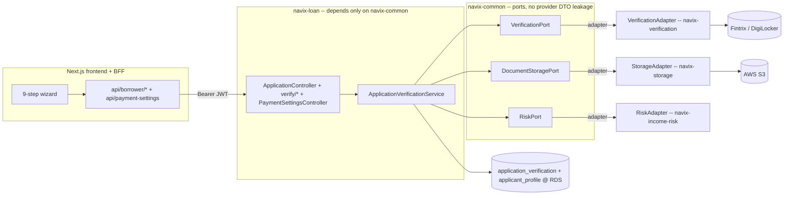

# NAVIX Finance — Production Migration, 9-Step Onboarding, Payment Settings & Agreements

## Context

NAVIX Finance's loan lifecycle (19-state aggregate, maker-checker, collections, repay/reborrow) is
built and wired end-to-end, but runs in **demo mode**: identity is injected via `X-Demo-Actor-*`
headers, the frontend is backed by an in-browser Zustand mock layer, and **every external integration
(Fintrix, DigiLocker, penny-drop, bureau) returns hardcoded data**. Documents are stored inline as
`bytea`, not S3.

This change takes the product to production: un-mock the **real Fintrix/DigiLocker APIs**, move
documents to **AWS S3 (presigned URLs)**, connect to **AWS RDS** (no Docker), build a **sequential
9-step verified onboarding wizard**, replace demo-header identity with **real JWT auth + Spring
Security**, and delete the mock layer. It also adds two product features the user supplied this
session: an **admin-editable company payment block (UPI QR image + payee account-info PDF + fields)**
shown to the borrower on the repay screen (replacing the hardcoded payee), and a **3-document
agreement consent step** the borrower must accept during onboarding.

**Intended outcome:** a salaried borrower completes 9 real verification steps + accepts the agreements;
the application becomes `KYC_PENDING` (the existing approver queue) with all artifacts (Aadhaar, salary
slip, selfie, API result codes) accessible to staff via short-lived S3 presigned GET URLs; staff admin
can edit the payment QR/account info; and no mock/demo code remains in the live path.

## Orientation for the implementing session (read first)

This plan is self-contained, but the repo's onboarding docs are the deeper source of truth — read
**`CLAUDE.md`** (full product + architecture overview), **`handoff.md`** (execution log), **`dfd.md`**
(authoritative state machine + roles), and for the integrations **`NAVIX_Fintrix_Integration_Flow.md`**,
**`Digilocker_API_Guide.md`**, **`AWS_Setup_Guide.md`** (+ the Postman collection in the repo for exact
request bodies). When `CLAUDE.md` and `dfd.md` disagree on the lifecycle, `dfd.md` wins — except the two
final product decisions: **salary-linked due date ≤ 40 days** and the **role names**.

**Develop on branch `claude/refine-local-plan-oxhiy9`** (create locally if missing); commit with clear
messages; push `-u origin <branch>`. Do **not** open a PR unless asked.

**Monorepo:** `backend/` = Spring Boot 3.4.1 / Java 21, Maven multi-module `com.navix`
(`navix-common` shared, `navix-loan` = the aggregate, `navix-app` = the only bootable module + Flyway
migrations + filters/security; `navix-verification`/`navix-storage`/`navix-income-risk`/`navix-iam` are
the integration/admin modules). `frontend/` = Next.js 15 App Router (`src/`), React 19, Tailwind, TS,
with a **BFF** under `src/app/api/*` (browser never calls Spring directly). **Money is integer paise
(`long`), HALF_UP** everywhere.

**Loan economics (canonical, `LoanMath`):** eligible limit = 25% of monthly salary floored to ₹100;
min loan ₹1,000; processing fee 10% + GST 18%-on-fee (both upfront, deducted from disbursal); interest
1%/day over actual tenure; late penalty 2%/day capped 30 days; due date = next salary credit ≤ 40 days;
single repayment. Borrower receives `principal − fee − GST`, repays `principal + interest` (+ penalty if
overdue). **SoD (maker ≠ checker) is mandatory**, enforced server-side via the `application_event` trail.

**Lifecycle entry path (the 9 steps target this):** `DRAFT → KYC_PENDING → KYC_APPROVED →
CREDIT_EXEC_PENDING → CREDIT_HEAD_PENDING → DISBURSEMENT_PENDING → ACCOUNTANT_PENDING → DISBURSED →
ACTIVE`. `KYC_PENDING` **is** the approver queue (the user's "PENDING_APPROVAL"); the 9 verification
steps + agreement run while `DRAFT` and `submit-kyc` flips `DRAFT → KYC_PENDING`.

**Run locally (no Docker — point at RDS):** build sibling jars first
(`cd backend && ./mvnw install -DskipTests`), then export creds + `NAVIX_ENV=dev AWS_PROFILE=navix-dev`
and `./mvnw -pl navix-app spring-boot:run` (Flyway auto-applies on RDS, Swagger at `/swagger-ui.html`);
frontend `cd frontend && npm install && npm run dev` (BFF reaches Spring via `BACKEND_BASE_URL`, default
`http://localhost:8080`). Tests: `./mvnw test` (unit, no Docker); Testcontainers IT via `-Pit`.
**Build caveats:** backend needs Java 21 (`JAVA_HOME`); `npm run build` static-prerender currently fails
at `/staff/admin/staff` (known Next 15 bug) — verify the frontend with `npx tsc --noEmit` + ESLint +
`npm run dev`, not `build`.

**AWS (account 382188661325, region ap-south-1, profile `navix-dev` = AdministratorAccess):**
RDS `navix-finance-dev` (PostgreSQL 18.3, SSL required, endpoint already in the SSM datasource URL);
S3 `navix-finance-bucket` (SSE-KMS `alias/navix-finance`, public access blocked, **CORS not yet set**);
RDS SG `sg-082443872704e48e4` (5432 currently allows only two office IPs — add this host); SSM params
present: `/navix/dev/spring/datasource/{url,username,password}` + `/navix/dev/navix/storage/{bucket,
kms-key-id}` (add the fintrix/digilocker creds in P0).

**Credentials mapping (no secrets committed — `.env` local, SSM SecureString runtime):** `.env` holds
`sandbox_username`/`sandbox_pass`; both providers share this pair and base
`https://admin.fintrix.tech/__api/api/v1/`. Map `sandbox_username → FINTRIX_CLIENT_ID = DIGILOCKER_CLIENT_ID`
and `sandbox_pass → FINTRIX_CLIENT_SECRET = DIGILOCKER_CLIENT_SECRET`. Verification APIs use **HTTP Basic**;
DigiLocker uses **`X-Client-ID`/`X-Client-Secret`** — both clients already built in `FintrixClientConfig`.

## Decisions locked with the user

1. **Salary / 25% cap** → declared salary + slip to S3 for approver review (no OCR API exists). Cap =
   25% floored to ₹100 via the risk authority.
2. **Selfie liveness** → call `vkyc_face_liveness` (presigned GET of the S3 selfie as `p_image`); fail →
   one retry → manual-review flag.
3. **Auth** → implement real JWT + Spring Security now. **Mobile OTP delivery stays mocked** (fixed code);
   only token issuance becomes real.
4. **AWS infra writes** → **Claude applies them directly** (the user authorised full AWS access via the
   `navix-dev` profile — RDS, S3, SG, CORS, SSM, KMS — so the flow needs no manual intervention). P0
   runs the exact commands in Appendix A (RDS SG ingress for the backend host, S3 CORS, SSM
   SecureString creds) before connectivity/E2E testing.
5. **RiskPort** → **introduce it** (this session): `navix-income-risk` becomes the single authority for
   risk grade + the 25% eligible-limit cap, resolving the `LoanMath` vs `LimitCalculator` duplication.
6. **Generic presign endpoints** → **leave the `StorageController` generic presign routes as-is** (do
   not restrict/remove). App-scoped upload/view routes are still added for the onboarding flow.
7. **Full-Aadhaar masking** → **out of scope this session**. `applicant_profile.aadhaar` keeps the V12
   plaintext+unique behavior; the "never store full Aadhaar" item stays deferred (Risks).
8. **New:** admin-editable payment block (QR + account-info PDF + payee fields) on repay; 3-document
   agreement consent in onboarding (the 3 PDFs + the QR jpeg + account-info PDF the user added locally
   are copied into the repo by the implementer — they are not yet pushed).

## Verified findings (confirmed against the code)

- **The 7 Fintrix/DigiLocker clients return hardcoded demo data** (`PanComprehensiveClient`,
  `DigiLockerClient` read directly — every method returns canned records, the injected `RestClient` is
  unused). Only the bodies need replacing. `FintrixClientConfig` already builds `fintrixRestClient`
  (Basic `base64(id:secret)`) + `digiLockerRestClient` (`X-Client-ID`/`-Secret`); `FintrixProperties`/
  `DigiLockerProperties` read `navix.fintrix.*`/`navix.digilocker.*`. TODOs note "add timeouts".
- **Ports are house style** — `LoanDirectory` (interface in `navix-common`) + `LoanDirectoryAdapter`
  (in `navix-loan/service`), wired by component scan; same for `StaffDirectory`/`SettlementDirectory`.
  **`navix-loan` depends only on `navix-common`** (verified `pom.xml`) → new ports in `navix-common`
  with adapters in the provider modules add **no new Maven edge**.
- **`DocumentStorageService` is real S3** — `presignUpload/presignDownload/store/exists/delete`,
  `buildKey(StorageCategory, filename)`. `StorageController` exposes `POST /api/storage/presign-upload`
  + `GET /api/storage/presign-download` (generic, currently unauthenticated — left as-is per decision 6).
- **`application.yml`** has the SSM import `optional:aws-parameterstore:/navix/${NAVIX_ENV:dev}/`,
  `spring.cloud.aws.region.static`, datasource defaulting to localhost, and `navix.fintrix.*` /
  `navix.digilocker.*` / `navix.storage.*` blocks reading env placeholders. The storage bucket default
  (`navix-finance-documents-dev`) is stale but **SSM overrides it at runtime** to `navix-finance-bucket`.
  DigiLocker base-url defaults to the Fintrix base — must be set explicitly in SSM.
- **Identity is BFF-side today.** `DemoActorFilter` (`@Order(HIGHEST_PRECEDENCE)`) reads
  `X-Demo-Actor-{Id,Name,Role}` → `ActorContext`; `SecurityConfig` is three `permitAll` chains.
  **Login is entirely in the Next.js BFF** (`api/auth/staff/login` resolves a role to a real seeded
  staff via `GET /api/staff`); **there is no backend auth controller, and `StaffUser` has no password
  column.** → P6 is net-new backend work (auth controller + `password_hash` migration + `JwtService`),
  not a swap.
- **The live onboarding never touches the integration modules.** The wizard → `live-journey.ts`
  `submitOnboarding` drives `navix-loan` only (create DRAFT → `PUT /profile` → `POST /documents` (bytea)
  → `POST /submit-kyc`). The 9-step automation is net-new wiring into the aggregate; `navix-kyc`/
  `navix-verification` machinery stays unused otherwise.
- **Repay page hardcodes the payee** (`repay/page.tsx`: UPI `navix.collections@hdfcbank`, bank
  `A/C 5010 0099 8877` / IFSC `HDFC0000123`) — the exact block the admin payment settings replace.
- **Frontend wizard** `(borrower)/signup/*` has 10 steps (`pan, mobile-otp, employment, salary, email,
  bank, financials(AA), co-applicant, address-proof, review`), Zustand scratch state + localStorage
  `navix.live.applicationId`. Cosmetic mock screens: `kyc/selfie`, `kyc/digilocker(+/callback)`,
  `loan/bank-verify`, `loan/documents` (e-sign). Mock layer to remove: `lib/mock/*`,
  `components/borrower/demo-bar.tsx`, `lib/config.ts` `demoMode`, hardcoded `DEMO_OTP`, legacy stub BFF
  routes (`api/loan`, `api/kyc/*`, `api/auth/route.ts`, `api/webhooks/fintrix`).
- **State machine:** `KYC_PENDING` **is** the approver queue (= "PENDING_APPROVAL"). The 9 steps run
  while `DRAFT`; `submit-kyc` flips `DRAFT → KYC_PENDING` once all required checks are PASS/REVIEW.

## Conflicts surfaced (and how this plan resolves them)

| Task prompt said | Reality | Resolution |
|---|---|---|
| Fintrix uses `X-Client-ID`/`Secret` | Verification APIs use **Basic**; only DigiLocker uses X-Client | Wire both from the same `sandbox_*` pair → `FINTRIX_*` / `DIGILOCKER_*` |
| Step 7 parse salary slip | No OCR/parse API | Declared salary + slip→S3 for approver |
| Step 9 "records only" | — | Call `vkyc_face_liveness` (decision 2) |
| RDS PostgreSQL 16 | RDS is **18.3** | Compatible; note drift |
| Step 4 "init→list→check→download" | DigiLocker is **redirect + poll** | init → open URL → poll until `completed` → list → download/xml |
| Account-Aggregator "financials" step | No AA/bank-statement API | Remove the `financials` wizard step |
| Docs `LMS_Master…`/`…Completion_Handoff` | Don't exist | Use the real docs (`NAVIX_Fintrix_Integration_Flow.md`, `Digilocker_API_Guide.md`, `AWS_Setup_Guide.md`, `handoff.md`, `dfd.md`) |

## Architecture



- **Three ports in `navix-common`** (mirroring `LoanDirectory`), adapters wired by component scan from
  `navix-app`; **no new Maven edges**, no provider DTOs on the loan classpath:
  - `verification.VerificationPort` + neutral result records (`PanCheck`, `EmailCheck`, `AddressCheck`,
    `BureauCheck`, `PennyDropCheck`, `DigiLockerSession/Status`, `AadhaarResult`, `FaceLivenessCheck`)
    — adapter `VerificationAdapter` in `navix-verification` maps `FintrixDtos`/`DigiLockerDtos` → neutral.
  - `storage.DocumentStoragePort` (`buildApplicationKey`, `presignUpload`, `presignDownload`, `store`,
    `exists`) — adapter `StorageAdapter` in `navix-storage` delegating to `DocumentStorageService`.
  - `risk.RiskPort` (grade + `eligibleLimitPaise`) — adapter in `navix-income-risk`; the single
    authority for grade + 25% cap (kills the `LoanMath`/`LimitCalculator` duplication).
- **Single aggregate preserved.** Verification data hangs off `loan_application`, not `navix-kyc`.
  New table `application_verification` keyed `UNIQUE(application_id, check_type)` (the idempotency key).
- **Steps run while `DRAFT`** — no new pre-KYC state; rows accumulate on the DRAFT app; `submit-kyc`
  gates on all required checks PASS/REVIEW **and agreement consent**, then flips `DRAFT → KYC_PENDING`.
- **S3 for documents/images.** `application_document` gains `s3_object_key` (`data bytea` → nullable;
  invariant = exactly one of the two). Browser uploads (salary slip, selfie) use **presigned PUT**;
  DigiLocker Aadhaar is ingested **server-side** (`store`, bytes never touch the browser); approver
  views use **presigned GET** (short TTL).
- **Idempotency.** A step already `PASS` returns the stored result without re-calling Fintrix; each
  external call sends `client_ref_num = "navix-{appId}-{checkType}"`.
- **Auth.** `JwtAuthFilter` (replaces `DemoActorFilter`) validates an HS256 JWT (`AUTH_SECRET`) from
  `Authorization: Bearer` and populates `ActorContext`. Two audiences — staff (subject=staffId, role)
  and borrower (subject=applicantId). The BFF stores the backend-issued JWT in the existing httpOnly
  cookies and forwards it as a bearer; it stops injecting `X-Demo-Actor-*`.

## Phased plan

```
P0 config/RDS/S3 ─► P1 un-mock clients ─► P2 persistence+ports+RiskPort ─► P3 verify endpoints ─┐
                                                                                                 ├─► P5 frontend 9-step + agreements
                                                                          P4 S3 docs ────────────┘            │
                                                                                                              ▼
                                                                              P6 real JWT auth ─► P7 remove mock + approver enrichment
                                                                              P8 admin payment settings + repay (parallel to P3+)
```
Ordering keeps the app bootable at every step: infra first, un-mock behind the still-demo identity, then
persistence/endpoints, then S3, then the frontend rebuild, then swap identity to JWT, then delete mocks.

### P0 — Config, credentials, connectivity *(Claude runs the AWS writes — Appendix A)*
- **Claude applies the AWS infra writes itself** (full `navix-dev` access): RDS SG ingress for the
  backend host IP on 5432 (`sg-082443872704e48e4`), S3 bucket CORS on `navix-finance-bucket`
  (`PUT/GET/HEAD` from `http://localhost:3000` + deployed origin, `ExposeHeaders:[ETag]`), and the SSM
  SecureString creds. Adjust RDS/S3 freely (e.g. widen ingress, tweak CORS/KMS) so the flow needs no
  manual step. **Discover the live host egress IP** at run time (e.g. `curl -s https://checkip.amazonaws.com`)
  rather than hardcoding `223.190.82.3`.
- Put Fintrix/DigiLocker creds in **SSM SecureString** (KMS `alias/navix-finance`):
  `/navix/dev/navix/fintrix/{client-id,client-secret}` + `/navix/dev/navix/digilocker/{…}` (same
  `sandbox_*` pair). Set `/navix/dev/navix/digilocker/base-url` explicitly. Locally export from `.env`:
  `FINTRIX_CLIENT_ID=$sandbox_username`, `…SECRET=$sandbox_pass`, `DIGILOCKER_*` same pair,
  `NAVIX_ENV=dev AWS_PROFILE=navix-dev`.
- **Verify:** `curl :8080/actuator/health` → `UP` (RDS via SSM, no Docker); Flyway applies V1–V14 on
  RDS; presign round-trip (`POST /api/storage/presign-upload` → PUT a file → object in bucket).
- Files: `backend/navix-app/src/main/resources/application.yml` (confirm SSM keys), `.env`.

### P1 — Un-mock the 7 Fintrix/DigiLocker clients
- Replace each hardcoded body in `navix-verification/.../client/*.java` with a real call on
  `fintrixRestClient` (Basic) / `digiLockerRestClient` (X-Client), using the request bodies from the
  Postman collection + integration docs, mapping responses into `FintrixDtos`/`DigiLockerDtos`. Add
  per-call timeouts (the `FintrixClientConfig` TODO), non-2xx → typed error, `client_ref_num`/`remark`.
- `BureauService`: keep Experian-primary → CRIF-fallback (trigger on no-record/missing-score/source-down)
  → one `UnifiedBureauReport`.
- `DigiLockerClient`: implement **redirect+poll** (init returns `client_id`+`url`; poll status until
  `completed`; list; `document`/`aadhar_xml`); persist `client_id` per application.
- **PII discipline:** never log bodies; mask PAN/Aadhaar/mobile in structured logs.
- **Verify:** per-client unit tests (mock `RestClient`) + a **profile-guarded live sandbox smoke test**
  (one real call each to `pan_comprehensive`, `cv_email_verification`, `ent_address_verification`,
  `verification_pennydrop`, `individual_experian`) so CI stays offline.

### P2 — Verification persistence + ports + RiskPort *(navix-loan + navix-common + adapters)*
- **Flyway `V15__application_verification_and_s3.sql`:** table `application_verification(id,
  application_id, check_type, status, provider, provider_txn_id, client_ref_num, name_match, score,
  s3_object_key, raw_response jsonb, derived jsonb, message, created_at, updated_at,
  UNIQUE(application_id, check_type))` + index on `application_id`; plus
  `alter table application_document add column s3_object_key varchar; alter column data drop not null`.
  `jsonb` maps natively on Hibernate 6 / Boot 3.4.1 via `@JdbcTypeCode(SqlTypes.JSON)` — no new dep.
- **Flyway `V16__applicant_profile_verification_fields.sql`:** add derived columns to
  `applicant_profile`: `bureau_score bigint`, `bureau_source varchar`, `risk_category varchar`,
  `pan_verified bool`, `aadhaar_linked bool`, `email_verified bool`, `address_verified bool`,
  `penny_drop_verified bool`, `name_match_score numeric`, `digilocker_client_id varchar`,
  `agreement_accepted bool`. (Aadhaar/PAN stay masked on read; full-Aadhaar masking deferred — Risks.)
- **Ports + adapters:** `VerificationPort` + `DocumentStoragePort` + `RiskPort` in `navix-common`;
  `VerificationAdapter` (navix-verification), `StorageAdapter` (navix-storage), `RiskAdapter`
  (navix-income-risk). Mirror `LoanDirectory`/`LoanDirectoryAdapter`.
- **Service `ApplicationVerificationService` (navix-loan)** — `runOnce(appId, checkType, args)`: return a
  stored `PASS` without re-calling (resume DigiLocker `PENDING` via stored `provider_txn_id`); else call
  `VerificationPort`, compute `name_match`/`score`/`derived`, upsert the row (deterministic
  `client_ref_num`), store any doc via `DocumentStoragePort`. Update `applicant_profile` derived fields;
  run the **identity cross-match** (PAN name/DOB vs Aadhaar XML vs penny-drop name → `name_match_score`;
  below threshold → REVIEW, not hard FAIL); expose `allRequiredPassed(appId)` / `summary(appId)`.
  Eligible limit from declared salary via **`RiskPort`** (authoritative).
- **Entity/repo:** `ApplicationVerification` + repository (`findByApplicationIdAndCheckType`,
  `findByApplicationId`) in navix-loan.
- **Verify:** unit tests for idempotency (second call returns stored), cross-match scoring, and
  submit-kyc gating (all required PASS/REVIEW + agreement accepted → allowed; any FAIL → blocked).

### P3 — Backend onboarding + agreement endpoints
New `BORROWER` endpoints on `ApplicationController` (`/api/applications/{id}/verify/*`), each returning a
per-step result DTO and persisting via `ApplicationVerificationService`:
- `POST …/verify/email {officialEmail}` → `cv_email_verification` (profile name + employer).
- `POST …/verify/address {lat,long}` (or `{manualAddress}` fallback) → `ent_address_verification`.
- `POST …/verify/digilocker/init` → `{redirectUrl,clientId}`; `GET …/verify/digilocker/status` → poll;
  `POST …/verify/digilocker/complete` → list + download Aadhaar to S3 + `aadhar_xml` parse.
- `POST …/verify/pan {pan}` → `pan_comprehensive` (sets `aadhaar_linked`, masked Aadhaar).
- `POST …/verify/bureau` → Experian→CRIF; store raw + derived score; **never returned to borrower**.
- `POST …/verify/salary {monthlySalaryPaise, slipObjectKey}` → store declared salary + slip key; compute
  provisional limit via `RiskPort`.
- `POST …/verify/penny-drop {accountNumber, ifsc}` → `verification_pennydrop` (name-match gate).
- `POST …/verify/selfie {selfieObjectKey}` → presign GET → `vkyc_face_liveness`; pass/fail/retry.
- `POST …/verify/agreement {versions[]}` → record agreement consent (sets
  `applicant_profile.agreement_accepted` + an `AGREEMENT_CONSENT` verification row with the doc
  versions/timestamp for audit).
- Harden `POST /{id}/submit-kyc` (`ApplicationFlowService`): require mandatory checks PASS/REVIEW **and**
  agreement consent before `DRAFT → KYC_PENDING`.
- **Verify:** Testcontainers integration walking DRAFT → all verify steps → agreement → submit-kyc →
  KYC_PENDING; idempotent re-POSTs.

### P4 — S3 document migration
- Schema ships in **V15** (above). App invariant: exactly one of `data` / `s3_object_key`.
- Add **`DocumentStorageService.buildApplicationKey(applicationId, docType, ext)`** →
  `applications/{application_id}/{document_type}/{timestamp}.{ext}` (a dedicated method — don't overload
  the `StorageCategory` enum; keep `buildKey` for repayment/collections artifacts). Surface it on
  `DocumentStoragePort`.
- **Browser uploads (salary slip, selfie):** app-scoped `POST /{id}/verify/presign-upload` (ownership-
  checked) → PUT to S3 → the verify/salary & verify/selfie calls carry the key → backend `headObject`
  confirms before recording. (The generic `StorageController` presign routes stay as-is — decision 6.)
- **Server-side ingest (DigiLocker Aadhaar):** backend fetches the Fintrix 10-min `download_url`,
  `DocumentStorageService.store(...)`, records the key (bytes never reach the browser).
- **Approver view:** documents returned as **presigned GET URLs** via app-scoped
  `GET /{id}/documents/{docId}/url` (short TTL — ~5 min for Aadhaar/selfie via `NAVIX_S3_PRESIGN_TTL`).
- Migrate `ApplicantReviewService.addDocument`/`getDocument` to write/read S3 keys (keep a bytea
  read-only fallback for any pre-existing rows).
- **Verify:** presigned PUT then approver presigned GET round-trip; objects under the required key prefix
  + KMS-encrypted; no document bytes flow through the backend on download.

### P5 — Frontend onboarding rebuild (9 steps) + agreements
- Restructure `(borrower)/signup/*` to: `mobile-otp → email → address → digilocker → pan →
  bureau(auto, no input) → salary → penny-drop → selfie → review`. Remove `financials`(AA). Collect
  **employer** before email (input for email verify); keep **co-applicant** conditional (post-bureau,
  only when risk demands) — else hidden.
- Make cosmetic pages real, each calling the new BFF `/verify/*` routes with live result/error states:
  `kyc/digilocker(+/callback)` (init→open url→poll→complete), `kyc/selfie` (camera→presigned PUT→
  `verify/selfie`, retry on fail), `loan/bank-verify` (penny-drop name-match), address (browser
  Geolocation→`verify/address`, manual fallback), salary (declared amount + slip presigned PUT).
- **Agreements:** turn `loan/documents` into a real **consent step** before submit — render the 3
  agreement PDFs (copied to `frontend/public/legal/agreement-{1,2,3}.pdf`) with an "I have read &
  agree" checkbox; on accept call `verify/agreement`; block `review→submit` until accepted.
- BFF: the catch-all `api/borrower/applications/[[...path]]` already proxies `/verify/*`; add a small
  **presign proxy** `api/borrower/storage/presign-*` injecting the session.
- Persist wizard progress to the backend DRAFT (the `application-store.ts` TODO) and drive step gating
  off the persisted verification statuses so steps survive reloads.
- **Verify:** `npx tsc --noEmit` + ESLint clean; manual E2E (`npm run dev` + backend on RDS + real
  Fintrix sandbox) walking all 9 steps + agreement → `KYC_PENDING`.

### P6 — Real auth (JWT + Spring Security) *(net-new backend — no auth controller exists today)*
- **Backend:** `JwtService` (sign/verify HS256 with `AUTH_SECRET`) + `JwtAuthFilter` (replaces
  `DemoActorFilter`) reads the bearer token → populates `ActorContext`. Rewrite `SecurityConfig`:
  borrower chain requires a borrower token; staff chain requires a staff token + role; storage download
  authenticated; actuator/swagger as needed.
- **Flyway `V17__staff_password.sql`:** add `staff_user.password_hash varchar` (nullable). Seed an
  initial ADMIN with a BCrypt hash (replaces demo role-pick).
- **New `AuthController` (navix-iam or navix-app):** `POST /api/auth/staff/login {email,password}` →
  BCrypt verify vs `StaffUser` → staff JWT; invites set a password on `…/accept`.
  `POST /api/auth/borrower/login {mobile,otp}` — **OTP stays mocked** (fixed code) → borrower JWT
  carrying `applicantId`. (Login is **moved from the BFF into the backend**; the BFF login routes now
  call these.)
- **BFF:** store the issued JWT in `navix_staff`/`navix_borrower` httpOnly cookies; forward as
  `Authorization: Bearer`; **stop** injecting `X-Demo-Actor-*`. `AuditingConfig`/`ActorContext` keep
  working (now fed by JWT claims).
- **Verify:** unauthenticated business calls → 401; wrong-role → 403/`FORBIDDEN_ROLE`; SoD intact;
  staff/borrower token namespaces don't cross; integration tests updated to mint test tokens.

### P7 — Remove the demo/mock layer + approver enrichment
- **First rewire live imports off the mock layer** (or the build breaks): `lib/api/live-journey.ts`
  imports `signOutBorrower` from `@/lib/mock/session` and types from `@/lib/mock/borrower` — replace with
  real session helpers + real types **before** deleting. Move the wizard's Zustand scratch use to
  `react-hook-form`/local state.
- Then delete `frontend/src/lib/mock/*`, `components/borrower/demo-bar.tsx`, `lib/config.ts` `demoMode`,
  hardcoded `DEMO_OTP`, and the legacy stub BFF routes (`api/loan`, `api/kyc/*`, `api/auth/route.ts`,
  `api/webhooks/fintrix`). Set `NEXT_PUBLIC_DEMO_MODE=false`, then remove the flag once unreferenced.
- **Backend:** delete `DemoActorFilter`; make `V10__seed_demo_staff.sql` dev-only and archive
  `scripts/populate-demo-data.ps1` out of the shipped path.
- **Approver enrichment:** extend the KYC-approver view (`staff/kyc-approvals` +
  `components/staff/live-pipeline.tsx`) with a **verification card per step** (status + provider txn id +
  key derived fields) and **presigned-GET links** to Aadhaar/salary-slip/selfie. The Phase-3/4 handoff =
  the `application_verification` rows + S3 keys already on the application.
- **Verify:** grep shows no `lib/mock`, `demoMode`, `DEMO_OTP`, `X-Demo-Actor` in the live path; build +
  lint clean; approver opens every artifact via short-lived presigned URLs.

### P8 — Admin payment settings (QR + account info) + borrower repay *(parallel; depends on P4 S3)*
- **Backend (navix-iam, modeled on `BlocklistController`/`StaffController`):**
  - **Flyway `V18__payment_settings.sql`:** singleton table `payment_settings(id, upi_id, account_name,
    account_number, ifsc, bank_name, qr_object_key, account_info_object_key, updated_by, updated_at)`,
    seeded with one row from the current hardcoded values.
  - `PaymentSettings` entity + repository; `PaymentSettingsController`:
    `GET /api/payment-settings` (any authenticated actor — borrower repay + admin read; returns the
    fields + **presigned GET URLs** for the QR image and account-info PDF via `DocumentStoragePort`),
    `PUT /api/payment-settings` (**ADMIN** — update fields + `qr_object_key`/`account_info_object_key`).
    Admin uploads the QR/PDF via the generic `StorageController` presign-upload (kept open, decision 6),
    then PUTs the keys.
- **Frontend:**
  - New admin page `staff/admin/payment-settings` — edit UPI/account/IFSC/bank fields + upload **QR
    image** + **account-info PDF**; gated to ADMIN (`customer:manage`). Add to the Administration nav.
  - **Repay page** (`(borrower)/repay/page.tsx`): replace the hardcoded payee block
    (`navix.collections@hdfcbank` / `A/C 5010…`) with a fetch of `GET /api/payment-settings` — show the
    **QR ``** for the UPI method and the **account fields + a download link to the account-info
    PDF** for bank transfer.
  - BFF: new `api/payment-settings` proxy (borrower GET + admin PUT through the staff session).
  - Seed assets: copy the user-supplied QR jpeg + account-info PDF into the repo (or upload once) as the
    initial `payment_settings` row's objects.
- **Verify:** admin edits + uploads QR/PDF → borrower repay shows the new QR + account info via presigned
  GET; `tsc --noEmit` + ESLint clean.

## Standing constraints (throughout)
- **Integer paise** for all money; backend is the authority (no client-side financial math drives decisions).
- **S3 keys** `applications/{application_id}/{document_type}/{timestamp}.{ext}`; presigned PUT upload,
  presigned GET download (never stream document bytes through the backend on download); short TTLs for
  sensitive docs.
- **Idempotency** on every external + money op via `client_ref_num`/txn refs + `UNIQUE(application_id,
  check_type)`.
- **No secrets** in source/logs/responses — `.env` (local) + SSM SecureString (runtime).
- **No PII in logs**; mask PAN/Aadhaar/mobile. Risk grade / credit score **never shown to the borrower**.

## Verification strategy (end-to-end)
1. **Infra:** health `UP` against RDS; Flyway V1–V18 apply on RDS; presign PUT/GET round-trip to `navix-finance-bucket`.
2. **Integrations:** per-client unit tests + guarded live sandbox smoke per Fintrix call.
3. **Orchestration:** unit tests for idempotency, cross-match, submit-kyc gating (incl. agreement).
4. **E2E onboarding:** `npm run dev` + backend on RDS + real Fintrix sandbox → 9 steps + agreement → `KYC_PENDING` with verification rows + S3 docs.
5. **Approver:** staff sees verification cards + opens each artifact via presigned GET.
6. **Payment settings:** admin edits/upload → borrower repay shows new QR + account info.
7. **Auth:** 401/403 matrix; SoD intact; token namespaces isolated.
8. **Mock removal:** repo grep clean; `tsc --noEmit` + ESLint + backend unit/Testcontainers green.

## Risks & open items
- **Sandbox vs prod creds** — confirm `sandbox_*` are the creds to ship; sandbox responses are thin
  (Experian "No record found", score 8) — test against real PANs where the contract allows.
- **DigiLocker redirect UX** — needs a reachable `redirect_url` (frontend callback) + polling window;
  validate mobile webview. Base-url defaults to Fintrix base — set explicitly in SSM.
- **Identity cross-match thresholds** — name fuzzy-match cutoffs are a credit-policy call; start
  permissive → REVIEW (not hard-fail); approver decides.
- **PG18 vs 16** — version drift from docs; compatible.
- **RDS public access + IP allow-list** — dev convenience; tighten for prod (private subnets + task SG).
- **Auth scope (P6)** — sizable; if timelines slip it can ship after P5 (the header seam still works
  until then). Plan keeps it in scope this phase per decision 3.
- **Full Aadhaar still stored** — `applicant_profile.aadhaar` keeps the V12 plaintext+unique behavior
  (masking deferred per decision 7); revisit before prod.
- **`raw_response` PII** — minimise/scrub PII before persisting the audit `jsonb`; keep Aadhaar/selfie
  presign TTLs short (~5 min); fetch the DigiLocker 10-min `download_url` server-side immediately.
- **User-supplied assets** (QR jpeg, account-info PDF, 3 agreement PDFs) live on the user's local
  machine and aren't pushed — the implementer copies them into the repo (`public/legal/*` for
  agreements; seed the QR/PDF into `payment_settings`).

## Appendix A — AWS commands Claude runs in P0 (full `navix-dev` access)
```bash
export AWS_PROFILE=navix-dev AWS_REGION=ap-south-1
# 1) RDS ingress for the backend host — discover the live egress IP, don't hardcode
HOST_IP="$(curl -s https://checkip.amazonaws.com)"
aws ec2 authorize-security-group-ingress --group-id sg-082443872704e48e4 \
  --protocol tcp --port 5432 --cidr "${HOST_IP}/32"
# 2) S3 bucket CORS (browser presigned PUT/GET)
aws s3api put-bucket-cors --bucket navix-finance-bucket --cors-configuration '{
  "CORSRules":[{"AllowedHeaders":["*"],"AllowedMethods":["PUT","GET","HEAD"],
  "AllowedOrigins":["http://localhost:3000","https://YOUR_FRONTEND_DOMAIN"],
  "ExposeHeaders":["ETag"],"MaxAgeSeconds":3000}]}'
# 3) Fintrix/DigiLocker creds → SSM SecureString (real values from .env)
aws ssm put-parameter --type SecureString --key-id alias/navix-finance \
  --name /navix/dev/navix/fintrix/client-id --value "$sandbox_username"
aws ssm put-parameter --type SecureString --key-id alias/navix-finance \
  --name /navix/dev/navix/fintrix/client-secret --value "$sandbox_pass"
# (repeat for /navix/dev/navix/digilocker/{client-id,client-secret} — same pair; and .../base-url)
```

## Critical files (by phase)
- **Un-mock (P1):** `backend/navix-verification/.../client/*.java`, `.../service/BureauService.java`,
  `.../config/FintrixClientConfig.java`.
- **Persistence/ports (P2):** `backend/navix-common/.../{verification,storage,risk}/*Port.java` (+ result
  records), `navix-verification/.../VerificationAdapter.java`, `navix-storage/.../StorageAdapter.java`,
  `navix-income-risk/.../RiskAdapter.java`, `navix-loan/.../service/ApplicationVerificationService.java`,
  `navix-loan/.../entity/ApplicationVerification.java`, migrations `V15`,`V16`.
- **Endpoints (P3):** `navix-loan/.../controller/ApplicationController.java` (+ DTOs),
  `.../service/ApplicationFlowService.java` (submit-kyc gating).
- **S3 (P4):** `navix-storage/.../service/DocumentStorageService.java` (`buildApplicationKey`),
  `navix-loan/.../service/ApplicantReviewService.java`.
- **Frontend (P5):** `frontend/src/app/(borrower)/signup/*`, `.../kyc/{selfie,digilocker}`,
  `.../loan/{bank-verify,documents}`, `frontend/src/lib/api/{live-journey,applications}.ts`,
  `frontend/src/stores/application-store.ts`, `frontend/src/app/api/borrower/*`,
  `frontend/public/legal/agreement-{1,2,3}.pdf`.
- **Auth (P6):** `navix-app/.../config/{SecurityConfig.java, DemoActorFilter→JwtAuthFilter}`, new
  `JwtService`, new `AuthController` + `navix-iam` staff login, migration `V17`, `frontend/src/app/api/auth/*`.
- **Remove (P7):** `frontend/src/lib/mock/*`, `components/borrower/demo-bar.tsx`,
  `lib/config.ts`(demoMode), legacy `frontend/src/app/api/{loan,kyc,auth,webhooks}` stubs,
  `components/staff/live-pipeline.tsx` (approver cards).
- **Payment settings (P8):** `navix-iam/.../{entity/PaymentSettings.java, controller/PaymentSettingsController.java}`,
  migration `V18`, `frontend/src/app/staff/admin/payment-settings/page.tsx`,
  `frontend/src/app/(borrower)/repay/page.tsx`, `frontend/src/app/api/payment-settings/*`.