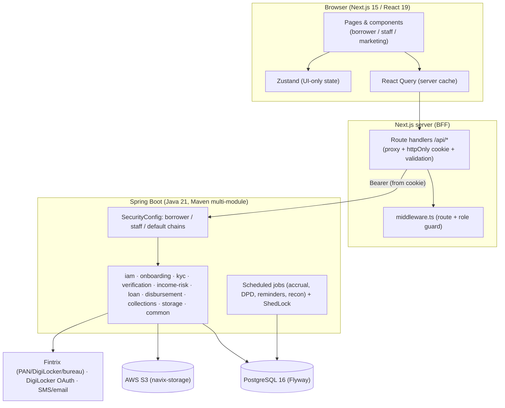

# NAVIX Finance — Project Completion Handoff

> **Purpose:** a single, execute-against plan to take NAVIX Finance from its current state (high-quality scaffold + fully-clickable mock UI) to a **production-complete** system.
> **One unified plan** — frontend and backend together, under one set of conventions ("the theme", §3).
> **Read alongside:** the verified progress audit (the source of truth for *current* status) and `NAVIX_Finance_Product_Flow.md` (product rules).

| | |
|---|---|
| **Version** | 1.0 (completion handoff) |
| **Current state** | FE ~90% UI (100% demo mode, not wired) · BE scaffolding 100%, **business logic ~5%** · 21 tables, 0 rows · no auth · no tests · no live integrations |
| **Target** | Production-grade, regulated-lending-ready, fully wired FE↔BE, tested, observable, deployed |
| **Stack** | Next.js 15 / React 19 / TS / Tailwind / Zustand / React Query · Spring Boot (Java 21) Maven multi-module · PostgreSQL 16 / Flyway · AWS S3 · Fintrix + DigiLocker |
| **Status reality** | Nothing is live. Backend **boots**, but every business endpoint returns **500** (services throw `UnsupportedOperationException`). Only `/actuator/health`, Swagger, and (with AWS) `/api/storage/*` work. |

---

## 0. Orientation — read this first

The project is a **high-quality skeleton with a fully-functional mock**. The remaining work is, in order of mass:

1. **Backend business logic** — almost every service throws `UnsupportedOperationException("Not implemented yet")`. This is the single biggest block of work (§5).
2. **Authentication & authorization** — none is enforced; all Spring chains are `permitAll`. Nothing is safe until this exists (§5.2).
3. **FE↔BE wiring** — the frontend runs 100% on an in-browser mock; the BFF route handlers return `501`. Flip demo→live behind a flag, implement the BFF, replace mock reads with real calls (§6).
4. **Live integrations** — Fintrix (PAN/Aadhaar/bureau), DigiLocker OAuth, penny-drop, OTP/SMS, email, S3 bucket — all stubbed/unprovisioned (§5.4, §9).
5. **The production-grade layer that isn't in the audit yet** — daily accrual, audit/maker-checker trail, idempotency, PII encryption, RBI compliance artifacts, NBFC/lender model, observability, jobs, tests (§7).

**Two assets already act as the spec — use them:**
- **`frontend/src/lib/calc/loan-math.ts`** is the *correct* economic spec (fee, GST, net, daily interest, salary-linked due date, penalty). **Port it server-side and make the backend the source of truth** (§5.7).
- **The mock mutators** (`decideKyc, assignExecutive, recommend, decideCredit, releaseDisbursement, confirmTransfer`, collections + admin actions) are the *behavioral contract* for the workflow. Every mutator must have a backend endpoint + service behind it (Appendix A).

**Prime directives for whoever executes this:**
- The **backend is the source of truth** for money, state, eligibility, and decisions. The FE never computes anything authoritative; it displays what the BE returns.
- **Money is integer paise** end-to-end. No floating-point money math anywhere.
- **Every state-changing action is authorized, validated, idempotent, and audited.**
- **Don't collapse separation of duties** — the same person may not perform two maker-checker steps (§5.8).
- **Demo mode must never ship to production** (§6.4).

---

## 0.1 Current working mode (demo-first) — staff side included

> **This overrides the sequencing in §4 for the current phase.** Per current direction, NAVIX stays in **demo mode** for now, and that **includes the staff side**. Real authentication and live data are a later, explicit **go-live** phase — not now.

**Keep all data demo.** Both the **borrower** portal *and* the **staff** portal continue to run against the existing in-browser Zustand mock (`useMockDb` + `localStorage`). Do **not** switch to live backend data yet.

**Staff side is in scope and stays demo.** It is already built and clickable in the mock and remains so — including:
- KYC approvals queue + decisions
- Credit queue + per-application review (assign → recommend → decide)
- Disbursement release + accounting (transfer) confirmation
- Collections: DPD buckets, case detail, settlements / revised plans
- Admin: staff management, invites, blocklist
- Role-based staff navigation

(The staff workflows are specified throughout this handoff — IAM §5.2, the credit/disbursement maker-checker chain §5.8, collections §5.9, and the endpoint matrix in Appendix A — but for **now** they run on the **mock**, not real services.)

**No real authentication for now.** Do **not** make real auth API calls yet — no staff JWT login, no borrower OTP token, no cookie/BFF auth. Keep the current demo session:
- *Frontend:* keep the existing mock session + role selection (`lib/auth/session.ts` + the mock) so you can act as any staff role or as a borrower.
- *Backend (only if/when you build logic):* keep `SecurityConfig` **permissive in a `demo` profile** and resolve the acting user from a simple **`CurrentActor`** source (a request header or the demo session) instead of a verified token — so **separation-of-duties and audit still work in demo** without real login.

**You can still (optionally) do now, without real auth:** build and validate **backend business logic** (loan economics, risk/limit, the approval chain, DPD/collections) and wire individual screens to it behind the demo flag — just drive identity from the demo `CurrentActor`, not real login.

**Deferred to "go-live" (explicitly not now):** real authentication (staff JWT + borrower OTP + httpOnly-cookie BFF, §3.3 / §5.2), enforcing the real Spring Security chains (replacing `permitAll`), and flipping data from mock → live (§6). In §4, treat **P1 (auth)** and **P9 (demo→live)** as the go-live phase.

> **Net:** keep the UI — **borrower *and* staff** — on demo data, use a demo identity instead of real login, and add real auth + live data later as a dedicated go-live phase.

---

## 1. Definition of "complete" (production-grade target)

The project is complete when all of the following are true. Treat this as the acceptance bar.

**Functional**
- Every borrower journey works against the real backend: signup + OTP → KYC (PAN/Aadhaar/DigiLocker/selfie) → income & risk → eligibility & limit → 3-step loan take (amount + e-sign agreement/sanction/KFS → penny-drop → manual transfer) → active loan → manual repayment (full/partial/prepay) → closure → re-loan/offers.
- Every staff workflow works: KYC approval → credit assignment/recommendation/decision → disbursement release → accountant confirmation → collections (DPD buckets, assignment, activity+proof, settlement/revised-plan with Head approval) → admin (staff, invites, blocklist).
- All economics match the spec exactly (25% cap, 10% fee + 18% GST, 1%/day interest, salary-linked due ≤ ~40d, prepayment, 2%/day penalty capped 30d).

**Security & compliance**
- Authentication enforced on every non-public endpoint (staff JWT, borrower OTP-token); RBAC + separation-of-duties enforced server-side; BFF uses httpOnly cookies (no tokens in browser JS).
- PII encrypted at rest and masked in responses/logs; immutable audit + maker-checker trail for every decision.
- RBI digital-lending artifacts present (KFS, consent records, cooling-off, grievance), and the **lender-of-record / NBFC model is decided and reflected**.

**Reliability & operations**
- Daily accrual + DPD + status transitions run reliably (scheduled, idempotent); webhooks verified + idempotent; reconciliation in place.
- Observability: structured logs, metrics, health/readiness, alerts. Backups/PITR. CI/CD with tests + security scan gating deploys.

**Quality**
- Test pyramid exists and passes (BE unit + integration via Testcontainers; FE unit + Playwright E2E; money-path tests). Seed/fixtures for dev. No `UnsupportedOperationException` remains in any code path that an endpoint can reach.

**Done = all boxes in §13 checked.**

---

## 2. Target architecture (unified)

**Boundaries & responsibilities**
- **Browser** renders and holds only UI state (Zustand) and server cache (React Query). It never holds tokens or computes authoritative values.
- **Next.js BFF (route handlers)** is the only thing the browser calls. It authenticates via an **httpOnly cookie**, attaches the bearer token, validates input (Zod), shapes responses, and proxies to Spring. Secrets stay server-side.
- **Spring Boot** owns all business logic, money math, state machines, decisions, persistence, integrations, and scheduled jobs. It is the **source of truth**.
- **Module map (actual names):** `iam` (staff identity, RBAC, invites, blocklist, **auth**) · `onboarding` (borrower, co-applicant, signup, **OTP**) · `kyc` (cases, checks, DigiLocker sessions) · `verification` (Fintrix/DigiLocker clients — anti-corruption layer) · `income-risk` (income profile, risk scoring, **limit**) · `loan` (application, loan, payments, **economics + accrual**) · `disbursement` (maker-checker approval chain, penny-drop gate, accountant confirm) · `collections` (DPD, cases, interactions, settlements) · `storage` (S3) · `common` (audit base, `ApiResponse`, masking).

---

## 3. Cross-cutting standards (the theme both sides obey)

These conventions are the "theme" applied identically across frontend and backend. Every feature must conform.

| # | Standard | Rule |
|---|----------|------|
| 3.1 | **Money** | Integer **paise** everywhere (DB `BIGINT`, Java `long`/`BigDecimal`, TS `number` as paise). Round **half-up** to the paisa. **Backend computes; frontend displays.** `loan-math.ts` becomes display-only (ideally reads BE-returned quotes). |
| 3.2 | **API contract** | All responses use `ApiResponse<T>` (already in `navix-common`). Errors carry a stable shape `{code, message, fieldErrors, requestId}` and correct HTTP status (400 validation, 401 auth, 403 RBAC/SoD, 404, 409 idempotency/conflict, 422 business rule, 429 rate-limit, 500). Add a `@RestControllerAdvice` global handler (today there is none — stubs leak 500s). |
| 3.3 | **Auth/session** | Backend issues JWTs (staff + borrower); the **Next BFF stores them in an httpOnly, Secure, SameSite cookie** and forwards `Authorization: Bearer` to Spring. Tokens never reach browser JS. Support **revocation** via `token_version`. CSRF protection on cookie-authenticated BFF mutations. |
| 3.4 | **RBAC + SoD** | Authorize by role/permission server-side (`@PreAuthorize`); the **`SeparationOfDutiesGuard` enforces actor-uniqueness** across maker-checker steps (recommend ≠ credit-approve ≠ release ≠ confirm). UI gating is convenience only. |
| 3.5 | **State machines** | Loan and disbursement lifecycles are explicit, **server-enforced** state machines; illegal transitions are rejected; each transition writes an audit event. (Disbursement chain states are already named — §5.8.) |
| 3.6 | **Idempotency** | Every money/decision endpoint accepts an idempotency key (or derives one) and is safe to retry. Back it with unique DB constraints (e.g. one active disbursement per loan; unique payment `txnRef`). |
| 3.7 | **Audit / maker-checker** | Append-only audit log of every decision and state change: actor, action, entity, before/after (masked), timestamp, requestId. Powers regulatory logs and approval trails. |
| 3.8 | **PII** | Encrypt PAN, Aadhaar reference, bank account at rest (column-level, KMS); **never store the raw Aadhaar number**; mask in all responses and logs (extend the `Masking` stub). |
| 3.9 | **Config/secrets** | No secrets in the repo. Per-environment config via SSM/env; the app already imports SSM with `optional:`. Document the full secret set (§9). |
| 3.10 | **Type & validation parity** | Generate TS types from the backend OpenAPI (`openapi-typescript`) and use them in the BFF/client to prevent contract drift. Validate input with **Zod at the BFF** and **Bean Validation at the BE** (defence in depth). |
| 3.11 | **Observability** | Structured JSON logs with a `requestId` propagated browser→BFF→BE; Micrometer metrics; `/actuator/health` readiness for deploys; **no PII in logs**. |

---

## 4. The completion plan — phased workstreams
> **Current direction (see §0.1):** stay **demo-first**. Treat **P1 (real auth)** and **P9 (demo→live)** as the later **go-live** phase — not now. The immediate focus is keeping the **borrower *and* staff** portals working on demo data and (optionally) building backend logic exercised via a demo identity. The full sequence below is the path to production *once you choose to go live*.

Sequenced so each phase unblocks the next. Each phase lists its goal and **exit criteria** (the gate to move on). Backend and frontend tasks are interleaved per phase. Detailed per-module specs are in §5–§6; production-grade detail in §7.

### P0 — Foundations & guardrails *(do before feature work)*
**Goal:** the primitives every later phase depends on.
- Implement `navix-common` **`Masking`** + add a global **`@RestControllerAdvice`** error handler returning the §3.2 shape.
- Decide & stub the **auth scheme** (JWT lib, key management, cookie strategy) and the **idempotency** + **audit** primitives (audit entity/service, idempotency interceptor).
- Stand up **secrets/env** per environment; generate **OpenAPI→TS types**; add a **CI skeleton** (build + test + lint).
- Seed an initial **ADMIN** staff user and reference data (roles/permissions, DPD bucket config, loan-product params §5.7).
- **Exit:** error envelope consistent; audit + idempotency available as shared utilities; CI runs; an ADMIN can be authenticated end-to-end once P1 lands.

### P1 — IAM + Authentication *(unblocks the whole staff portal)*
**Goal:** real identity, access, and the three Spring chains enforced.
- Implement `StaffService`, `InviteService`, `BlocklistService`, **`SeparationOfDutiesGuard`**; implement staff JWT issue/verify + **borrower OTP-token**.
- Replace `permitAll` in `SecurityConfig` with authenticated + role-scoped rules across the **borrower / staff / default** chains; add `@PreAuthorize`.
- Wire the staff endpoints (`/api/staff`, `/api/staff/invites`, `/api/staff/invites/accept`, `/api/admin/blocklist`).
- FE: implement `/api/auth` BFF (login → set cookie), staff login + invite-activation against real endpoints.
- **Exit:** a seeded ADMIN logs in; staff CRUD/invite/blocklist work; unauthorized/forbidden requests are correctly rejected; SoD guard blocks same-actor double steps.

### P2 — Onboarding + OTP
**Goal:** a borrower can be created and verified.
- Implement `BorrowerService` (create Borrower + SignupApplication), **add the missing `POST /api/borrower`**, and `OtpService` (generate/persist/dispatch via an SMS provider).
- Persist the 12-step signup data; resumable wizard state.
- FE: `/api/auth` borrower OTP flow; wire the signup wizard to real endpoints behind the demo flag.
- **Exit:** a new borrower completes signup + OTP against the backend; data persists; re-entry resumes.

### P3 — Verification (Fintrix + DigiLocker)
**Goal:** real identity/income signals.
- Implement `PanComprehensiveClient` (PAN + Aadhaar-link), `DigiLockerClient` (OAuth + Aadhaar fetch), `ExperianClient`/`CrifClient`, `PennyDropClient`, `EmailVerificationClient`, `AddressVerificationClient`, and `BureauService` aggregation — all over Fintrix as an **anti-corruption layer**.
- Implement the **Fintrix webhook** handler (signature verify + idempotency); FE `/api/webhooks/fintrix` + `/api/kyc/pan` + `/api/kyc/digilocker` BFF routes.
- **Exit:** PAN, DigiLocker, bureau, and penny-drop return real, normalized results in a sandbox; webhooks are verified and idempotent.

### P4 — KYC
**Goal:** end-to-end identity verification.
- Implement `KycService` to orchestrate checks (PAN → DigiLocker/Aadhaar → selfie → address), persist `KycCase`/`KycCheck`/`DigiLockerSession`, and expose case state; add write endpoints beyond the current `GET`.
- FE: wire `kyc/*` pages (DigiLocker redirect/callback, selfie) to real endpoints.
- **Exit:** a borrower completes KYC; a KYC approver sees the case and can decide (ties into P7 chain start).

### P5 — Income & risk
**Goal:** eligibility and limit.
- Implement **`LimitCalculator`** (firm **25% of monthly salary** cap, risk-adjusted downward) and **`RiskScoringService`** (combine bureau, income/UAN, banking behaviour, prior history → score → A/B/C/D).
- **Exit:** for a verified borrower the system returns a risk category and an eligible limit ≤ 25% of salary; secondary-applicant requirement is flagged for higher risk.

### P6 — Loan economics, application & repayment
**Goal:** the core money logic.
- **Port `loan-math.ts` to the backend** as the source of truth; implement `LoanService.apply` (fee/GST/net/salary-linked due) + quote endpoint, the 3-step take (amount + e-sign agreement/sanction/**KFS** → penny-drop → manual transfer), and `RepaymentService` (full/partial/**prepayment** with interest-to-date).
- Implement the **accrual mechanism**: canonical **compute-on-read `outstanding(asOf)`** + a **daily ShedLock job** to flip `ACTIVE→OVERDUE`, recompute DPD, and snapshot (§5.7, §7).
- FE: wire `loan/apply`, `loan/documents`, `loan/bank-verify`, `loan/status`, `repay`, `reloan` to real endpoints.
- **Exit:** a loan can be applied for, priced exactly per spec, taken via the 3 steps, and repaid (incl. prepay) with correct outstanding at any date.

### P7 — Disbursement (maker-checker)
**Goal:** controlled release of funds.
- Implement **`ApprovalChainService`** state machine (`PENDING_CREDIT_REVIEW → CREDIT_RECOMMENDED → CREDIT_APPROVED → RELEASE_AUTHORISED → TRANSFER_CONFIRMED`), **`PennyDropGate`**, **`AccountantConfirmationService`**, and **add the missing `DisbursementController` handlers**. Enforce **SoD** at each step.
- FE: wire credit queue/review, disbursement release, accounting confirmation pages.
- **Exit:** an approved loan flows credit-review → credit-approve → release → accountant-confirm, with different actors per step, full audit, and idempotent transitions.

### P8 — Collections
**Goal:** overdue handling.
- Implement **`DpdCalculator`** (days-past-due → bucket), `CollectionsService` (assignment, interaction logging with **flexible proof**), `SettlementService` (partial settlement + revised plan, **Head-approved**), and **add the missing `CollectionsController` handlers**; 90+ DPD → recovery queue flag.
- FE: wire buckets, case detail, settlements pages.
- **Exit:** overdue loans bucket correctly; officers log activity with proof; settlements/plans require Head approval; 90+ routes to recovery.

### P9 — Frontend bridge (demo → live)
**Goal:** the app runs on the real backend.
- Implement all **BFF route handlers** as authenticated proxies (cookie → bearer, Zod validation, error mapping); replace mock-store reads with **React Query** hooks against the BFF; keep the mock for tests/preview only.
- Add the **production demo-mode guard** (§6.4) so `NEXT_PUBLIC_DEMO_MODE=true` cannot ship.
- **Exit:** with `demoMode=false`, every screen works against the backend; mock is excluded from prod builds.

### P10 — Production hardening
**Goal:** safe to operate.
- Encryption at rest for PII; rate limiting; audit on every decision; **scheduled jobs** (accrual/DPD/reminders/reconciliation) with ShedLock; **reconciliation**; observability (logs/metrics/alerts); RBI **compliance artifacts** (KFS, consent, cooling-off, grievance); **NBFC/lender-of-record** model wired; backups/PITR (§7).
- **Exit:** §13 security/reliability/compliance boxes pass.

### P11 — Testing
**Goal:** confidence.
- BE unit (services) + integration (Testcontainers Postgres) + security tests; FE unit (Vitest/RTL) + **Playwright E2E** across the full journeys; money-path tests; contract tests via OpenAPI; coverage gates in CI (§8).
- **Exit:** test pyramid green in CI; no reachable `UnsupportedOperationException`.

### P12 — Infrastructure & launch
**Goal:** ship.
- Provision **S3 bucket** (`navix-finance-documents-dev` + per-env), AWS creds/SSM params, Fintrix/DigiLocker secrets; finalize **CI/CD** (build→test→scan→deploy, health-gated, rollback); staging environment; smoke tests; **go/no-go** (§11, §13).
- **Exit:** staging passes smoke; launch checklist complete.

> **Critical path:** P0 → P1 → P2 → P3 → P4 → P5 → P6 → P7 → P8, with P9 trailing each feature (wire as you finish), and P10–P12 running continuously from P6 onward. IAM/auth (P1) gates everything staff-facing; loan economics (P6) gates disbursement/collections.

---

## 5. Per-module implementation specs (turn the stubs into working logic)

For each module: **what each stubbed service must do**, the **key rules**, the **endpoints to make real**, and **acceptance criteria (AC)**. Entities/repositories already exist and are schema-validated — implement the service bodies and (where noted) add missing controller handlers.

### 5.1 `navix-common` — platform primitives *(do first)*
- **`Masking`** (currently TODO): implement `pan` (`ABCxxxx1F`), `aadhaarRef` (show last 4), `account` (`••••6789`), `mobile`, `email`. Use it in every response serializer and before writing audit before/after.
- **Global error handler (missing — add):** a `@RestControllerAdvice` mapping exceptions → `ApiResponse` error `{code,message,fieldErrors,requestId}` with correct status: `400` bean-validation (with `fieldErrors`), `401` auth, `403` access/SoD, `404` not-found, `409` idempotency/conflict, `422` business-rule, `429` rate-limit, `500` sanitized fallback. **This is what stops stubs from leaking raw 500s.**
- **Shared primitives (add):** an `AuditEvent` entity + `AuditService.record(...)`, and an **idempotency** interceptor/store (key → first result). Referenced by §3.6–3.7.
- **AC:** consistent error envelope across all modules; masking applied to PII; audit + idempotency callable from any service.

### 5.2 `navix-iam` — identity, access & **authentication**
> **Auth is deferred — not now (see §0.1).** Keep authentication **demo** and `SecurityConfig` **permissive in the `demo` profile** for the current phase. You may still build the IAM business logic (staff / invite / blocklist) if useful, but drive identity from the demo `CurrentActor`; add real JWT/login only at go-live.

**Services to implement**
- `StaffService`: create/update/disable staff, set status (`PENDING_ACTIVATION/ACTIVE/SUSPENDED`), assign roles.
- `InviteService`: `createInvite(email, roles)` → one-time hashed token + expiry + email; `acceptInvite(token, password, profile)` → set password (BCrypt), status `ACTIVE`.
- `BlocklistService`: add/list/remove entries keyed by PAN / Aadhaar-ref / phone / device / bank; expose `isBlocked(...)` for onboarding & application screening.
- **`SeparationOfDutiesGuard.enforce(actor, step, entity)`**: reject (403) if `actor` already performed a conflicting maker-checker step on that entity (recommend ≠ credit-approve ≠ release ≠ confirm).

**Authentication (new — currently none)**
- **Staff login:** email + password → verify (BCrypt) → issue **staff JWT** (`sub`, `roles`, `tokenVersion`, `iat`, `exp`). Recommend RS256; **shorter TTL for staff/admin** (e.g. 8–12h) + refresh.
- **Borrower auth:** mobile + OTP verify (§5.3) → issue **borrower JWT** (scoped to self-service).
- **Revocation:** `tokenVersion` per user; bump on logout/password/role change → instantly invalidates tokens.
- **`SecurityConfig`:** replace all `permitAll` with authenticated + role-scoped rules across the **borrower / staff / default** chains; add `@PreAuthorize` on staff endpoints. Public: marketing, auth, health, Swagger (lock Swagger in prod).

**Endpoints to make real:** `GET/PUT/DELETE /api/staff`, `POST /api/staff/invites`, `POST /api/staff/invites/accept`, `GET/POST/DELETE /api/admin/blocklist`, plus auth (`/api/auth/staff/login`, `/api/auth/otp/*`, `/api/auth/refresh`, `/api/auth/logout`).
**AC:** seeded ADMIN logs in; invite→activate works; only `ACTIVE` staff are assignable; RBAC + SoD enforced server-side; blocklisted identifiers are rejected at signup/apply.

### 5.3 `navix-onboarding` — borrower signup + **OTP**
**Services to implement**
- `BorrowerService.create(...)`: validate input, run **blocklist screening**, create `Borrower` + `SignupApplication`, trigger OTP; persist the 12-step wizard data incrementally (mobile, personal+official email, PAN, employment+UAN, salary, financials, bank, address proof, co-applicant, review) so the wizard is **resumable**.
- `OtpService`: generate 6-digit, **hash + persist** with `expiresAt` + `attempts`, dispatch via an SMS provider, `verify(...)` (single-use, attempt-limited), enforce **resend cooldown**.

**Endpoints:** **add the missing `POST /api/borrower`** (create) and per-step save endpoints; keep `GET /api/borrower/{id}`.
**AC:** a new borrower is created against the backend, receives + verifies an OTP, and the wizard resumes on re-entry; blocklist hits are blocked.

### 5.4 `navix-verification` — Fintrix / DigiLocker (anti-corruption layer)
The HTTP plumbing (RestClient beans, auth, base URLs, DTOs) is ready; implement the **call + response mapping** in each client, returning **normalized domain results** (never leak Fintrix payloads).

> **Demo-first (now):** Fintrix *does* provide all these checks, but **mock them for now**.
> Ship a **profile-toggled stub/mock** of each client (deterministic fake PAN / Aadhaar-link /
> DigiLocker / bureau / penny-drop / email / address results) so KYC, income/risk, and
> disbursement flows run end-to-end without live creds. Keep the real client behind the **same
> interface** and swap it in at go-live via Spring profile (`@Profile("!demo")` vs `@Profile("demo")`).
- `PanComprehensiveClient`: PAN validity + name match + **Aadhaar-link** flag.
- `DigiLockerClient`: OAuth **consent URL** → callback token exchange → fetch Aadhaar; **store only a reference, never the raw Aadhaar number**.
- `ExperianClient` + `CrifClient` (via `BureauService`): pull score + **active loans / obligations**; aggregate multi-bureau into one signal.
- `PennyDropClient`: account + IFSC → `SUCCESS / NAME_MISMATCH / FAILED`.
- `EmailVerificationClient` (official-email domain), `AddressVerificationClient` (address proof).
- **Fintrix webhook (add):** verify signature, apply idempotently, update the relevant `KycCheck`. (FE stubs `/api/webhooks/fintrix`.)
- Add **timeouts, retries, circuit-breaking** and map provider failures to typed errors.
**AC:** in a Fintrix sandbox, each check returns real normalized results; webhooks are verified + idempotent; consent recorded; Aadhaar stored as reference only.

### 5.5 `navix-kyc` — case orchestration
**Services to implement**
- `KycService`: create/advance a `KycCase`; run checks in order (PAN → DigiLocker/Aadhaar → **selfie** → address); persist `KycCheck`/`DigiLockerSession`; compute case status (`PENDING/IN_REVIEW/APPROVED/REJECTED`).
- **Selfie:** upload via `navix-storage`, run liveness/face-match (Fintrix/provider), persist result.
- **KYC approver decision** (the mock's `decideKyc`): approve/reject with reason → transition the case and start the loan/credit chain.
**Endpoints:** add write endpoints (start check, submit consent, submit selfie, approver decision) beyond the current `GET /api/kyc/case/{borrowerId}`.
**AC:** a borrower completes KYC; an approver decides; PII masked; a rejected case is recoverable.

---
### 5.6 `navix-income-risk` — eligibility & limit
**Services to implement**
- **`LimitCalculator`:** `eligibleLimitPaise = min(riskAdjusted, round(0.25 × monthlySalaryPaise))`. The **25% cap is firm**; risk only reduces (A ≈ full cap, B near cap, C reduced, D heavily reduced or decline). Round down to a clean denomination (e.g. nearest ₹100).
- **`RiskScoringService`:** combine bureau score + active loans/obligations + income stability (salary, UAN/employment tenure) + banking behaviour (salary credits, balances, bounces) + prior NAVIX history → numeric score → category **A/B/C/D**; output a `RiskAssessment` (score, category, reasons, `secondaryApplicantRequired`).
**Endpoint:** `GET /api/income/{applicantId}` → income profile + risk + eligible limit.
**AC:** returns a category and a limit ≤ 25% of salary; secondary applicant flagged for C/D; **one price for all** (category never affects fee/interest).

### 5.7 `navix-loan` — economics, application & repayment *(the core; backend = source of truth)*
**Port `frontend/src/lib/calc/loan-math.ts` to the backend** and have the FE display BE-returned values. Seed these product params in P0:
`PROCESSING_FEE_RATE=0.10 · GST_RATE=0.18 · DAILY_INTEREST_RATE=0.01 · PENALTY_DAILY_RATE=0.02 · PENALTY_MAX_DAYS=30 · MAX_TERM_DAYS≈40 · SALARY_GRACE_DAYS=1`.

**Economics (canonical — port verbatim from `frontend/src/lib/calc/loan-math.ts`):**

*Constants:* `PROCESSING_FEE_RATE=0.10 · GST_RATE=0.18 · DAILY_INTEREST_RATE=0.01 · LATE_PENALTY_RATE=0.02 · LATE_PENALTY_CAP_DAYS=30 · LIMIT_PCT_OF_SALARY=0.25 · MIN_LOAN_AMOUNT=₹1,000 · SALARY_DUE_MIN_CYCLE_DAYS=15 · SALARY_DUE_MAX_WINDOW_DAYS=40`.

| Quantity | Formula | Notes |
|---|---|---|
| `processingFee` | `round(principal × 0.10)` | deducted up-front from disbursal |
| `gstOnFee` | `round(processingFee × 0.18)` | GST on the fee, not on principal |
| `netDisbursed` | `round(principal − processingFee − gstOnFee)` | amount credited to borrower |
| `interest(days)` | `round(principal × 0.01 × max(0, days))` | 1%/day on principal |
| `totalRepayable(days)` | `round(principal + interest(days))` | **fee + GST are NOT added to repayment** — repayment = principal + accrued interest |
| `latePenalty(daysLate)` | `round(principal × 0.02 × min(max(0,daysLate), 30))` | 2%/day, capped at 30 days |
| `eligibleLimit(salary)` | `floor(salary × 0.25 / 100) × 100` | 25% cap, rounded down to ₹100 |
| `outstanding(asOf)` | `totalRepayable(daysTo(asOf)) + latePenalty(daysLate(asOf)) − Σ payments` | canonical compute-on-read; prepayment = interest only to `asOf` |
| `dueDateFromSalary` | **the latest salary-credit date that is ≤ 40 days after disbursement** (strictly after disbursal) — i.e. the last salary the borrower receives inside the 40-day window | salary-linked single repayment; maximises tenure up to 40d |
| `dpdBucket(dpd)` | `≤0 UPCOMING · 1–7 T0_T7 · 8–30 T8_T30 · 31–60 T30_T60 · 61–90 T60_T90 · >90 T90_PLUS` | computed, never stored |

*Worked examples (must match exactly):* principal **₹10,000** → fee ₹1,000, GST ₹180, **net ₹8,820**; due in 27d → interest ₹2,700 → **repay ₹12,700**; prepaid day 10 → interest ₹1,000 → **repay ₹11,000**; 30d → interest ₹3,000 → repay ₹13,000.

> **Rounding decided — integer paise, HALF_UP.** Money is **integer paise** (`long` on the BE,
> DB `BIGINT`), rounded to a whole paisa with `RoundingMode.HALF_UP`. The backend
> `com.navix.loan.service.LoanMath` is the source of truth and is implemented + unit-tested in
> paise (`backend/navix-loan/.../service/LoanMath.java` + `LoanMathTest.java`). **Follow-ups:**
> (a) migrate the loan money **columns/entities from `numeric(14,2)` to `BIGINT` paise** (new
> Flyway `V3`) before `LoanService` persists; (b) convert `frontend/src/lib/calc/loan-math.ts`
> to paise (currently whole-rupee `Math.round`) and have the FE display BE-returned values at the
> P9 bridge — until then the FE mock stays whole-rupee.

> **Due-date rule (decided) — update `loan-math.ts` when porting:** the agreed rule is
> **due = the latest salary-credit date ≤ 40 days after disbursement** (the last salary the
> borrower receives within the 40-day window). The current `dueDateFromSalary` in
> `loan-math.ts` instead rolls to the *first* salary date meeting a 15-day minimum cycle —
> it must be rewritten to pick the **latest** salary date inside the 40-day window so FE and
> BE agree. *Example (salary on 30th): disbursed 3 Jun → due 30 Jun (~27d, only one salary
> in window); disbursed 25 Jun → due 30 Jul (~35d, the later of 30 Jun/30 Jul, both ≤ 40d).*

**Services to implement**
- `LoanService.apply(...)`: validate ≤ limit, create `LoanApplication`, compute fee/GST/net, set salary-linked `dueDate`; expose a **quote** endpoint (KFS data) returning the breakdown + estimated interest/total to due date.
- **3-step take:** (1) e-sign **agreement + sanction + KFS** → persist `LoanDocument` + consent; (2) **penny-drop** (via §5.8 gate); (3) **manual transfer** (via §5.8 chain) → loan `ACTIVE`, set `disbursedAt`+`dueDate`.
- `RepaymentService.record(...)`: **idempotent on `txnRef`**; allocate **penalty → interest → principal**; allow **partial**; close loan (`CLOSED`) when `outstanding == 0`; support **prepayment** naturally via `outstanding(today)`.
- **Repayment options (borrower UI → `repay` page).** Offer three pay paths, all settling `outstanding(payDate)` so interest is charged only to the actual day paid:
  1. **Pay on salary day** — pay on the due date (the salary credit). No penalty.
  2. **Pay the day after salary** — within the **1-day grace** (`SALARY_GRACE_DAYS=1`); still **no penalty**; penalty only begins to accrue from day +2.
  3. **Explicit prepayment** — pay any day before the due date; interest accrues only to that day (borrower saves the remaining days' interest).
- **Accrual mechanism:** make **`outstanding(asOf)` the canonical compute-on-read** figure (correct without any job running) **plus** a **daily ShedLock job** that flips `ACTIVE→OVERDUE` at the due date, recomputes DPD, writes a daily snapshot (reporting/NBFC), and (later) triggers reminders.
**Endpoints:** `POST /api/loan/applications`, `GET /api/loan/{loanId}`, quote, sign, `POST/GET /api/loan/{loanId}/repayments`, `GET /api/loan/{loanId}/outstanding?asOf=`.
**AC:** pricing matches the spec **and** the FE math exactly; **due date = the latest salary credit ≤ 40 days after disbursement**; the three repayment options (salary day / day-after within the 1-day grace / explicit prepay) all charge interest only to the day paid, with **no penalty on the grace day**; partial allocation correct; outstanding correct at any date; loan closes at zero.

### 5.8 `navix-disbursement` — maker-checker chain + SoD
**State machine** (already named): `PENDING_CREDIT_REVIEW → CREDIT_RECOMMENDED → CREDIT_APPROVED → RELEASE_AUTHORISED → TRANSFER_CONFIRMED` (+ `REJECTED` / `TRANSFER_FAILED` branches).

**Map the mock mutators → transitions → roles (enforce SoD at each):**
| Mock action | Transition | Role | SoD rule |
|---|---|---|---|
| `assignExecutive` | → `PENDING_CREDIT_REVIEW` (assigned) | Credit Head | assignee must be an **ACTIVE** Credit Executive |
| `recommend` | → `CREDIT_RECOMMENDED` | Credit Executive | — |
| `decideCredit` | → `CREDIT_APPROVED` / `REJECTED` | Credit Head | **Head ≠ the recommending Executive** |
| `releaseDisbursement` | → `RELEASE_AUTHORISED` | Disbursement Head | **≠ the credit approver**; **penny-drop must pass first** |
| `confirmTransfer` | → `TRANSFER_CONFIRMED` → loan `ACTIVE` | Accountant | manual confirm; capture UTR/ref; failure → retry |

**Services to implement**
- `ApprovalChainService`: enforce legal transitions, call `SeparationOfDutiesGuard` at each step, write an `ApprovalStep` + audit event per transition, **idempotent**.
- `PennyDropGate`: must pass before `RELEASE_AUTHORISED`.
- `AccountantConfirmationService`: **manual** success/failure confirmation (no auto-reconciliation); on success activate the loan + set due date.
**Endpoints:** **add the missing `DisbursementController` handlers** for each transition + the queues (credit, release, accountant).
**AC:** the chain runs with **different actors per maker-checker step**; penny-drop gates release; accountant confirmation activates the loan; full approval trail + audit; transitions idempotent.

### 5.9 `navix-collections` — overdue handling
**Services to implement**
- **`DpdCalculator`:** `daysPastDue = today − dueDate` (when outstanding > 0) → bucket: `UPCOMING(<0) · T0_T7(1–7) · T8_T30 · T30_T60 · T60_T90 · T90_PLUS(>90)`. **Computed, never stored.**
- `CollectionsService`: create/assign `CollectionCase` (Collection Head → **ACTIVE** officer), log `InteractionLog` with outcome + **flexible proof** (screenshot / text / txnId; a `PAID` outcome requires txnId or screenshot), capture PTP (date/amount).
- `SettlementService`: propose `Settlement` / `RepaymentPlan` (officer) → **Collection Head approves** (maker-checker) before it applies.
- **90+ DPD → recovery/legal queue** flag (recovery partner is a commercial decision — leave the handoff point pluggable).
**Endpoints:** **add the missing `CollectionsController` handlers** (buckets, queue, assign, activities, settlement, revised-plan, Head approvals).
**AC:** buckets computed live; assignment ACTIVE-only; proof rules enforced; settlements/plans require Head approval before applying; 90+ flagged for recovery.

### 5.10 `navix-storage` — already working; provision it
`DocumentStorageService` is implemented (S3 put/presign/head/delete). Remaining: **provision the bucket(s)** (`navix-finance-documents-dev` + per-env), AWS creds/SSM, **short-lived scoped presigned URLs**, lifecycle rules, and categories (KYC, selfie, sanction letter, proof). **AC:** uploads/downloads work per env; nothing public; URLs scoped + expiring.

---

## 6. Frontend completion (demo → live)
> **Go-live phase — not now (see §0.1).** For the current phase keep `demoMode=true` and the mock for **both** borrower and staff; defer BFF live wiring + cookie auth. The steps below apply when you move to go-live.

The UI is ~90% done in demo mode. The work is the **bridge** and a safe cutover.

- **6.1 BFF route handlers (currently 501):** implement each as an **authenticated proxy** — read the httpOnly cookie, attach `Authorization: Bearer`, **validate input with Zod**, call the backend, map `ApiResponse`/errors, return. Cover `/api/auth` (login/otp/logout → set/clear cookie), `/api/kyc/pan`, `/api/kyc/digilocker` (+callback), `/api/loan`, `/api/webhooks/fintrix` (verify signature → forward), and add proxies for the staff workflows.
- **6.2 Data layer:** replace mock-store reads with **React Query** hooks (queries + mutations) against the BFF; stable query keys per resource; **invalidate after mutations**; optimistic updates only for non-money UI. Keep **Zustand for UI-only state** (wizard step, modals) — server data lives in React Query.
- **6.3 Keep the mock for tests/preview only:** gate by `demoMode`; ensure the mock layer is **excluded from production bundles** (dynamic import / build guard).
- **6.4 Production demo-mode guard (critical):** make `NEXT_PUBLIC_DEMO_MODE=true` **impossible to ship** — fail the production build and assert at runtime startup. Default to live in prod.
- **6.5 Auth on FE:** cookie-based; `middleware.ts` protects routes by session + role using a lightweight `/api/auth/me`; **no token in browser JS**; add CSRF handling for mutations.
- **6.6 Forms:** standardize the 12-step wizard on **react-hook-form + Zod** with schemas shared with the BFF.
- **6.7 Types:** generate TS types from the backend **OpenAPI** (`openapi-typescript`) and use them in `client.ts` + BFF to kill drift.
- **6.8 UX:** consistent loading/empty/error via React Query states + a toast/error component.
**AC:** with `demoMode=false`, every screen works against the backend; tokens are httpOnly; FE types match the backend contract; the mock is absent from prod builds.

---
## 7. Production-grade additions (not in the current audit — plan them now)

These are required for a real lender and are absent from the present codebase. Build them alongside the features, not after.

| # | Addition | What it means |
|---|----------|---------------|
| 7.1 | **Audit & maker-checker trail** | Append-only log of every decision/state change (actor, action, entity, before/after masked, requestId, time). Backs regulatory logs + approval trails. Wire via `navix-common` `AuditService` on every transition (§3.7). |
| 7.2 | **Idempotency** | Money/decision endpoints (apply, repay, each approval transition, disbursement) accept/derive an idempotency key and are retry-safe; unique DB constraints (one active disbursement per loan; unique payment `txnRef`). |
| 7.3 | **PII encryption + masking** | Column-level encryption (KMS) for PAN, Aadhaar reference, bank account; **never store raw Aadhaar**; mask in all responses + logs (extend `Masking`). |
| 7.4 | **RBI Digital Lending compliance** | **Key-Fact Statement** (already in the take flow — make it the regulated KFS), **consent artifacts** (DigiLocker + Account Aggregator), **cooling-off / look-up period**, **grievance redressal** contact + flow, **data localization**, all-in cost disclosure, no dark patterns. Confirm specifics with legal. |
| 7.5 | **NBFC / lender-of-record model** | **Support both models behind config** (directive): (a) **NAVIX lends on its own book**, or (b) **partnership with an NBFC** — NAVIX as LSP, loans booked on the **NBFC's books**, **FLDG/DLG** arrangement, **regulatory reporting** (SMA/NPA + provisioning) to the NBFC. Model **lender-of-record as a per-product/per-loan attribute** so booking, reporting, and FLDG hooks switch on it. Build the hooks now; **default to self-lending**, enable the NBFC path when a partnership is signed. *(§12.)* |
| 7.6 | **Scheduled jobs (ShedLock-guarded)** | Daily accrual/status flip (`ACTIVE→OVERDUE`), DPD recompute, reporting snapshots, OTP/token cleanup, reconciliation, and (future) reminders. Single-run across instances. |
| 7.7 | **Reconciliation** | Payout + payment reconciliation. Accountant confirmation stays manual now; add bank-statement/UTR matching as the volume grows. |
| 7.8 | **Webhooks** | Fintrix callbacks: **signature verification + idempotency + retry**; never trust unverified callbacks. |
| 7.9 | **Rate limiting & abuse** | Throttle login, OTP, and application endpoints (`429` + `Retry-After`); never auto-retry money/decision calls. |
| 7.10 | **Observability** | Structured JSON logs with a `requestId` propagated browser→BFF→BE; Micrometer metrics (funnel, disbursed, repayment rate, DPD); `/actuator/health` readiness; alerts + error tracking; **no PII in logs**. |
| 7.11 | **Backups & DR** | Postgres automated backups + PITR; defined RPO/RTO; periodic restore drill. |
| 7.12 | **Notifications (future)** | WhatsApp / SMS / Email / IVR reminders before & after due — enable post-provider/NBFC (keep out of the launch-blocking scope). |

---

## 8. Testing strategy (there are zero tests today)

Build a real pyramid; gate CI on it.

**Backend**
- **Unit** (JUnit5 + Mockito): every service — especially **loan economics** (exact fee/GST/interest/penalty/due-date across many inputs incl. prepayment and the 40-day edge), `LimitCalculator` (25% cap), `RiskScoringService`, `DpdCalculator`, `SeparationOfDutiesGuard`.
- **Integration** (Testcontainers Postgres): repositories, Flyway, and full flows (signup→KYC→credit→disbursement→active; repayment; collections). Verify state machine + idempotency + audit rows.
- **Web/security:** controller tests for auth + RBAC + SoD (forbidden/unauthorized paths return 401/403); idempotency (replays don't double-apply).

**Frontend**
- **Unit** (Vitest + Testing Library): components, hooks, the wizard, money/date formatting (display only).
- **E2E** (**Playwright** — installed, no tests yet): the full borrower journey and the staff approval chain and collections, run against a seeded test backend (or a contract-faithful mock).
- **Contract:** generate types from OpenAPI; CI fails if FE types drift from the backend.

**First tests to write:** loan economics exactness · auth + SoD on the approval chain · DPD bucketing · the signup→loan E2E happy path.
**Coverage gates:** enforce a threshold on `loan`/`income-risk`/`disbursement`/`collections` services and the BFF.

---

## 9. Infrastructure, config & secrets

- **Environments:** `dev` / `staging` / `prod` with separate config + secrets; never share creds across envs.
- **Secrets (none in repo):** AWS creds, **S3 bucket** name, **Fintrix** client id/secret, **DigiLocker** client id/secret, **SMS** provider key, **JWT** signing keys, **DB** creds — all via **SSM/env** (the app already imports SSM with `optional:`). Full list in Appendix B.
- **Database:** automated backups + PITR; HikariCP pool sized to the instance; **Flyway discipline** (never edit an applied migration; reference data as versioned migrations); a read replica for reporting later.
- **Storage:** create the S3 bucket(s) + lifecycle rules; Block Public Access on; scoped, short-lived presigned URLs.
- **CI/CD:** pipeline = **build → test → lint → security scan (deps + container) → deploy (health-gated) → rollback**. `Dockerfile.backend` + `deploy/` exist — wire them into the pipeline and verify.
- **Runtime:** `/actuator/health` readiness gates deploys; lock Swagger in prod; structured logging on.

---

## 10. Data & seeding

- **Reference data (Flyway migrations):** roles + permissions, **DPD bucket config**, **loan-product params** (§5.7), an initial **ADMIN** staff user (or a one-time bootstrap), empty blocklist.
- **Dev fixtures (separate profile, never prod):** sample borrowers, applications, staff, and collection cases mirroring the current mock seed so the real backend is demoable like the mock.
- **Rule:** schema + reference data via Flyway; demo fixtures via a dev-only seeder. **No demo data in production.**

---

## 11. Cutover plan (demo → real)

1. Wire each feature's **BFF + backend** in `dev`, flip that feature to live behind the flag, validate against the **Fintrix sandbox**.
2. Run a **full staging dry-run** of every journey end-to-end with sandbox integrations + seeded data.
3. **Smoke tests** (auth, apply, take, repay, approval chain, collections) automated in CI against staging.
4. **Go/No-Go** against §13. Default `demoMode=false` in prod; keep the mock only for local/preview.

---

## 12. Risks & decisions to confirm

| Decision | Why it matters |
|---|---|
| **NBFC / lender-of-record** | **Decided (for now): support both** — self-lending *and* NBFC partnership — as a configurable lender-of-record attribute (§7.5). Default to self-lending; confirm the partner NBFC + FLDG/DLG terms when a partnership is signed. |
| **Fintrix coverage & sandbox** | **Decided (for now): Fintrix provides the checks** (PAN/Aadhaar-link/DigiLocker/bureau/penny-drop/email/address) **— but MOCK them for now** (demo-first). Build each client behind a profile-toggled stub; swap to live Fintrix (with sandbox creds) at go-live; fill any real gaps with direct providers then. |
| **Auth token TTL + refresh** | Shorter for staff/admin vs borrower; refresh strategy with httpOnly cookies. |
| **Accrual approach** | Confirm compute-on-read as canonical + daily job for status/DPD/snapshots (§5.7). |
| **SoD role mapping** | Ensure Credit Head ≠ Disbursement Head ≠ Accountant are distinct people/roles, not collapsed in the chain. |
| **Salary-due edge case** | Handling when "day after salary" falls just outside the 40-day window. |
| **Providers** | SMS/email vendors; recovery agency for 90+ DPD (commercial decision). |
| **Demo-mode safety** | Enforce that demo mode cannot reach production (§6.4). |

---

## 13. Definition of Done & launch readiness checklist

**Per feature (DoD):** no reachable `UnsupportedOperationException`; authenticated + authorized (RBAC/SoD); input validated (Zod + Bean Validation); idempotent if it moves money/state; **audited**; unit + integration tests; FE wired via BFF + React Query (no mock in prod).

**Launch readiness (all must pass):**
- [ ] **Security:** auth enforced on every non-public endpoint; httpOnly-cookie sessions; RBAC + SoD; PII encrypted + masked; rate limiting; CSRF; secrets only in SSM/env; Swagger locked in prod.
- [ ] **Compliance:** KFS shown + stored; consent artifacts (DigiLocker + AA); cooling-off; grievance flow; **lender-of-record model implemented**; reporting hooks ready.
- [ ] **Correctness:** backend is the source of truth for money; economics match the spec + FE math; salary-linked due date; prepayment + partial allocation correct; state machines enforced.
- [ ] **Reliability:** accrual/DPD/status jobs run (ShedLock); reconciliation; webhooks verified + idempotent; backups/PITR; observability (logs/metrics/health/alerts).
- [ ] **Integrations:** Fintrix (PAN/Aadhaar/bureau), DigiLocker, penny-drop, OTP/SMS, email, S3 — live in the target env.
- [ ] **Quality:** test pyramid green in CI; coverage gates met; **no reachable stubs**.
- [ ] **Infra:** S3 bucket + creds/SSM; CI/CD with scans; staging smoke passes; `demoMode=false` in prod.
- [ ] **Data:** reference data seeded; **no demo/mock data in production**.

---

## 14. Progress tracker & change log

> Update this section as work lands. Status: `[ ]` not started · `[~]` in progress · `[x]` done.
> Per §0.1 the project stays **demo-first** now; **P1 (real auth)** and **P9 (demo→live)** are the deferred **go-live** phase.

**Phase tracker**

| Phase | Scope | Status | Demo-first note |
|---|---|---|---|
| **P0** | Foundations & guardrails (Masking, error advice, audit + idempotency primitives, CI skeleton, ADMIN seed) | `[~]` | **Done:** `Masking`, global error advice (pre-existing), demo `CurrentActor`/`ActorContext` + `DemoActorFilter`, `AuditorAware` (created_by populates), JUnit harness. **Pending:** `AuditEvent`/`AuditService`, idempotency interceptor, CI, ADMIN seed |
| **P1** | IAM + Authentication (services + JWT/OTP + real SecurityConfig) | `[~]` | **Business logic done + verified:** `StaffService`/`InviteService`/`BlocklistService`/`SeparationOfDutiesGuard` + wired staff/invite/blocklist endpoints, 28 tests, curl smoke (invite→accept→ACTIVE). **Deferred → go-live:** real JWT auth + `SecurityConfig` lockdown |
| **P2** | Onboarding + OTP (`BorrowerService`, `POST /api/borrower`, `OtpService`) | `[x]` | **Done + verified:** `BorrowerService` + `POST /api/borrower` + signup-step, `OtpService` (in-memory demo, 13 tests); curl smoke passed |
| **P3** | Verification (Fintrix/DigiLocker/bureau/penny-drop + webhook) | `[~]` | **Demo mocks done:** all 7 clients + `BureauService` return deterministic canned DTOs (no throws). **Deferred:** live Fintrix creds + webhook signature verify |
| **P4** | KYC orchestration (`KycService` + write/decision endpoints) | `[x]` | **Done + verified:** `KycService` (case/check/DigiLocker session + approve/reject), wired write endpoints, 10 tests |
| **P5** | Income & risk (`LimitCalculator`, `RiskScoringService`) | `[x]` | **Done + verified end-to-end:** `LimitCalculator` (25% cap, paise), `RiskScoringService` (A/B/C/D + granted limit), `IncomeService` + endpoints, 6 tests, curl smoke (profile→assess→view) |
| **P6** | Loan economics, application & repayment (port `LoanMath`, apply/quote/sign/repay, accrual) | `[~]` | **Done + verified end-to-end:** `LoanMath` (paise), BIGINT money migration (V3), `LoanService` (apply + materialize), `RepaymentService` (record/verify/list + compute-on-read outstanding), wired controllers, 28 tests + curl smoke (apply→loan→pay→verify→CLOSED). **Pending:** 3-step e-sign/KFS, daily accrual ShedLock job |
| **P7** | Disbursement maker-checker (`ApprovalChainService`, `PennyDropGate`, `AccountantConfirmationService`, + controller handlers) | `[x]` | **Done + verified end-to-end:** full state machine (PENDING_CREDIT_REVIEW→…→TRANSFER_CONFIRMED) with **server-enforced SoD** (recommender≠approver≠releaser≠confirmer), `PennyDropGate`, approval trail, 8 tests; curl smoke drove the whole chain across 4 distinct demo actors + SoD rejection |
| **P8** | Collections (`DpdCalculator`, services, + controller handlers) | `[x]` | **Done + verified end-to-end:** `DpdCalculator` (bucketing), `CollectionsService` (cases/assign/interactions + proof rule), `SettlementService` (propose→approve maker-checker w/ SoD), 19 tests; curl smoke (PROOF_REQUIRED, settlement SoD, DPD bucket) |
| **P9** | Frontend bridge (BFF proxies, demo→live, demo-mode guard) | `[ ]` | **Deferred → go-live.** Keep `demoMode=true` for both portals now |
| **P10** | Production hardening (PII encryption, jobs, recon, observability, compliance, NBFC model) | `[ ]` | Plan alongside P6+; enable at go-live |
| **P11** | Testing (BE unit/integration, FE unit + Playwright E2E, money-path) | `[ ]` | Start now for any logic built |
| **P12** | Infrastructure & launch (S3, SSM, CI/CD, staging, go/no-go) | `[ ]` | Go-live |

**Doc-quality tracker**

- [x] §5.7 economics block filled with formulas + worked examples (from `loan-math.ts`)
- [x] Progress tracker + change log added (this section)
- [x] §7.5 lender-of-record / NBFC model decided — **support both** (self-lending + NBFC partnership), configurable; default self-lending (§7.5/§12)
- [x] Fintrix coverage decided — provides the checks but **mock for now** behind a profile toggle (§5.4/§12)
- [x] Due-date rule decided — **latest salary credit ≤ 40 days after disbursement**; + 3 repayment options (salary day / day-after grace / prepay) (§5.7)
- [x] Rounding policy decided — **integer paise, HALF_UP** (§3.1/§5.7); backend `LoanMath` implemented + unit-tested in paise
- [ ] Migrate loan money columns/entities `numeric(14,2)` → `BIGINT` paise (Flyway `V3`) before `LoanService` persists (§5.7) — **open follow-up**
- [ ] Convert `frontend/src/lib/calc/loan-math.ts` to paise + rewrite its `dueDateFromSalary` to "latest salary ≤ 40d" at the P9 bridge (§5.7) — **open follow-up**

**Change log**

- **2026-06-24 (8)** — **Due date reverted to salary-linked + roles renamed to dfd (per product owner).** Due date is now **the latest salary credit ≤ 40 days after disbursement** (chosen over dfd D10's fixed +30d): `LoanService.disburse` uses `LoanMath.dueDateFromSalary`, the application carries `salary_credit_day` (Flyway `V7`, optional, default 1; added to the borrower apply form). Roles renamed: `COLLECTIONS_HEAD`→`COLLECTION_HEAD`, `COLLECTION_OFFICER`→`COLLECTION_EXECUTIVE`, **+`DEVELOPER`** (Flyway `V8` = check-constraint + data migration; `StaffRole` enum + FE `rbac`/personas/labels updated). **Verified:** 114 unit + 3 integration tests green, FE `npm run build` clean; live curl — disbursed 2026-06-24 / salary day 30 → **due 2026-07-30 (36d, ₹13,600)**, and a `COLLECTION_HEAD` invite→accept works. (NOTE: this supersedes the earlier "+30d (D10)" entries below.)
- **2026-06-24 (7)** — **Frontend wired to the backend state machine + full-stack verified, with separate staff/borrower auth.** Backend: a Testcontainers integration test (`navix-app` `ApplicationFlowIntegrationTest`, `@Tag("integration")`, run via `-Pit`) drives the full app over a real Postgres — DRAFT→ACTIVE, SoD violation, illegal transition — **3/3 green** (114 unit + 3 IT across the reactor). Frontend (additive, mock demo untouched): typed client `lib/api/applications.ts`, **separate BFF namespaces** `/api/borrower/*` (cookie `navix_borrower`) and `/api/staff/*` (cookie `navix_staff`) — never shared, role from the staff session → `X-Demo-Actor-Role`; separate logins `/api/auth/{borrower,staff}/login`; borrower `apply-live` page + role-aware staff `applications` console. Fixed the proxy catch-alls to optional (`[[...path]]`) so base paths match. **Verified end-to-end through the Next BFF**: borrower create→submit-kyc→apply, staff KYC→assign→recommend→approve→disburse→validate→ACTIVE, borrower sees the loan (net ₹8,820, due +30d, ₹13,000); a staff endpoint with no staff cookie → 401 (separation), wrong role → FORBIDDEN_ROLE. **Run it:** backend `:8080` + `frontend npm run dev` `:3000`; borrower `/login?live=1` (OTP 123456) → `/apply-live`; staff `/staff/login` (pick role) → `/staff/applications`. Integration test: `DOCKER_HOST=unix:///Users/<you>/.colima/default/docker.sock TESTCONTAINERS_DOCKER_SOCKET_OVERRIDE=/var/run/docker.sock TESTCONTAINERS_RYUK_DISABLED=true TESTCONTAINERS_HOST_OVERRIDE=127.0.0.1 ./mvnw -pl navix-app test -Pit`.
- **2026-06-24 (6)** — **Adopted `dfd.md` as the authoritative lifecycle model + built the unified application state machine.** The real design is a SINGLE application aggregate (not the fragmented `LoanApplication`/`DisbursementRequest`/`KycCase` split): `loan_application` now carries the canonical `ApplicationStatus` (DRAFT→KYC→CREDIT_EXEC→CREDIT_HEAD→DISBURSEMENT→ACCOUNTANT→DISBURSED→ACTIVE→…) with a transition map, an append-only `application_event` audit trail, and `ApplicationFlowService` enforcing role-per-step + SoD (D3: exec≠head) + auto-routes; mints the 30-day loan at DISBURSED→ACTIVE via `LoanService.disburse`. New `/api/applications` API (create, stage queues, all transitions, events). Flyway `V5` (state machine + audit table) + `V6` (amount nullable). **Binding change:** due date is now **disbursed + 30d (dfd.md D10)**, overriding the earlier salary-linked ≤40d rule (awaiting user confirm). Supersedes the session-built `DisbursementRequest` chain. 30 navix-loan tests green; full curl walk-through verified DRAFT→ACTIVE across 6 distinct staff roles + SoD rejection + audit trail. Roles still need renaming to dfd (`COLLECTION_HEAD`/`COLLECTION_EXECUTIVE`/`DEVELOPER`). Next: wire the frontend (borrower apply + staff console) to `/api/applications`.
- **2026-06-24 (5)** — **All buildable backend phases landed (demo-first).** Implemented P5 income & risk (`LimitCalculator` 25% cap, `RiskScoringService` A/B/C/D, `IncomeService`), P1 IAM business logic (`StaffService`/`InviteService`/`BlocklistService`/`SeparationOfDutiesGuard` — real auth still deferred), P2 onboarding + in-memory `OtpService` (+ `POST /api/borrower`), P4 `KycService` (+ write/decision endpoints), P3 verification clients as deterministic **demo mocks**, P7 disbursement maker-checker (`ApprovalChainService` state machine + `PennyDropGate` + SoD), P8 collections (`DpdCalculator` + `CollectionsService` + `SettlementService` maker-checker). Flyway `V4` migrated the remaining money columns (borrower/income/risk/settlement) → `BIGINT` paise. **112 backend tests green** (full reactor BUILD SUCCESS); app boots with V3+V4 applied and Hibernate validating all entities; **43 endpoints live**; cross-module curl smoke verified income assess→limit, invite→accept, the full disbursement chain across 4 distinct actors + SoD rejection, and collections proof/settlement SoD + DPD bucketing. Remaining work is the **go-live** set: real JWT auth + `SecurityConfig` lockdown (P1), FE demo→live bridge + FE paise conversion (P9), live Fintrix/AWS/CI/compliance (P10/P12), plus P6 polish (3-step e-sign/KFS, daily accrual job).
- **2026-06-24 (4)** — **P0 foundations + P6 loan vertical landed (demo-first).** P0: implemented `Masking`, demo `CurrentActor`/`ActorContext` + `DemoActorFilter` (header-driven identity, §0.1), `AuditorAware` so `created_by` populates (global error advice already existed). P6: Flyway `V3` migrating loan money columns → `BIGINT` paise + entities to `Long`; implemented `LoanService` (apply with min/limit checks, `createLoanFromApplication` computing fee/GST/net/dueDate/total in paise), `RepaymentService` (record with txnRef idempotency, verify → recompute outstanding → CLOSE at zero, compute-on-read `outstanding(asOf)`), `EligibilityService`, DTOs, and wired `LoanController`/`RepaymentController`. **28 backend tests green**; verified end-to-end via curl (apply→materialize→partial pay→verify→prepay/overdue balances→CLOSED; error envelope; `created_by`=demo actor). App boots, Flyway V3 applied, Hibernate validates BIGINT.
- **2026-06-24 (3)** — **Started building (P6).** Rounding decided: **integer paise, HALF_UP**. Implemented `backend/navix-loan/.../service/LoanMath.java` as the canonical paise money engine (fee/GST/net, interest, totalRepayable, latePenalty cap-30, eligibleLimit 25%-floor-₹100, `outstanding(asOf)`, `daysPastDue`, and `dueDateFromSalary` = latest salary ≤ 40d). Added the project's first **test harness** (`spring-boot-starter-test` in `backend/pom.xml`) and `LoanMathTest` — **19 tests green**. App still compiles. Follow-ups: BIGINT money migration; FE paise conversion (§5.7).
- **2026-06-24 (2)** — Resolved open decisions: (1) **lender-of-record = both** self-lending *and* NBFC partnership, configurable per-loan, default self-lending (§7.5/§12); (2) **Fintrix = mock for now** — real clients kept behind a Spring-profile toggle (§5.4/§12); (3) **due date = the latest salary credit ≤ 40 days after disbursement**, plus **three repayment UI options** — pay on salary day, day-after (1-day grace, no penalty), or explicit prepayment (§5.7). Flagged that `loan-math.ts` `dueDateFromSalary` must be rewritten from "first salary ≥ 15d cycle" to "latest salary ≤ 40d".
- **2026-06-24** — Adopted `handoff.md` as the single execution plan. Verified it against a fresh repo audit (mock-mode FE, stubbed BE, empty DB, no auth/tests — see `PROGRESS_HANDOFF.md`); all claims accurate. Filled the empty §5.7 economics block from `frontend/src/lib/calc/loan-math.ts` and added this §14 tracker. No code written yet — staying demo-first per §0.1.

---

## Appendix A — endpoint completion matrix

`✅ works · 🟡 stub (500/501) · ⛔ missing handler`. "Action" = what to implement.

| Endpoint | Now | Action |
|---|---|---|
| `GET /actuator/health`, `/swagger-ui.html` | ✅ | Keep; lock Swagger in prod |
| `POST /api/storage/presign-upload`, `GET /api/storage/presign-download` | ✅ | Provision bucket + creds (§5.10) |
| `POST /api/auth/staff/login`, `/api/auth/otp/*`, `/api/auth/refresh`, `/api/auth/logout` | ⛔ | Implement (§5.2); BFF sets cookie |
| `GET/PUT/DELETE /api/staff`, `POST /api/staff/invites`, `/api/staff/invites/accept` | 🟡 | Implement `StaffService`/`InviteService` |
| `GET/POST/DELETE /api/admin/blocklist` | 🟡 | Implement `BlocklistService` |
| `POST /api/borrower` | ⛔ | **Add** create handler (§5.3) |
| `GET /api/borrower/{id}` | 🟡 | Implement read |
| `GET /api/kyc/case/{borrowerId}` + KYC write/decision endpoints | 🟡/⛔ | Implement `KycService` + add writes (§5.5) |
| `GET /api/income/{applicantId}` | 🟡 | Implement risk + limit (§5.6) |
| `POST /api/loan/applications`, `GET /api/loan/{loanId}`, quote, sign, outstanding | 🟡/⛔ | Implement `LoanService` + add quote/sign/outstanding (§5.7) |
| `POST/GET /api/loan/{loanId}/repayments` | 🟡 | Implement `RepaymentService` (§5.7) |
| `DisbursementController` transitions (assign/recommend/decide/release/confirm) + queues | ⛔ | **Add all handlers** + `ApprovalChainService` (§5.8) |
| `CollectionsController` (buckets/queue/assign/activities/settlement/plan/approvals) | ⛔ | **Add all handlers** + services (§5.9) |
| Verification clients (Fintrix/DigiLocker/bureau/penny-drop/email/address) + Fintrix webhook | 🟡/⛔ | Implement calls + mapping + webhook (§5.4) |
| **BFF** `/api/auth`, `/api/kyc/pan`, `/api/kyc/digilocker(+callback)`, `/api/loan`, `/api/webhooks/fintrix`, staff proxies | 🟡/⛔ | Implement authenticated proxies (§6) |

## Appendix B — secrets & config checklist

| Key | Where | Notes |
|---|---|---|
| `DB_URL/USER/PASSWORD` | SSM/env | per env |
| `AWS_*` creds / role | SSM/instance role | for S3 |
| `STORAGE_BUCKET` | SSM/env | create `navix-finance-documents-dev` + per-env |
| `FINTRIX_CLIENT_ID/SECRET`, base URL | SSM/env | sandbox + prod |
| `DIGILOCKER_CLIENT_ID/SECRET`, redirect URI | SSM/env | OAuth |
| `SMS_PROVIDER_KEY` | SSM/env | OTP delivery |
| `JWT_PRIVATE/PUBLIC_KEY` | SSM/secret | sign/verify (RS256) |
| `NEXT_PUBLIC_DEMO_MODE` | FE env | **must be `false` in prod (guarded, §6.4)** |
| `BFF_BACKEND_URL`, cookie/CSRF secrets | FE server env | server-only |

## Appendix C — recommended libraries

**Frontend:** `@tanstack/react-query`, `zustand`, `react-hook-form`, `zod`, `openapi-typescript`, `@playwright/test`, `vitest` + `@testing-library/react`.
**Backend:** `spring-boot-starter-security` + JWT (Nimbus/`jjwt` or Spring Authorization Server), `springdoc-openapi`, `shedlock-spring` + `shedlock-provider-jdbc-template`, `resilience4j` (timeouts/circuit-breaker/retry), `bucket4j` (rate limiting), `testcontainers` (postgres), Flyway, KMS/Jasypt (column encryption), `micrometer-registry-prometheus`.

---

## 15. Production migration P0–P8 (2026-06-27)

Executed `finalplan.md` — un-mocked the integrations, added the verified 9-step
onboarding, moved documents to S3, swapped demo-header identity for real JWT auth, and
added the admin payment block. **Live-verified against a local Postgres boot + the real
Fintrix sandbox** (not just unit tests).

- **P1 — real Fintrix/DigiLocker clients.** `navix-verification` clients now make real
  `RestClient` calls (Fintrix Basic / DigiLocker `X-Client-*`), parse the real JSON
  envelopes into reshaped DTOs, with timeouts + `VerificationException` + PII-safe logging;
  Experian→CRIF fallback; new `FaceLivenessClient`. **Live sandbox check:** `verify/pan`
  on a real PAN returned the true demographics (name, masked Aadhaar, state). 18 unit tests.
- **P2 — verification engine.** Flyway **V15** (`application_verification` + `application_document.s3_object_key`) + **V16** (`applicant_profile` derived fields). Three `navix-common` ports — `VerificationPort` / `DocumentStoragePort` / `RiskPort` — with adapters in the provider modules (no new Maven edges; `RiskPort` makes `navix-income-risk` the single 25%-cap + A/B/C/D authority). `ApplicationVerificationService` (idempotent per `check_type`, identity name cross-match, derived-field updates, jsonb audit).
- **P3 — onboarding endpoints.** `ApplicationVerificationController` `/api/applications/{id}/verify/*` (pan/email/address/digilocker init·status·complete/bureau/salary/penny-drop/selfie/agreement/summary/presign-upload, borrower + ownership gated). `submit-kyc` hardened: all mandatory checks PASS/REVIEW + agreement, else `KYC_INCOMPLETE`. Staff-readable `GET /{id}/verifications`.
- **P4 — S3 documents.** `buildApplicationKey` + `storeFromUrl` on the storage service; app-scoped presign-upload; server-side DigiLocker Aadhaar ingest; approver `GET /{id}/documents/{docId}/url` presigned GET; `DocumentView.s3` flag.
- **P5 — frontend 9-step wizard.** mobile-otp → email → address → digilocker → pan → bureau → salary → penny-drop → selfie → agreement → review; each step persists + calls its `/verify/*` with live PASS/REVIEW/FAIL; geolocation address, camera selfie + slip via presign→S3 PUT, DigiLocker poll, agreement consent (3 docs in `public/legal/`), bureau hidden from the borrower. AA step removed.
- **P6 — real JWT auth + Spring Security.** `jjwt` `JwtService` (HS256, staff/borrower audiences); `AuthController` `/api/auth/{staff,borrower}/login` (staff = BCrypt vs `staff_user.password_hash` seeded in **V17**, borrower = mocked OTP `123456`); `JwtAuthFilter` replaces `DemoActorFilter`; `SecurityConfig` requires auth on `/api/**` except auth/storage/docs/actuator, 401 entry point. BFF stores the JWT in the httpOnly cookie + forwards `Authorization: Bearer`, stops injecting `X-Demo-Actor-*`. Role-pick staff login preserved (role→seeded email + default password `Admin@12345`). **Live-verified:** no/garbage token → 401, valid bearer → 200, login issues JWTs.
- **P7 — mock removal + approver enrichment.** Deleted `lib/mock/*`, demo-bar, `demoMode`/`DEMO_OTP`/`NEXT_PUBLIC_DEMO_MODE`, legacy stub BFF routes (rewired live imports first). `live-pipeline` `ApplicantReview` now shows per-step verification cards + presigned-GET document links.
- **P8 — admin payment block.** Flyway **V18** singleton `payment_settings` seeded from the old hardcoded payee; `PaymentSettingsController` (GET any actor with presigned QR/PDF URLs, PUT ADMIN); admin page + repay page (QR image for UPI, account fields + PDF link for bank) + BFF; demo assets in `frontend/public/payment/`.

**Verification done here:** all 18 Flyway migrations apply + Hibernate `validate` passes
against real Postgres; backend unit suite green (navix-loan 73, navix-verification 18,
navix-iam 32, navix-app 4); frontend `tsc --noEmit` + ESLint clean; the auth + verification
paths + a real Fintrix call exercised against a running app.

**Remaining for go-live (owner action):**
- Run `scripts/p0-aws-setup.sh` (RDS SG ingress for the host, S3 CORS, Fintrix/DigiLocker
  SSM SecureString creds) — Claude was blocked from mutating shared cloud infra in auto mode.
- Boot against **RDS** (or Docker) and run the Testcontainers IT under `-Pit` to confirm the
  schema + JWT lifecycle on the deployed DB (locally validated on Homebrew Postgres here).
- Browser E2E of the 9 steps against the live Fintrix/DigiLocker sandbox (camera, geolocation,
  DigiLocker redirect, presigned S3 uploads) + the S3 presign round-trip.
- Rotate the default staff password (`Admin@12345`) and set a strong `AUTH_SECRET` in SSM.
- Deferred (unchanged): full-Aadhaar masking, drop the legacy UUID `disbursement_request`,
  FK constraints, persisted `borrower_standing`, real emailed invites + OTP delivery.

---

*NAVIX Finance — completion handoff. One unified plan, FE + BE, to production. Nothing is live until §13 passes. Backend is the source of truth; money is paise; every state change is authorized, idempotent, and audited.*